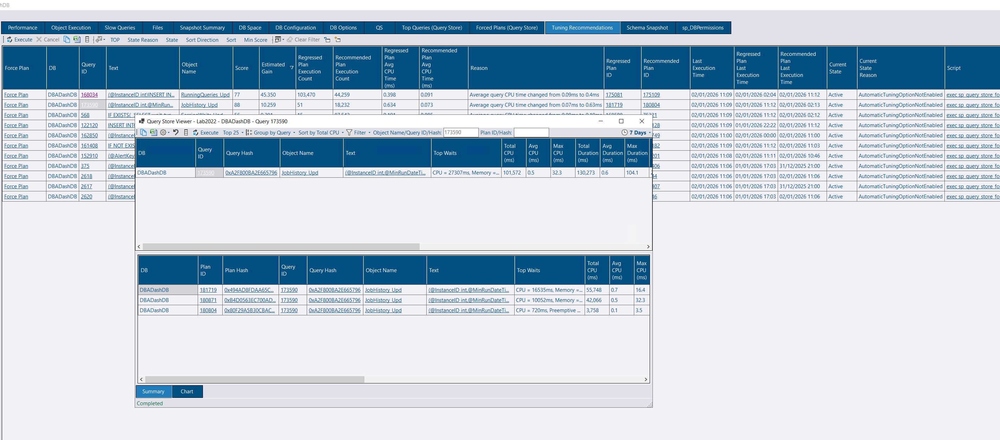
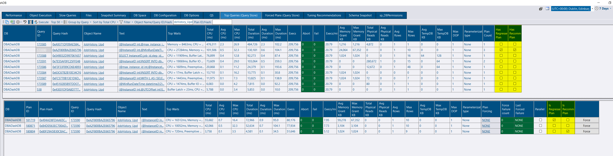

## Tuning Recommendations

DBA Dash can now pull data from [sys.dm_db_tuning_recommendations](https://learn.microsoft.com/en-us/sql/relational-databases/system-dynamic-management-views/sys-dm-db-tuning-recommendations-transact-sql?view=sql-server-ver17) which returns data about automatic tuning recommendations.  Even if you are not using automatic tuning, this DMV can provide data on the queries it has detected as regressed along with the recommended and regressed query plans.  You can then choose to fix these manually directly from DBA Dash.  Unfortunately, this is only available on *Enterprise* edition from version 2017 and later.


This report is available at instance level in the tree.  It requires the [messaging](/docs/help/messaging/) feature to be enabled.  It will be available for SQL 2017 and later, *Enterprise* edition only.


## Top Queries (Query Store) improvements

The *Top Queries (Query Store)* tab has also been extended to include data from [sys.dm_db_tuning_recommendations](https://learn.microsoft.com/en-us/sql/relational-databases/system-dynamic-management-views/sys-dm-db-tuning-recommendations-transact-sql?view=sql-server-ver17).  This will highlight if a query has a regressed/recommended plan.  It will also highlight which plan is regressed or recommended at plan level.

## S3 Bucket compatibility

This allows you to collect data from remote environments where you can't open a SQL connection to collect the data directly. This release extends support for non-AWS S3 buckets.

MinIO is now supported and tested automatically as part of a GitHub action. Other non-AWS buckets are also likely to work now.


This feature works by setting the destination connection to a S3 bucket instead of to the DBA Dash repository database in the remote environment.  In the environment local to the repository database, the S3 bucket is added as a source connection.  As long as both environments can read/write to the S3 bucket, data can be collected.

If you don't have SQL instances located in isolated environments, just write directly to the repository database.


## Other Improvements

sp_BlitzCache now has support for the new [AI](https://www.brentozar.com/archive/2025/12/get-chatgpts-advice-on-your-queries-with-sp_blitzcache/) related parameters.

See the [4.2.0 release notes](https://github.com/trimble-oss/dba-dash/releases/tag/4.2.0) for a complete list of fixes and improvements.
