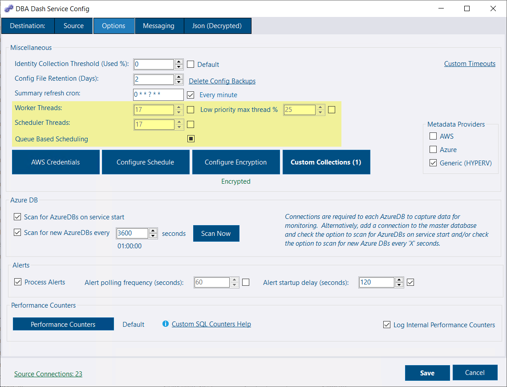

## Queue-Based Scheduling benefits

When monitoring dozens or hundreds of SQL Server instances, the previous scheduling system could experience bottlenecks during startup and periods of high activity. Collections would sometimes be missed (misfired), and slower operations like schema snapshots could monopolize worker threads, preventing faster, more critical collections from running on time.

The new scheduling system fundamentally changes how DBA Dash manages collection work, delivering improved performance and reliability.

### Key Benefits

* **Better handling for larger number of connections** when there is contention for worker threads
* **Smart prioritization** for collections based on schedule frequency
* **Reliable execution** backed by queue system to avoid missed collection jobs with High/Normal/Low priority queues
* **Improved startup** - slower, less frequent collections set to run on startup will no longer monopolize the worker threads

### How It Works

#### Previous Architecture

* [Quartz.NET](https://www.quartz-scheduler.net/) is used for scheduling
* Single job created per instance, per schedule (collections with the same schedule are run as part of the same job)
* Quartz jobs fire at specified time and run the collection directly
* **Problem**: Could lead to thread starvation and missed collections during high activity periods

#### New Queue-Based Architecture

* [Quartz.NET](https://www.quartz-scheduler.net/) is used for scheduling
* Single job created per schedule/collection combination - **significantly fewer Quartz jobs** for environments with many instances
* Quartz jobs fire at scheduled time, iterate through instances, and **queue collections** using .NET Channels
* **Intelligent prioritization**: Work is distributed across High/Normal/Low priority queues based on collection frequency
* **Duplicate protection**: If a previous collection group for an instance is still queued, new work is skipped with a warning. This prevents the queue from growing.
* **Smart dequeuing**:
  - 80% chance of processing High priority work first
  - 15% chance for Normal priority
  - 5% chance for Low priority
  - Ensures all priority levels get processed even when high-priority queues are busy
* **Resource management**: Low priority work (like schema snapshots) is limited to 25% of available worker threads, preventing thread starvation

### Real-World Impact

**Before 4.3**: Monitoring 100 instances might create 300+ Quartz jobs, with potential for thread contention and missed collections during startup or high activity.

**After 4.3**: The same environment creates only a handful of jobs, with more reliable execution.

### Configuration Options

The new queue-based scheduling is **enabled by default** - no action required to benefit from these improvements.

[](config.png)

#### Disable Queue-Based Scheduling (if needed)
If you encounter issues with queue based scheduling, it can be disabled in the Options tab of the service config tool. Please report any issues as traditional scheduling will be removed in a future version.

#### Adjust Threads
With queue based scheduling you can now adjust the worker threads and scheduling threads (Quartz). The scheduling threads default to 10 which should be sufficient for most deployments of DBA Dash. Scheduling threads are responsible for putting work on the queue rather than executing any collections with queue based scheduling. With traditional scheduling, the scheduling threads are the worker threads.

#### Adjust Low Priority Max Thread %
Adjust the percentage of worker threads available to the low priority queue. Use to prevent slower, less frequent collections from consuming all the available worker threads during startup or at their scheduled time of execution.

#### Channel Capacity

The channel capacity is set to 5000 per channel (high, normal & low). This is the maximum queue size before the channel creates backpressure, causing writes to wait.

The actual limit on queued work is based on the number of instances and collection groupings. This is typically much lower than the channel capacity, so you're unlikely to need this setting.

If adjustment is needed, add this to the config:

```json
   "ChannelCapacity": 5000
```

## Priority Calculation

### High Priority
**Collections that run every 5 minutes or less**
- No thread limit
- 80% chance of dequeuing first
- Ensures critical, frequent monitoring data is always collected promptly

### Normal Priority
**Collections that run every 2 hours or less**
- No thread limit
- 15% chance of dequeuing first, otherwise dequeued after High priority
- Balances important but less frequent collections

### Low Priority
**Collections that run less frequently + Schema snapshots (regardless of schedule)**
- Capped at 25% of available worker threads by default
- 5% chance of dequeuing first, otherwise dequeued last
- Prevents resource-intensive operations from blocking critical collections

## Migration Notes

- **No action required**: Existing installations automatically benefit from the new scheduling system
- **Backward compatible**: All existing configuration options continue to work
- **Logging**: Enhanced logging helps monitor queue performance and identify any scheduling issues

## Other Improvements

See the [4.3.0 release notes](https://github.com/trimble-oss/dba-dash/releases/tag/4.3.0) for a complete list of fixes and improvements.
