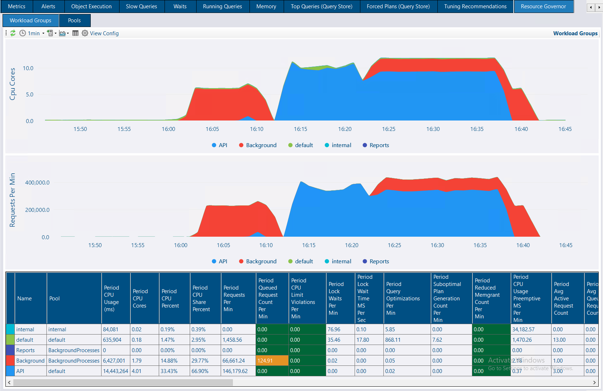
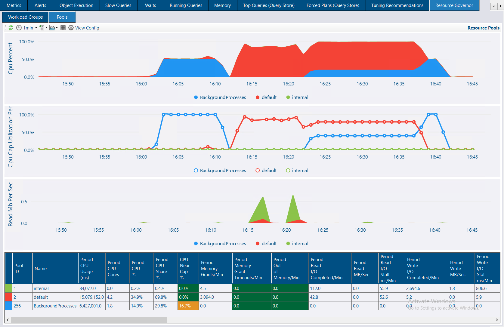

## 📊 Resource Governor Monitoring - Pools & Workload Groups

Resource Governor is a powerful SQL Server feature that allows you to manage resource allocation across different workloads. You can use this to prioritize web application traffic over API and internal reports, for example.


Resource Governor is now available on **standard edition** in SQL 2025!  SQL Server 2025 also adds the ability to govern tempdb data file usage.



Resource Governor is also an excellent way to track how much resources each application or service consumes. DBA Dash now provides this capability by tracking the stats from the `sys.dm_resource_governor_resource_pools` & `sys.dm_resource_governor_workload_groups` DMVs over time.


### Visualization in DBA Dash

The chart below shows workload group level metrics.  The *Background* group (🔴Red) is associated with a pool with a cap of 50% CPU and max of 20% (soft cap).  In the first red peak, we can see the background group consuming half the available CPU resource, being constrained by the CPU cap on the associated resource pool.  Later in the chart we can see the red *background* group limited to 20% (soft cap) CPU when there is CPU contention from the API workload group.

#### Workload Groups

The group max requests is set to 20 which means a max of 20 simultaneous requests can run.  The period queued request count per min column highlights when this limit is exceeded and requests are being queued.  The API workload group (🔵Blue) maps to the default workload group which doesn't have any CPU constraints.

#### Resource Pools

The resource pool chart below shows the same data as the workload groups chart, but summarized at the pool level.  The CPU cap utilization percent chart makes it more obvious that we are hitting 100% of the available CPU cap (50%) for the **BackgroundProcesses** pool.

The CPU Near Cap % column in the grid is also used to highlight when we are hitting a CPU cap (percentage of time 95% or more of the cap was used within the selected date range).

The soft CPU caps only take effect when there is contention for CPU resources. This effect is visible in the chart when the CPU is at 100% and both the *BackgroundProcesses* and *default* pools are consuming significant CPU resources.


Both workload groups and resource pool tabs have a ton of other metrics available for display.


### ⚙️Configuration

The two new collections (**ResourceGovernorWorkloadGroups, ResourceGovernorResourcePools**) are enabled and set to run every 1min by default on applicable instances:

* SQL Server 2008-2022, Enterprise edition only (Including developer)
* SQL Server 2025, Standard or Enterprise (Including developer editions)
* Only instances with configured workload groups

The collections can be disabled or their frequency adjusted in the service configuration tool.

If you have data collected, the *Resource Governor* tab will appear at the instance level in the tree node.  If it doesn't appear, right-click on the root of the tree and select *Refresh*.  Check that the new collection appears on the Collection Dates tab under the *Checks* node of the tree.

## 📈 Major Chart Performance Improvements

DBA Dash 4.4.0 delivers a significant performance boost! This improvement comes from upgrading the charting engine from [LiveCharts](https://livecharts.dev/) v0 to v2. Charts that were already using v2 have been updated to the latest version for optimal performance.


Charts will have much faster rendering and handle significantly more data points.  It's now possible to use more granular time periods without significant performance impact.


## 🙏 Special Thanks

A huge shout out to [Alberto Rodríguez](https://github.com/beto-rodriguez) for his incredible work on LiveCharts2. DBA Dash is open-source and relies heavily on the work of many other great open-source projects like [LiveCharts2](https://github.com/Live-Charts/LiveCharts2).

Thanks to [Benjamin Belnap](https://github.com/BenjaBelnap) for this [pull request](https://github.com/trimble-oss/dba-dash/pull/1746) which adds `{TriggerDate}` parameter support for alert templates.

## ⚠️ Breaking Changes

**Important**: The framework target for the GUI has changed from **net10.0-windows7.0** to **net10.0-windows10.0.19041.0**, which requires Windows 10.0.19041.0 or later (version 2004, Build 19041).

This change was necessary to upgrade to the latest version of LiveCharts2. Since Windows 7 and 8 have been end-of-life for some time, this shouldn't impact most users. Note that this change only affects the GUI, which can be deployed separately from the service.

## Other Improvements

See the [4.4.0 release notes](https://github.com/trimble-oss/dba-dash/releases/tag/4.4.0) for a complete list of fixes and improvements.
