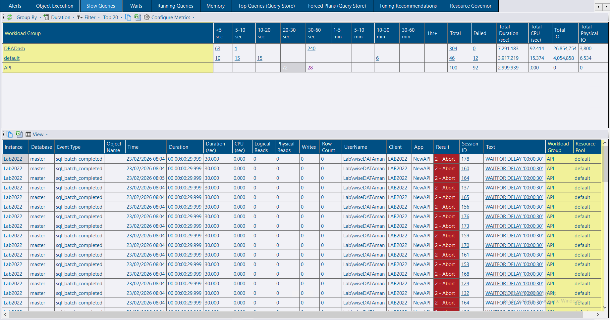
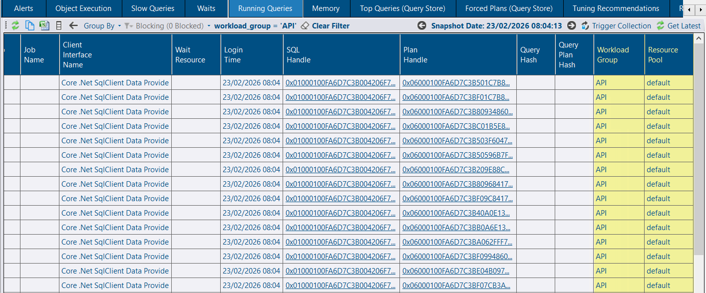

## Slow Queries - Workload Groups and Resource Pools

You can now group and filter slow query capture by **workload group** or **resource pool**.

#### Configuration Notes:

* **Automatic Capture:** Data is captured automatically if Resource Governor is active and workload groups are configured.
* **Required Collections:** Ensure *ResourceGovernorWorkloadGroups* and *ResourceGovernorResourcePools* are enabled (default enabled, collection running every 1min, provided that Resource Governor is active and workload groups are configured).
* **Extended Events:**
  * **Standard Setup:** Existing XE sessions are dropped and re-created automatically with the new settings.
  * **Persist XE Sessions:** If you use the 'persist XE sessions' setting in service config tool, you must manually edit the extended event to add capture `sqlserver.session_resource_group_id` & `sqlserver.session_resource_pool_id`.  The existing session will still work but it won't capture the data required to map the captured queries to workload groups and resource pools.

## Running Queries - Workload Groups and Resource Pools

You can also group and filter the **Running Query** snapshots by **workload group** and **resource pool**.

#### Configuration Notes:

* **Required Collections:** Ensure *ResourceGovernorWorkloadGroups* and *ResourceGovernorResourcePools* are enabled (default enabled, collection running every 1min, provided that Resource Governor is active and workload groups are configured).
* **Automatic Capture:** The *group_id* column from *sys.dm_exec_sessions* is captured automatically.

## Other Improvements

See the [4.5.0 release notes](https://github.com/trimble-oss/dba-dash/releases/tag/4.5.0) for a complete list of fixes and improvements.
