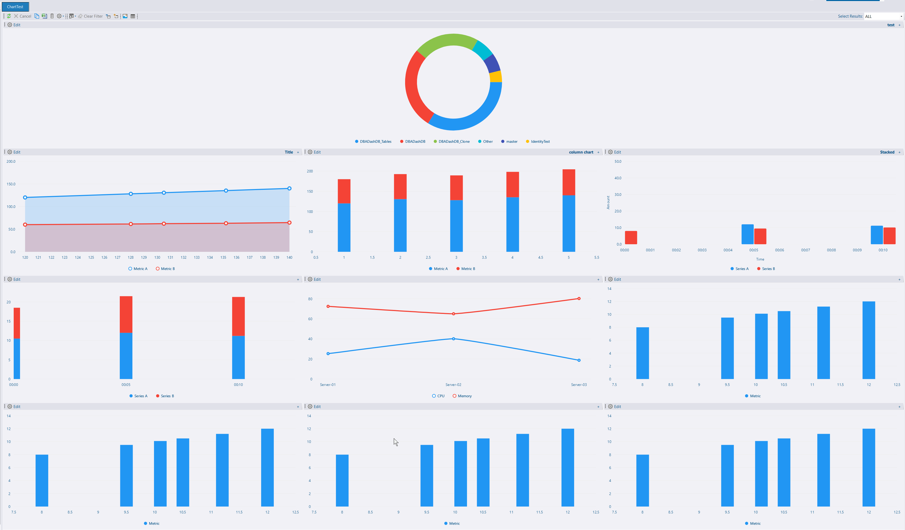
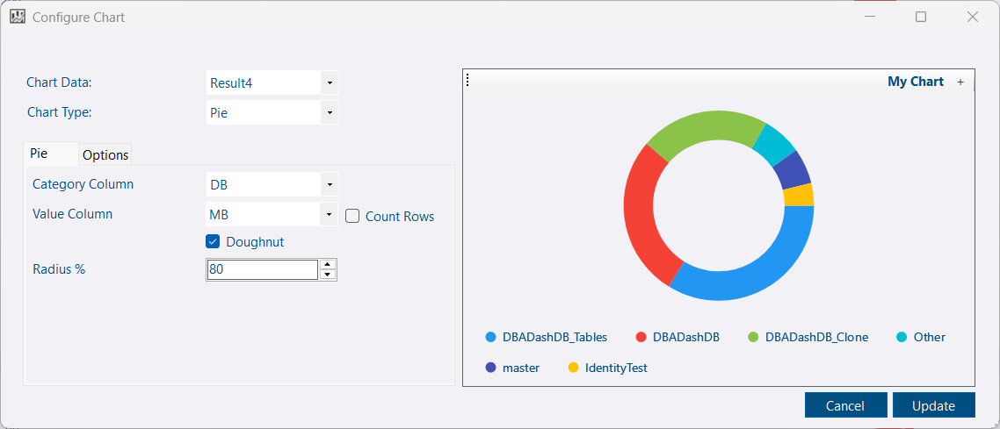


Version 4.6 is a pre-release. You can try it now by [upgrading manually](/docs/setup/upgrades/#manual-upgrade).


## Custom reports — charts

[Custom reports](/docs/how-to/create-custom-reports) let you extend DBA Dash using T-SQL and in-app formatting. In 4.6 you can add charts to custom reports.

To add a chart: click the gear icon, choose *Add Chart*, then select the data source, chart type, and configuration options.

## UI improvements

Key interface and performance refinements:

- Reduced dark-mode flicker and related polish.
- Faster tree-node switching.
- Reports node now available at the group level.
- Improved app startup: repository DB connection loads asynchronously with cancellation support.

## Alerts — database status rule

A new database status alert rule (contributed by [Benjamin Belnap](https://github.com/BenjaBelnap)) notifies you when a database enters states such as suspect, emergency, or recovery pending. To receive notifications more quickly, modify the Databases collection [schedule](/docs/help/schedule) (default: hourly).

## 🙏Thanks

- [Chris May](https://github.com/ChrisMayIVCE) — Managed instance CPU reporting: [PR](https://github.com/trimble-oss/dba-dash/pull/1787)
- [R4PH1](https://github.com/R4PH1) — Drive filter fix for drive space alerts: [PR](https://github.com/trimble-oss/dba-dash/pull/1788)
- [Benjamin Belnap](https://github.com/BenjaBelnap) — database status alert rule: [PR](https://github.com/trimble-oss/dba-dash/pull/1781)

## Other improvements

See the [4.6.0 release notes](https://github.com/trimble-oss/dba-dash/releases/tag/4.6.0) for a full list of fixes and improvements.
