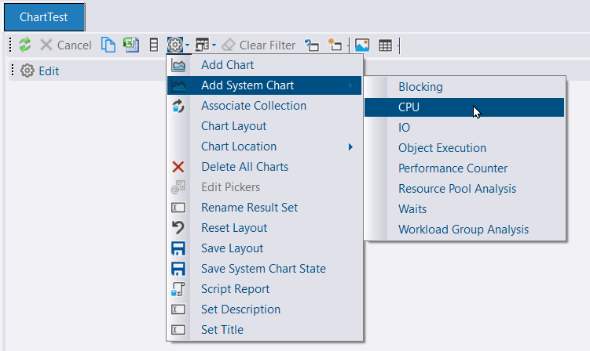
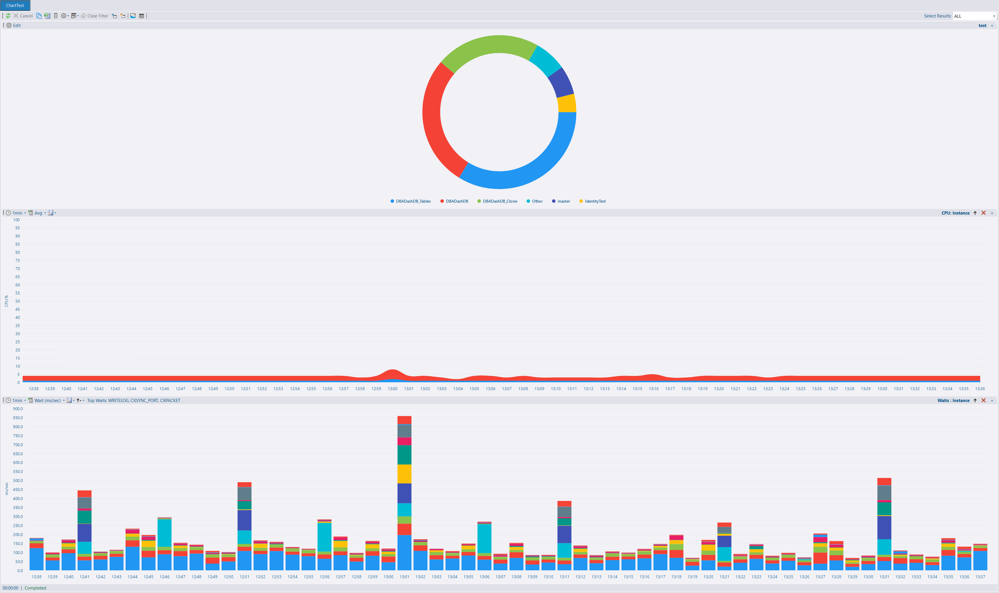
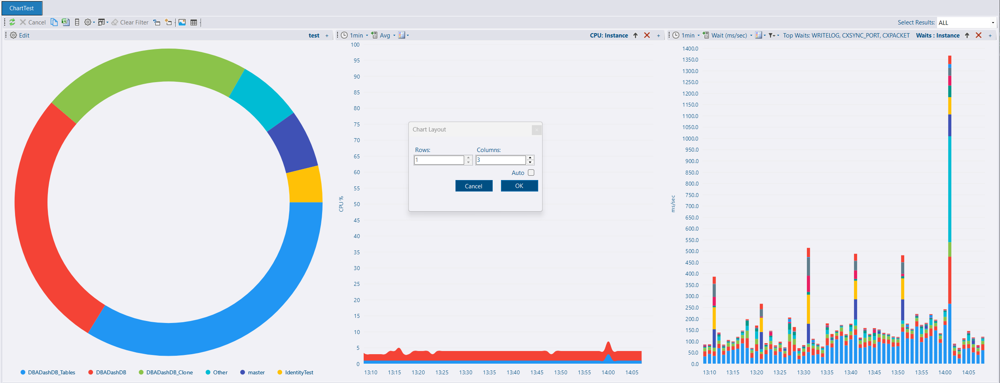
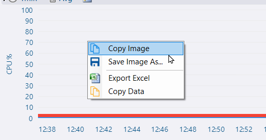
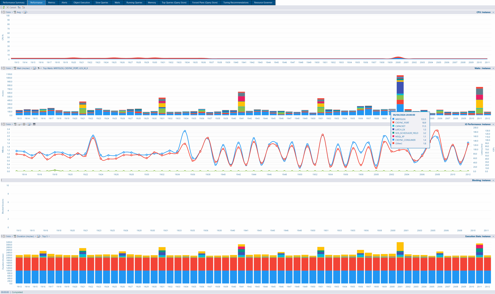

## Custom reports - system charts

Expanding on the changes made in [4.6](/blog/whats-new-in-4.6), you can now add various system charts to your own custom reports. This powerful feature lets you combine built-in monitoring charts with your custom metrics, creating comprehensive dashboards tailored to your specific needs. Whether you're tracking performance counters, wait stats, or resource utilization, you can now build unified views that bring together exactly the information you need—without switching between different tabs or views.

* To add a system chart, create a [custom report](/docs/how-to/create-custom-reports/) and select *Add System Chart* from the gear toolbar icon.

## Chart Layout

When you have multiple charts in your custom reports, presentation matters. The new layout options give you control over how your charts are arranged, letting you optimize for different screen sizes and use cases. Whether you prefer a grid layout for side-by-side comparisons or a vertical stack for detailed analysis, you can configure your reports to display information exactly the way you want.

* To edit the layout, select *Chart Layout* from the gear toolbar icon.  Edit the number of columns to indicate how many charts you would like to display side-by-side on each row.

## Chart Context Menu

A new context menu on charts provides quick access to common actions. Right-click any chart to save it as an image for reports or presentations, copy it directly to your clipboard, or export the raw data behind the chart for further analysis in Excel or other tools. These shortcuts eliminate the need for screenshots and manual data collection, streamlining your workflow when sharing insights with your team.

## Performance tab improvements

The Performance tab has been rebuilt using the custom reports framework, bringing enhanced functionality and a more consistent user experience. This architectural change delivers several benefits:

* **Expand individual charts** - Click to enlarge any chart for detailed analysis without losing context
* **Open in new window** - Pop out the entire performance report to a separate window for multi-monitor setups
* **Improved maintainability** - Built on the same foundation as custom reports, ensuring consistent behavior and easier future enhancements

## Other improvements

See the [4.7.0 release notes](https://github.com/trimble-oss/dba-dash/releases/tag/4.7.0) for a full list of fixes and improvements.
