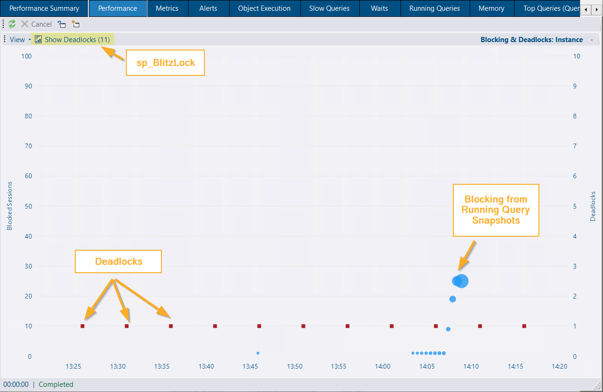
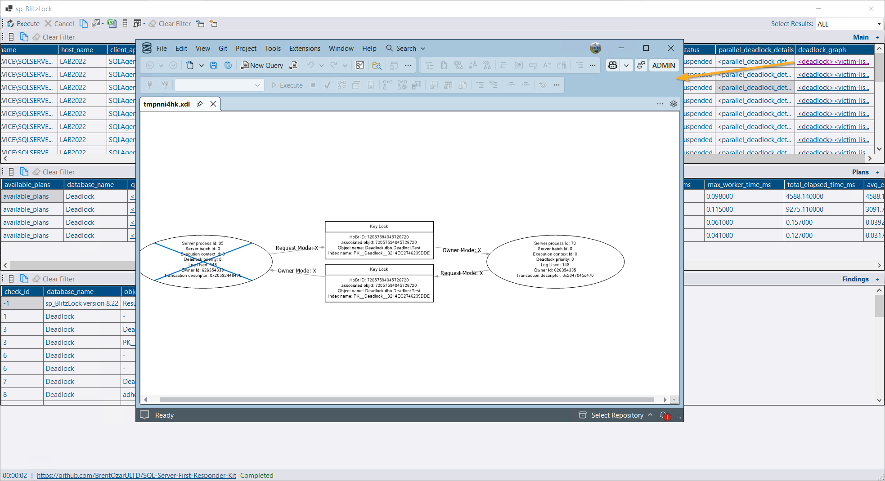
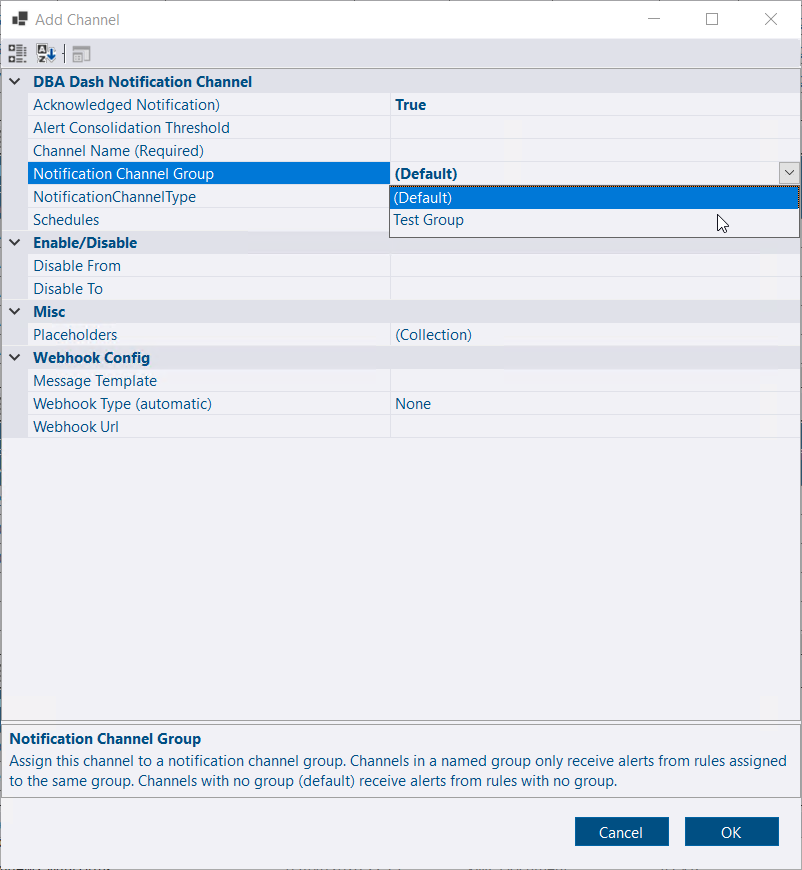
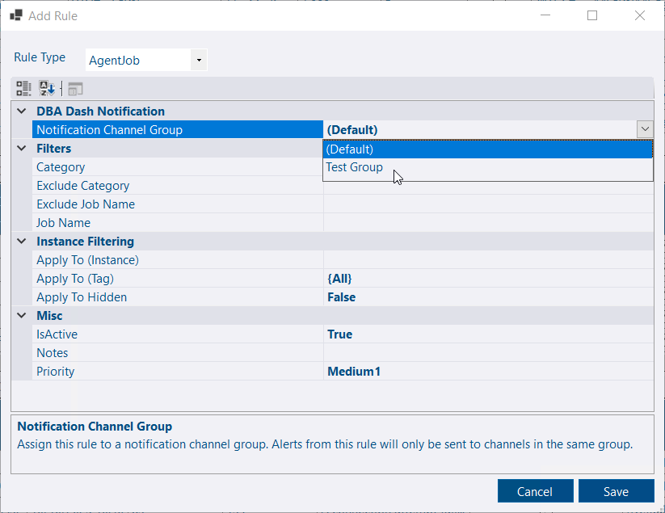
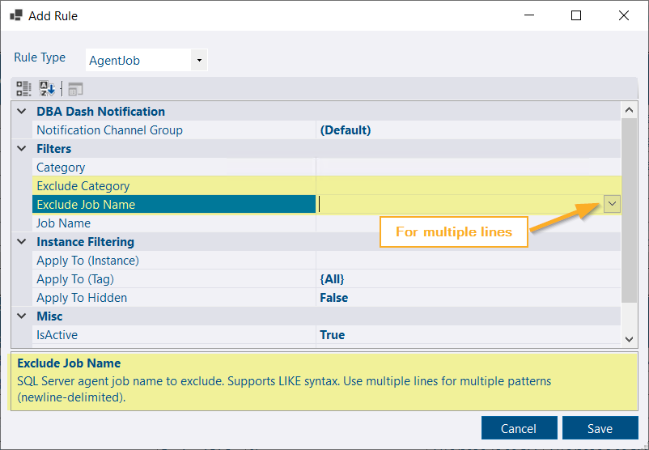
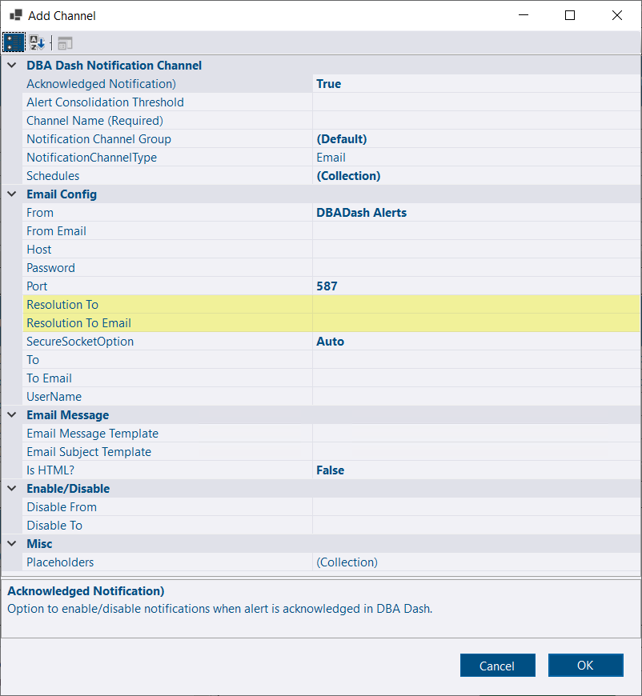

## Deadlocks

Deadlocks occur when two or more processes each hold locks the others need, causing them to wait indefinitely. SQL Server detects these cycles and chooses a deadlock victim, rolling back that transaction (error number 1205). Applications should handle the 1205 error and retry or otherwise recover gracefully.

A single deadlock may be harmless depending on the application's retry behavior. However, frequent deadlocks can increase resource usage and cause repeated work as transactions are rolled back and retried. It's important to know when deadlocks occur and how they affect your workload. For more information on deadlocks and how to minimize them, see [Microsoft: Deadlocks](https://learn.microsoft.com/en-us/sql/relational-databases/sql-server-deadlocks-guide).

Deadlocks are now surfaced in the Blocking section of the Performance tab, so you can spot and investigate them more quickly.

- The chart uses the `Locks\Number of Deadlocks/sec` performance counter and converts it into a discrete deadlock count.
- Red squares show the deadlock count; blue circles indicate blocking detected in running-query snapshots. Only the blue circles are clickable.

[](blocking-and-deadlocks.png)

Click the *Show Deadlocks* button to view deadlock details for the selected time range. This triggers the [messaging](/docs/help/messaging) feature to execute `sp_BlitzLock` on the monitored instance and retrieve the details and deadlock graph from the `system_health` extended event.

[](sp_BlitzLock.png)

### Deadlock setup

Deadlocks are shown by default when detected. If you've customized performance counters, make sure the following line appears in your `PerformanceCountersCustom.xml` file:
```xml
<Counter object_name="Locks" counter_name="Number of Deadlocks/sec" instance_name="_Total" />
```

Users need the `CommunityScripts` and `Messaging` roles in the repository database to run `sp_BlitzLock`. The procedure must be deployed to monitored instances and enabled in the service configuration tool. The DBA Dash service account also needs permission to execute the procedure. See [community tools setup](/docs/help/community-tools/) for details.

## Alerts improvements

### Notification Channel Groups

Notification channel groups let you target alert rules to specific sets of notification channels (email, Google Chat, Slack, PagerDuty, etc.). All existing channels and rules are placed into a *default* group automatically.

### Notification Channel Group Setup

* On the Alerts tab, click *Configure*
* Click **Add Group**.  Enter the group name and click OK.
* Create/Edit a notification channel.  Select the group created.

*The notification channel will only receive alerts associated with the new group.*
* Create/Edit an alert rule.  Select the group created.

*The new alert rule will only send notifications to channels associated with the new group.*


You can apply schedule filters to notification channels to control which alert notifications a channel receives based on:

- Time of day
- Day of week
- Alert priority
- Instance tag (for example: Prod, DEV)




### Agent job exclusion filters

Agent job alerts can now use exclusion filters for job name and category. You can specify multiple filters — enter each filter on a new line (use the down).

[](agent-job-exclude.png)

### Dedicated recipient for resolved notifications

[This pull request](https://github.com/trimble-oss/dba-dash/pull/1844) by [goldenjacob](https://github.com/goldenjacob) adds the option to use a separate email address for resolution notifications. This can prevent resolved alerts creating unnecessary tickets in external systems.

[](resolution-to-email.png)

## Other improvements

See the [4.8.0 release notes](https://github.com/trimble-oss/dba-dash/releases/tag/4.8.0) for a full list of fixes and improvements.
