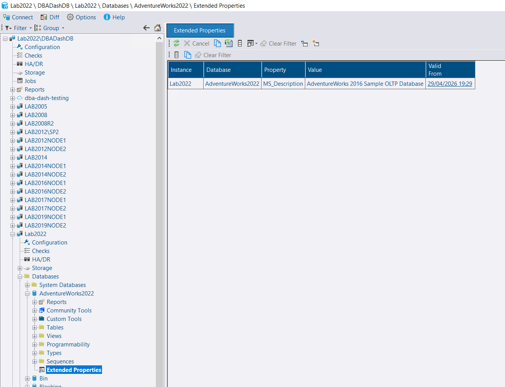

## Database Level Extended Properties

[Extended properties](https://learn.microsoft.com/en-us/sql/relational-databases/system-stored-procedures/sp-addextendedproperty-transact-sql) are a SQL Server feature that lets you attach arbitrary key-value metadata to database objects. At the database level they are commonly used to record organizational information — owner, team, cost centre, application name, business unit — that is invaluable when managing a large estate.

A new `DatabaseExtendedProperties` collection type has been added to DBA Dash. The collection runs at midnight by default, but the schedule can be adjusted — or the collection disabled entirely — in the service configuration tool.

The **Database Extended Properties** report is available in the **Reports** folder or under the **Extended Properties** node in the database-level tree. It shows all extended properties defined at the database level across your monitored instances, making it easy to query and compare organizational metadata in one place.

[](extended-properties.png)

🙏 Thanks to [goldenjacob](https://github.com/goldenjacob) for [contributing](https://github.com/trimble-oss/dba-dash/pull/1855) this feature!

## Automatic Updates (Beta)

The DBA Dash service can now check for and apply updates automatically on a defined cron schedule. Previously this required external tooling or scripting — it is now a first-class feature built directly into the service.


Automatic updates are a **beta** feature. If an upgrade fails for a reason that requires manual intervention, monitoring will be interrupted until the issue is resolved. Review your environment carefully before enabling this feature in production.


### Setup

Open the service configuration tool and add `UpgradeCheckCron` set to a cron schedule of your choice. For example, to check at midnight every day:

```json
"UpgradeCheckCron": "0 0 0 1/1 * ? *",
```

Ensure the service account is a member of the local administrators group or has permissions to start/stop the service and kill processes. The service needs to be stopped and any GUI instances terminated to avoid locked-file issues.

Automatic updates are **disabled by default** — no changes will happen until `UpgradeCheckCron` is configured.

## Other improvements

See the [4.9.0 release notes](https://github.com/trimble-oss/dba-dash/releases/tag/4.9.0) for a full list of fixes and improvements.
