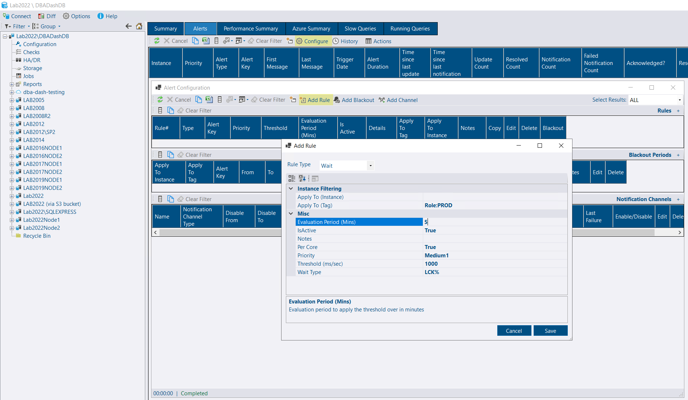
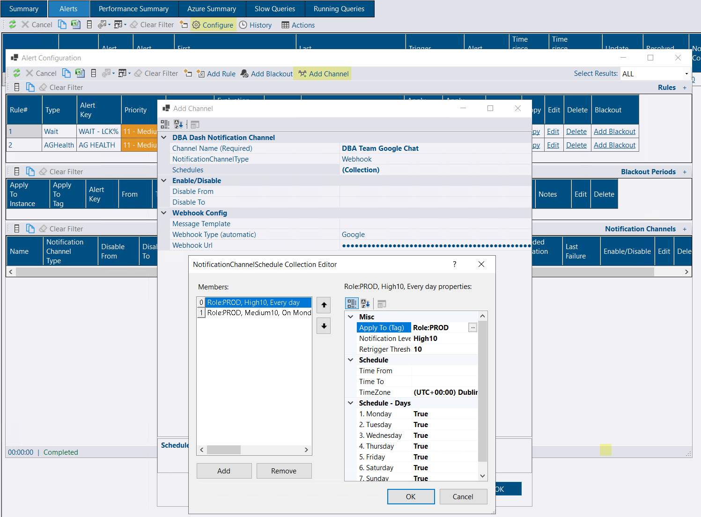
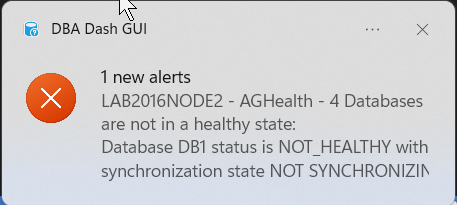
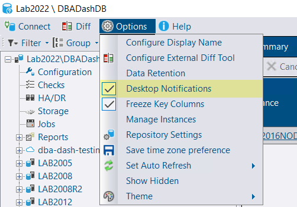
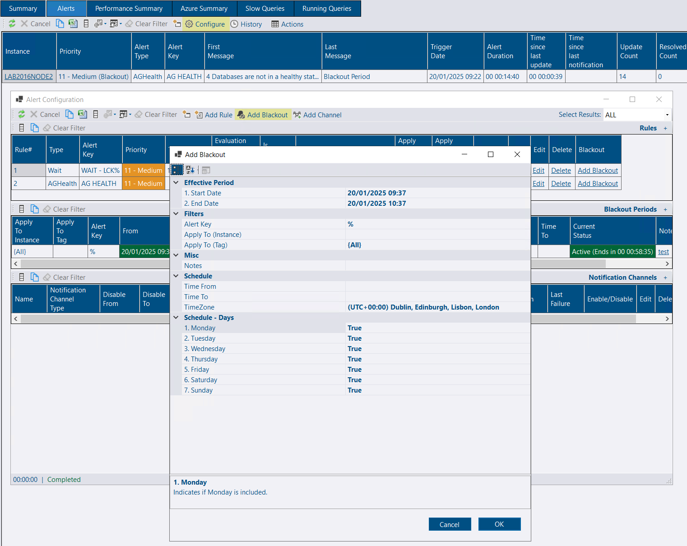
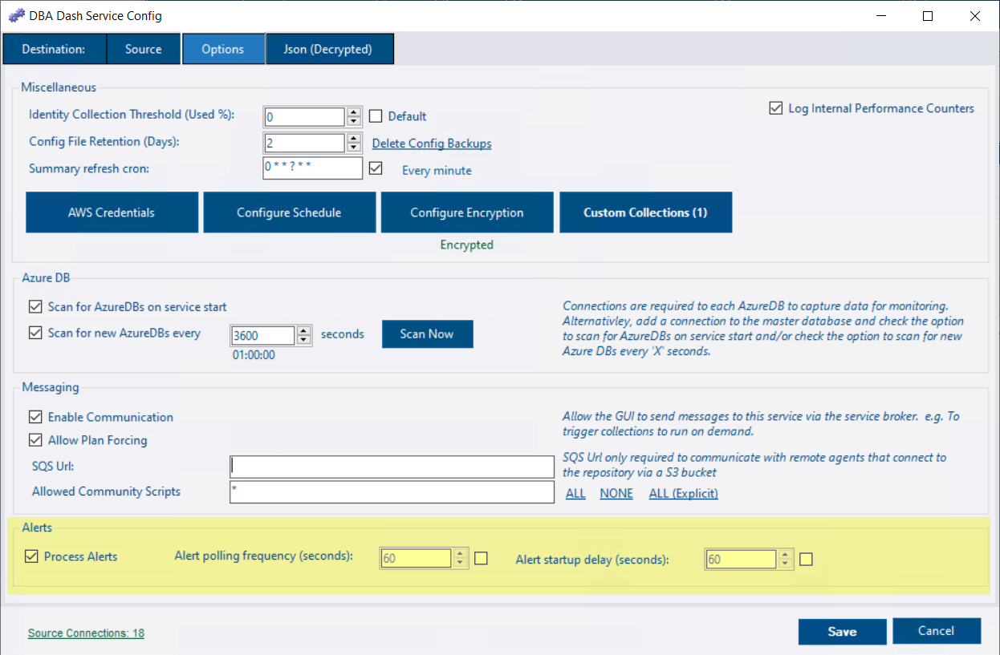
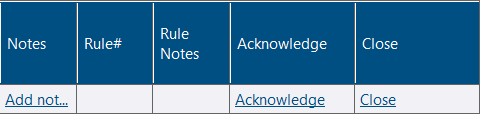
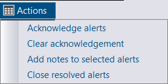

## Introduction

Alerts are available in DBA Dash starting from 3.17.0.


Alerts can be setup in DBA Dash to provide instant notification for issues that require your immediate attention.  Alerts need to be configured before you start receiving alerts. The rules, thresholds and notification schedules can be tailored to your environment.


Receiving alert notifications for issues that *don't* require your attention is often a bigger problem than not receiving a critical notification.  A noisy alert system quickly creates alert fatigue and users will start to ignore notifications or important notifications might be lost in a flood of alerts.

Alerts don't replace the need for daily DBA checks and the absence of notifications doesn't mean everything is in a good state.  The Summary tab in DBA Dash provides a good compliment to alerts.  In some cases it will allow you to deal with problems before they become critical enough for an alert notification (e.g. disk space issues.).


## Rules

An alert rule defines a condition that you want to be notified about. To create a rule:

* Click the *Configure* button on the Alerts tab in the GUI.
* Click the **Add Rule* button on the Alert Configuration window.
* Select a rule type.  The following rule types are currently available:
    * AG Health
    * Collection Dates
    * Counter. e.g.
      * Memory Manager\Memory Grants Pending - queries queued waiting for a memory grant
    * CPU
    * Drive Space
    * Wait. e.g.
        * RESOURCE_SEMAPHORE - queries queued waiting for a memory grant
        * RESOURCE_SEMAPHORE_QUERY_COMPILE - queries queued waiting to compile
        * THREADPOOL - queries waiting for an available worker thread
        * LCK% - queries blocked
    * Agent Job.

  *Receive a notification when a job fails.  The rule can be filtered by job name or category (with LIKE syntax support)*

  
  The agent job rule can be used for custom notifications by creating a job that will fail based on your condition
  

* Configure the rule
  * Apply To (Instance) - enter the name of the instance you want the alert to apply to OR leave blank to apply to all instances.
  * Apply To (Tag) - Select a tag to apply the alert to a group of instances.

 


Tags are a great way to simplify your alert configuration.


  * IsActive - Set to false to disable the alert.
  * Notes - Option to add notes to describe the purpose of the alert.
  * Priority - The priority determines the status icon for the alert and it can also be used to filter alerts for notification purposes (Alerts can be generated without sending a notification).  The broad categories are Critical, High (1-10), Medium (1-10), Low (1-10) and Information (1-10).
  * Depending on the rule type selected, different properties are available to configure.


If you want to have a different priority based on the threshold, click the *Copy* link in the grid to clone the existing rule and change the threshold and priority.  The rules will map to the same alert key and will generate a *single* event, the higher priority rule taking precedence.
The same applies if you have a rule that you want to apply to a different tag - clicking the *Copy* link will save time.  A server with both tags will still generate a *single* event.


* Click Save

## Notification Channels

A notification channel defines where to send the alert notification. To create a channel:

* Click *Add Channel* on the alert configuration window.  Select from the menu options:
  * Webhook - For Google chat and generic webhooks.  Google chat supports threaded conversations.
  * Slack - Slack can also be configured as a webhook, but this option uses the API and supports threaded conversations.
  * Email
  * PagerDuty. *Select the service in PagerDuty.  Click Integrations.  Click to add an Events API V2 integration.  This provides the integration key required when setting up the notification channel in DBA Dash*
* Configure the channel.
  * Alert Message Consolidation Threshold - *The number of notifications that will trigger a single consolidated alert notification to reduce noise.  Default 5.*
  * Channel name - How you want to identify the channel
  * Disable From/To - option to disable a notification channel.  e.g. Holidays.
  * Schedules - By default, a notification channel is available 24x7 for alerts of Medium priority and higher.  You can edit the schedule and add additional schedules as required.  For example, you can have a schedule for medium priority alerts that send notifications Mon-Fri, 9am-5pm.  An additional schedule can be added for high priority alerts that will send notifications 24x7.  If you have teams in different timezones you can configure notification channels and schedules to align with when the teams are available.
  Schedules can also be applied to a specific tag.  So the 24x7 high priority schedule could be filtered for tag Role:Production.  Or if you have different teams responsible for different instances a tag could be used to filter instances applicable to the team associated with the notification channel.
  Note: It's OK to have overlapping schedules.  A channel will receive a single notification.  If multiple channels have overlapping schedules, each channel will be notified.

 

Schedules have an associated re-trigger threshold which is the minimum delay required before sending an updated alert notification.  By default you will receive updates every 10 minutes and a maximum of 6 (configurable in Options\Repository Settings) notifications will be sent for each alert.  For Slack and Google chat alerts, updates are sent to the previous conversation thread.


Sensitive information associated with the notification channel is stored in the repository database.  Data masking is used to limit access to sensitive information and users will receive a "Insufficient permission to access notification channel details" error if they try to edit a channel without appropriate [permissions](https://learn.microsoft.com/en-us/sql/relational-databases/security/dynamic-data-masking?view=sql-server-2017#permissions) to unmask the data.  Sensitive data is obfuscated even if you have permissions to unmask, preventing casual viewing of the data.


## Desktop notifications

DBA Dash can send desktop notifications (popup window) while you are using the GUI.  To receive desktop notifications, check the *Desktop Notifications* from the options menu.  If desktop notifications are disabled, there is still a visual cue in the application that you have alerts that require your attention in the menu area on the top right.  This shows the number of active alerts and the number that require your attention (alerts that are not resolved or acknowledged).

 

## Blackout Periods

A blackout defines when alerts are not monitored - e.g. For maintenance.  Alerts are not generated during the blackout.  If an alert is active at the time of a blackout, it's status is changed to indicate that it is now in blackout.

### Disable alerts for the next hour

If you want to disable alerts for the next hour, click *Add Blackout* on the Alert Configuration window.  The start date and end date already default to the next hour - adjust these if required.  The rest of the configuration can be left to the defaults - click OK to create the blackout.  More advanced configuration is available, including scheduled blackouts and blackouts targeting specific alerts and instances.

### Blackout configuration

* Start Date - when the blackout period starts.  Defaults to current date/time
* End Date - when the blackout period ends.  Defaults to the next hour.  For scheduled alerts, set to empty/null or a date in the distant future.
* Alert Key - By default the blackout period will apply to all alerts. To filter for a specific alert, enter the alert key to filter on (LIKE syntax is supported.).  Alternatively, create the blackout using the *Add Blackout* link in the alert rules grid.
* Apply To (Instance) - option to filter the blackout period to a specific instance
* Apply To (Tag) - option to apply the blackout period to a specific tag.  e.g. Role:DEV
* Notes - option to add notes to describe the purpose of the blackout.
* Time From/To - For scheduled alerts, enter a time when you want the blackout period to start & end.  e.g. 23:00.
* TimeZone - The timezone used for Time From/To.
* Days - check which days of the week you want the blackout to apply.

## Service Config Tool

By default, the service config tool is already configured to process alerts.  If you have multiple services, only one of the services will process alerts at a time.  In some cases you might want to control which service processes alert notifications (maybe outbound connections are disabled preventing notifications).  On the Options tab you have the following alert configuration options:

* Process Alerts - option to disable alert processing.
* Alert polling frequency - How often we check alert rules & process notifications.
* Alert startup delay - when the service starts you might want to introduce an additional delay, allowing collections time to run before generating alerts.

## Handling new alerts

An alert can be acknowledged by clicking the Acknowledge link in the grid or selecting Acknowledge alerts from the *Actions* menu.  Once acknowledged, notifications for the alert will be muted. Notifications are also muted once the maximum number of notifications is reached (Configurable in Options\Repository Settings).

You can add notes to the alert to explain the root cause by clicking the link in the Notes column.  This can be a simple line of text or a full RCA written in markdown.  You can also add the same notes to multiple alerts by selecting them in the grid and using the option from the *Actions* menu.

Once an alert has been resolved it will be automatically closed after a period of time (Configurable in Options\Repository Settings).  You can also Close alerts manually by clicking the *Close* link or the option from the *Actions* menu.  Once closed, a **new** alert will be generated if the rule is triggered again.  This will reset the notification count and start new threads in Slack and Google chat.  To see Closed alerts, click the *History* button on the *Alerts* tab.

## Other alert options

SQL Server has built-in alert capabilities that can be used alongside DBA Dash.  For example, you can configure alerts for high severity errors, corruption, performance conditions & job failures.

