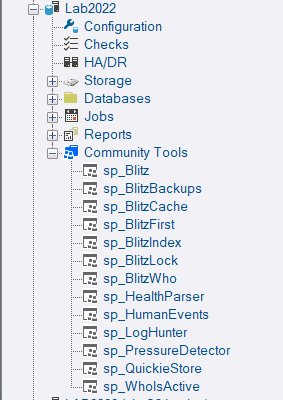
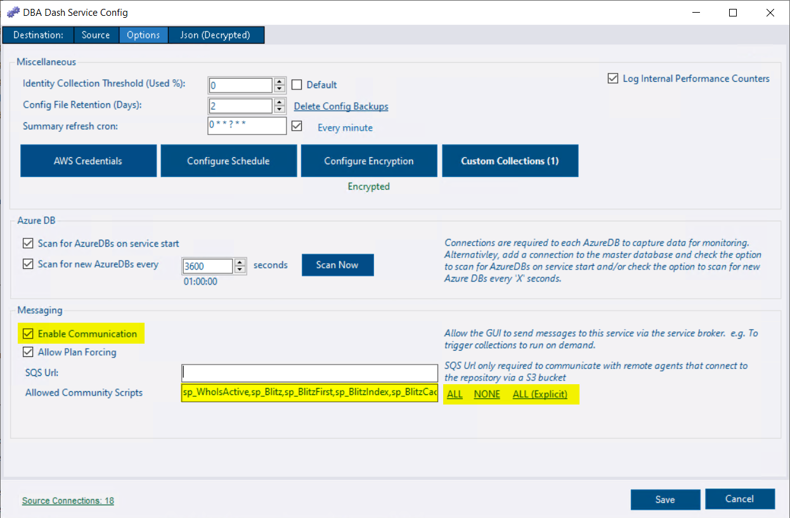

DBA Dash now supports various community scripts, including [Adam Machanic's](https://dataeducation.com/about/) [sp_WhoIsActive](https://whoisactive.com/), [Brent Ozar's](https://www.brentozar.com/) [First Responder Kit](https://github.com/BrentOzarULTD/SQL-Server-First-Responder-Kit) and [scripts from](https://github.com/erikdarlingdata/DarlingData) [Erik Darling](https://erikdarling.com/).  This extends the functionality of DBA Dash which is itself a community tool.🤝

[](community-tools-tree.png)

Community Tools are executed on your monitored instances using the [Messaging](/docs/help/messaging) feature.  The GUI communicates with the service via the repository database using service broker.  The service runs the scripts and sends the data back to the GUI.  The complexity is hidden behind the scenes - once the scripts are deployed and security configured, it just works.

### Community Tools Setup
* Deploy the community tools to your SQL instances & ensure the DBA Dash service account has permissions to execute.


The script below can be used to automate the deployment of community tools & permissions using [dbatools](https://dbatools.io/).


```pwsh
############# Setup ##############

## Instances to Deploy to
$SQLInstances = "SQL1","SQL2"

# DBA Dash service account user ($ at end for managed service account)
$DBADashServiceAccount = "YourDomain\DBADash$"

###################################

$DBADashServiceAccount = $DBADashServiceAccount.Replace("]","]]")

# sp_WhoIsActive deploy
Install-DbaWhoIsActive -SqlInstance $SQLInstances -Database master

# sp_WhoIsActive permissions
$GrantSQL = "GRANT EXECUTE ON sp_WhoIsActive TO [" + $DBADashServiceAccount + "]"
Invoke-DbaQuery -SqlInstance $SQLInstances -Query $GrantSQL

# FRK Deploy
Install-DbaFirstResponderKit -SqlInstance $SQLInstances -Database master

# FRK Permissions
$GrantSQL = "GRANT EXECUTE ON sp_Blitz TO [" + $DBADashServiceAccount + "]
GRANT EXECUTE ON sp_BlitzBackups TO [" + $DBADashServiceAccount + "]
GRANT EXECUTE ON sp_BlitzCache TO [" + $DBADashServiceAccount + "]
GRANT EXECUTE ON sp_BlitzIndex TO [" + $DBADashServiceAccount + "]
GRANT EXECUTE ON sp_BlitzFirst TO [" + $DBADashServiceAccount + "]
GRANT EXECUTE ON sp_BlitzLock TO [" + $DBADashServiceAccount + "]
GRANT EXECUTE ON sp_BlitzWho TO [" + $DBADashServiceAccount + "]
/* Required for sp_Blitz */
GRANT EXECUTE ON sp_AllNightLog TO [" + $DBADashServiceAccount + "]
GRANT EXECUTE ON sp_AllNightLog_Setup TO [" + $DBADashServiceAccount + "]
GRANT EXECUTE ON sp_BlitzQueryStore TO [" + $DBADashServiceAccount + "]
GRANT EXECUTE ON sp_DatabaseRestore TO [" + $DBADashServiceAccount + "]
GRANT EXECUTE ON sp_ineachdb TO [" + $DBADashServiceAccount + "]"
Invoke-DbaQuery -SqlInstance $SQLInstances -Query $GrantSQL

# Grant permissions to sql_expression_dependencies in each database for sp_BlitzIndex
$GrantSQL = "GRANT SELECT ON sys.sql_expression_dependencies TO [" + $DBADashServiceAccount + "]"
Get-DbaDatabase $SQLInstances | Invoke-DbaQuery -Query $GrantSQL

# Erik Darling scripts Deploy
Install-DbaDarlingData -SqlInstance $SQLInstances -Database master

# Erik Darling scripts permissions
$GrantSQL = "GRANT EXECUTE ON sp_HumanEvents TO [" + $DBADashServiceAccount + "]
GRANT EXECUTE ON sp_PressureDetector TO [" + $DBADashServiceAccount + "]
GRANT EXECUTE ON sp_QuickieStore TO [" + $DBADashServiceAccount + "]"
Invoke-DbaQuery -SqlInstance $SQLInstances -Query $GrantSQL

# sp_HealthParser (Erik Darling) deploy (Not included in Install-DbaDarlingData)
$HealthParser = (Invoke-WebRequest -Uri "https://raw.githubusercontent.com/erikdarlingdata/DarlingData/refs/heads/main/sp_HealthParser/sp_HealthParser.sql").Content
Invoke-DbaQuery -SqlInstance $SQLInstances -Query $HealthParser

# sp_HealthParser permissions
$GrantSQL = "GRANT EXECUTE ON sp_HealthParser TO [" + $DBADashServiceAccount + "]"
Invoke-DbaQuery -SqlInstance $SQLInstances -Query $GrantSQL

# sp_LogHunter (Erik Darling) deploy (Not included in Install-DbaDarlingData)
$LogHunter = (Invoke-WebRequest -Uri "https://raw.githubusercontent.com/erikdarlingdata/DarlingData/refs/heads/main/sp_LogHunter/sp_LogHunter.sql").Content
Invoke-DbaQuery -SqlInstance $SQLInstances -Query $LogHunter

# sp_LogHunter permissions.  Commented out as it requires sysadmin.
# Add-DbaServerRoleMember -SqlInstance $SQLInstances -ServerRole sysadmin -Login $DBADashServiceAccount

## Kenneth Fisher's permission tools

$sp_SrvPermissions = (Invoke-WebRequest -Uri "https://raw.githubusercontent.com/sqlstudent144/SQL-Server-Scripts/refs/heads/main/sp_SrvPermissions.sql").Content
Invoke-DbaQuery -SqlInstance $SQLInstances -Query $sp_SrvPermissions

$sp_DBPermissions = (Invoke-WebRequest -Uri "https://raw.githubusercontent.com/sqlstudent144/SQL-Server-Scripts/refs/heads/main/sp_DBPermissions.sql").Content
Invoke-DbaQuery -SqlInstance $SQLInstances -Query $sp_DBPermissions

$GrantSQL = "GRANT EXECUTE ON sp_SrvPermissions TO [" + $DBADashServiceAccount + "]
GRANT EXECUTE ON sp_DBPermissions TO [" + $DBADashServiceAccount + "]"

Invoke-DbaQuery -SqlInstance $SQLInstances -Query $GrantSQL

```

* On the options tab in the service configuration tool, ensure ***Enable Communication*** is checked.
* In the Allowed Community Scripts textbox, enter "*" to allow all community scripts or click the "ALL" link.  Or click the "All Explicit" link and edit the comma-separated list as required.

[](community-tools-config.png)

* Save the config & restart the service.

Community Tools can then be found in the Community Tools folder in the tree under each SQL instance node.  A subset of tools will also appear under each database node, passing the context database to the procedure.

Running a tool is as simple as clicking ***Execute***.  Most tools have additional parameters that can be set.


Community tools are ran directly on your monitored instances rather than against the repository database.  Where you see an ***Execute*** button rather than a ***Refresh*** button, the action will cause something to run directly on your monitored instance.



Community tools are run under the context of the DBA Dash service account.  This allows users that have been granted appropriate access to the *repository database* access to the monitored instances which they might not normally have access to. SQL Injection, elevation of privilege etc might be possible on past, present or future versions of community scripts. Enable the community scripts that your organization trusts and limit access to run the scripts to appropriate individuals.

Users can run community scripts if they are a ***database owner*** on the repository database, or have the ***Messaging*** and ***CommunityScripts*** roles.



