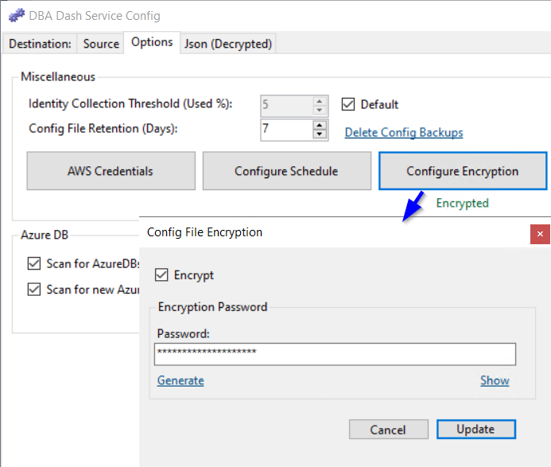

## Introduction

The configuration for the service is stored in JSON format in a file named **ServiceConfig.json** in the application folder.  You can edit this manually but it's recommended to use the **DBADashServiceConfigTool.exe** app (GUI) or **DBADashConfig.exe** (CLI) to ensure a valid configuration.  There is also a [commandTimeouts.json](/docs/help/query-timeout) file if you have customized any of the collection query timeouts.

## Protecting the config

To ensure your config file is protected:

* [Enable config file encryption](#encryption) (Starting 2.41.0).
* Use a strong password to encrypt the config.
* Avoid storing sensitive information in the config file if possible.

*e.g. Use Windows authentication where possible.  Use IAM roles to provide access to S3 buckets instead of access keys*

* Limit access to the config file.
* Review the [security](/docs/help/security) document and use the principal of least privilege.

### Obfuscation

If config file encryption isn't used, sensitive information like connection string passwords and AWS Secret key are automatically obfuscated.  They are encrypted using Aes encryption which is considered secure, but the **key storage is NOT secure**.

It's slightly better than plain text, but any user with access to the config and the application source code will be able to decrypt (anyone as it's open source).  If you have a need to store any sensitive information in the config file, you should use the [Encryption](#encryption) option.

Example:
```
  "SourceConnections": [
    {
    "ConnectionString": "Data Source=YourServer;Integrated Security=False;User ID=DBADash;Password=\"YourPassword\";Encrypt=True;Trust Server Certificate=True;Application Name=DBADash",
    ...
    }
  ]
```
Obfuscated to:
```json
  "SourceConnections": [
    {
    "ConnectionString": "Data Source=YourServer;Integrated Security=False;User ID=DBADash;Password=\"¬=!Ek8T8zZ+XHR3oMQHPunpSQ==\";Encrypt=True;Trust Server Certificate=True;Application Name=DBADash",
    ...
    }
  ]
```

 The password obfuscation is not secure.  Consider using the Encryption option to protect your config

## Encryption

Use the Options tab in the service configuration tool to enable encryption. Or enable encryption using:

`DBADashConfig -a Encrypt --EncryptionPassword "YourPasswordHere"`

[](config-file-encryption.png)

Backups of your ServiceConfig.json file are automatically generated and kept for 7 days by default. After you enable encryption you might want to <a href ='#config-file-backup'>remove old config files</a>

Enabling config file encryption provides much stronger protection for your config and works by encrypting the whole config file with a password rather than encrypting just passwords and access keys. Passwords and access keys remain obfuscated as before in the decrypted version of the config.

When encryption is enabled, the password is stored for your user account in the AppData folder, protected using the [DPAPI](https://en.wikipedia.org/wiki/Data_Protection_API).  You don't need to supply the password each time you load the configuration tool.  To allow the service account access to the config, a file containing the password is initially written to the application folder (ServiceConfig.TempKey).  This is protected using the DPAPI with the machine key and will allow anyone that can login to decrypt the password.  Once the service starts, the file is removed and the password is stored in the AppData protected using the DPAPI user key.  From that point only your user account and the service account will have access to the config.  If anyone else needs to access the config file, the password will be required.

The goals of this encryption solution were:
* Config file should be [portable](#config-file-portability).
* Provide enhanced protection to the whole config.
* Config file must be decrypted by multiple users.  e.g. DBAs & the service account
* Solution must not be tied to a specific cloud provider or external service.
* It should be as seamless as possible.

Example:
```json
{
  "ServiceThreads": -1,
  "LogInternalPerformanceCounters": false,
  "SourceConnections": [
    {
    ...
```
Encrypted version:

```json
{
  "ProtectedConfig": "3I78Hsq9feIajYOFZQ/FYh8zNxaNJAU+v3XCHXX2fhbNUr10ulAFIHMRziz3jM9Y2m1l7AX9m7J+usTlLW89fVugF1CbTvcSC4ahCo63z5qMnkOnUR0yenNVZfD9fY+90RhX2O8ntRafU+evLgDdawSpvaycN6XdDR5DVK1rA5/lRA245aSqRH0hA9ggmQBMCgcLuuTmSxHP2Od7x2AYKfUknO/Aag8OJ75gKVtVqr+txs0TK88tuuyLbRU/Ik3MeDWp5bWdkFMnxzudInltCht4pJo6FG5ibxcSuEyxTJ5mxbnRCMUxJ2fEX86AMuxTejzjLeaKLnNu18tfhD7tJwXbptzEdgl+CKzHvVt2cvRyKQKVZuJ6DTguAcv0DvDXNX+yrkfEM1Q1c+wQFlk8UylSFTyGBQ57SsmH8Ye9VNVZBFhc9R8UxQHseNs2DY4zH+hmzPoPlTtf62A0jVBBHL7c++BcYDejfps2/++lt95F5HITZ232Gru+BjQLdwPRARkOc7cuhaZ7bf/KlmXD7B5yGY6CPpba3MCyeDx7NE7F0J0YizOMBBfeqKC4S/wljx/mZzuOYAwD0KxBCWk1LQHaCnbokrlYycd/hvv5/BWM8J4OsNNE5wdOVbLk7i7s8IX/ICZsWa2izIFozqMxFmmsGf8oBQZc442MekF51flrRn5DV+vOmRXXygsvqiDKTp6pCr8eRU/qclwtl2FSbO2dKhzwIqQzl338f+n7/G3/RqAcxIvZ7w96Pb7MWjeX/h4vh0g3scLagrJ6OAANjDZdcK5/59m2O7Qqz1Ngso1F4xGpK6plpuzUmVXYfM8hFgaTss2v1T9Z/sP+i0N94tfnWQ3a6naWKtFO46QjArbzPPk5S484nSOaZmLJ1vfJGv/Nqfb165MhZx73txdVbQIO/oitzXR3HS+NUF6VJVOdulLdnVbLk91HLx8XjecWj86RPYSaxVOQz6tmTt/RROu7K9G0tLTT2qFn1Evo1Sh8iM+kP2pDGgLPvOs+kKLNjdyW3eo0jluaoGj5SbBg74NrPQ8LLS8rSUYEMcc4TA0iraeJGIOO4tuEtUsPHqZq2IbRtyvqr81wvHNkbHfjkiuN2pe1d4U3bl3kYY6Uc7ITK+Cou/JPYh6x1dHHLvRuf7hDtyygHUIr0gOygalkTf8SGpmBbt6YsLbGy3qvFciZHsW3aVM+fe9PlIwWQXFKcFNC/zVhZI7kUFagg5xRJ7b7TfdWpA/OpXwKWASdkpkw6nBdxjeD8QYADIfGg26N+PscKeCcDl32uH4ndJCl3zv6MKQsEfUPtWzd9GqdY/umsXawA/gGVaSvmYNQ2T8BfU6rdXqQGnDlGgQriet7ZTNCpxiknDgyU5zyNjhJxYs/R/0JEmKKu3g5zSK6MfPj"
}
```

The whole config file is encrypted and the decryption keys are protected. 

## Config file portability

If you need to move the DBA Dash service to another computer, you can simply copy the **ServiceConfig.json** file to your new install location.  If the config file is encrypted you will need to supply the password that you used to encrypt the config.  The new service account will also need access to decrypt the config.  In the service config tool, click the "Configure Encryption" button again and click update to create the temporary key for the service account.

## Config file backup

Backups of the config file are created for you automatically and are kept for 7 days by default.  You can configure the retention on the **Options** tab of the service configuration tool.  If retention is set to 0, config file backup will be disabled.  You can click the  "Delete Config Backups" link to delete ALL config backups.

If you enable encryption you might want to clear out old config backups that are not encrypted.

Config backup files will be named similar to: `ServiceConfig.json.backup_20230612144737`

## GUI config

Starting with version 2.40.0, the **GUI** will initially use the connection defined in the ServiceConfig.json file if it's available.  The connection details will then be persisted on a per user basis in the AppData folder.  The connections are encrypted using the [DPAPI](https://en.wikipedia.org/wiki/Data_Protection_API) which provides better protection than the [obfuscation](#obfuscation) used in the ServiceConfig.json file.  It's still better to use Windows authentication where possible which avoids the need to persist any sensitive data.
