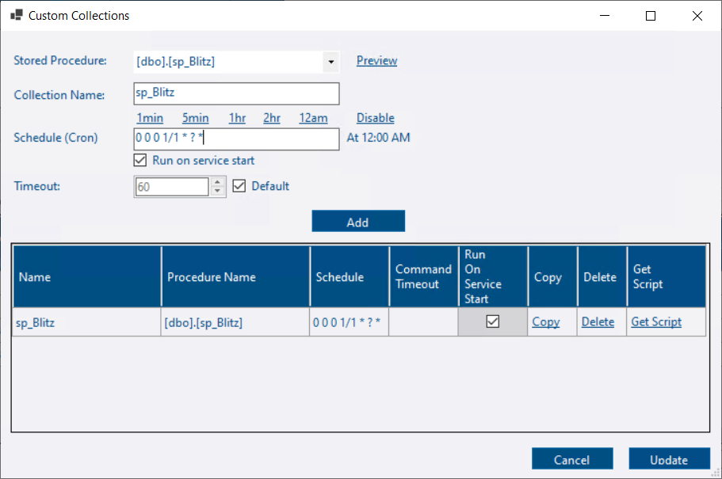
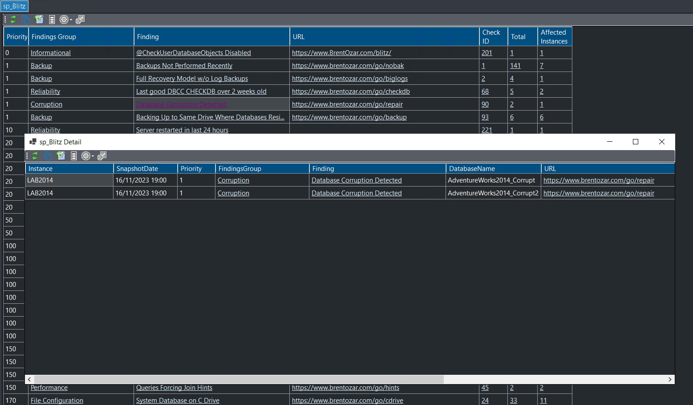

<iframe width="560" height="315" src="https://www.youtube.com/embed/0gebFSyS6_k?si=dPriURKKBtHAt7C_" title="YouTube video player" frameborder="0" allow="accelerometer; autoplay; clipboard-write; encrypted-media; gyroscope; picture-in-picture; web-share" allowfullscreen></iframe>

## What are custom collections?

Custom collections are where you can capture any data from your monitored instances and store it in custom user tables in the repository database.  DBA Dash will take care of the scheduling for your collection and provide you with a script that you can tweak to handle the data import and storage of collected data.  DBA Dash can also take care of the data retention, using partition switching to efficiently remove old data.  DBA Dash will also create some sample [custom reports](/docs/how-to/create-custom-reports/) to display the collected data in the application.

Depending on what the requirements are for your collection you might be able to use the provided scripts as is or you can tweak them to your own requirements.

Do you want to collect a custom metric?  Use [this feature](/docs/help/os-performance-counters/) instead.

Do you want a custom check for the summary dashboard?  Use [this feature](/docs/help/custom-checks/) instead.

## Prerequisites


It's crucial to ensure that a custom data collection doesn't inadvertently become the source of performance degradation on your monitored instances.

Ensure that the collection query is lightweight and runs on an appropriate schedule to minimize it's impact.

To limit the impact on the repository database, reduce the volume of data collected, the frequency of collection and set an appropriate retention.


* Create a stored procedure that will return the data for you custom collection.

This could be your own script or a community script.  You must be able to execute it without any parameters.  If you need to supply parameter values either create a new stored procedure that executes the script with the required values or set parameter default values for the stored procedure.


DBA Dash will try to execute the stored procedure in whatever default database is specified on your monitored instances.  Typically this will be **master**, but you can adjust the default database in the Source tab of the service configuration tool if required.



Custom collections are currently limited to running a stored procedure with no parameters.  This provides a degree of extra security as it prevents someone with access to edit your config file from running any adhoc SQL.  This only provides limited protection as someone with access to write to the service folder could potentially exploit that to elevate their permissions.

⚠️See the [security document](/docs/help/security) for information on how to protect your config file and for other security related advice.



* Grant the account that runs the DBA Dash service EXECUTE permission on the stored procedure.

## Setup

Custom collections are configured using the service configuration tool.

#### ALL Instances

* Click the **Custom Collections** button on the **Options** tab to configure a custom collection for ALL monitored instances.
* You will be prompted to connect to a SQL instance which will default to one of your existing source connections.  Edit the connection details (if required) and click connect.
*The connection is used for the stored procedure list, the preview button and to get the schema for your collection when you click the **Get Script** button.  Once created, the collection will apply to ALL instances.*
* Goto [next steps](#next-steps)

#### Specific Instance

* Go to the Source tab.
* Find your instance in the grid.
* Click the **View/Edit** link in the **Custom Collections** column.
* Goto [next steps](#next-steps)

#### New instance

* On the source tab, click **Custom Collections** button on the **Other** tab before adding the instance
OR
* Copy an existing connection that already has the custom collections defined using the **Copy** link in the **Copy Connection** column.
* * Goto [next steps](#next-steps)

#### Next steps

* Select a stored procedure from the drop down.  You can click the **Preview** button to test.
* The collection name is set based on the procedure name.  Each collection needs a unique name - You can edit this if required.
*The collection name is used to determine the name of the stored procedure that will handle the data import and the names of other objects related to the collection*
* Set a cron schedule.  Use the links for some examples.  This either needs to be a duration in seconds or a Quartz compatible cron expression. [See here](/docs/help/schedule/#cron-expressions)
* Set the **run on service start** and override the **default timeout** if required.
* Click **Add**
* Click the **Get Script** button.
* Set a value for data retention.
*Note: If you set a value of 0, partitioning won't be used and the previous collection will be replaced instead of maintaining multiple snapshots.*
* The script is copied to the clipboard.
* Review the generated script, edit it as required and run it against the DBA Dash repository database.
* Click the **Update** button.
* Click **Save** to save the configuration changes.
* Restart the service to apply the new configuration changes.
* The sample reports will appear the next time you load the GUI and will be populated with data when the collection runs.

#### Disable a collection

If you setup a custom collection for ALL instances and want to disable it for a specific instance:

* Open the custom collections for ALL instances.  Click the **Copy** link for the collection you want to disable.  (This just saves the procedure and collection name for us.  You can enter manually instead if you prefer)
* On the source tab, click the **View/Edit** button in the **Custom Collections** column for the instance.  💡Tip: Use the search feature to find your instance.
* The stored procedure and collection name should be set.  Click the **Disable** link to remove the schedule.
* Click **Add**
* Click **Update**

The collection defined at the instance level will override the server level options for the collection.  No schedule is defined so the collection will be disabled.

## Inspiration

[sp_Blitz](https://www.brentozar.com/blitz/) is a popular community health check script for your SQL instances.  There is some overlap with checks provided by DBA Dash, but sp_Blitz has additional checks.  sp_Blitz provides it's information in a single report with links that provide advice on each check. DBA Dash is more suited to support your daily DBA checks and sp_Blitz is ideal to run when setting up a new server, working on a SQL instance for the first time and to run occasionally for SQL instances.

Capturing sp_Blitz for all your SQL instances is just a case of following the steps above.  You can probably set the retention to 0, but the option is available to keep previous snapshots if you prefer.  The default reports are OK but with a bit of work you can have a summary dashboard with drill down links like this:

For sp_Blitz you can setup initially using the steps above and replace the reports with the [customized versions from here](https://github.com/trimble-oss/dba-dash/discussions/768)


sp_Blitz requires **sysadmin** permissions to run. See the [Security section in the discussion post](https://github.com/trimble-oss/dba-dash/discussions/768) for a workaround to run with minimal permissions.


You can find more [custom report examples here](https://github.com/trimble-oss/dba-dash/discussions?discussions_q=label%3A%22Custom+Report%22) and also post your own custom collection and report examples.

