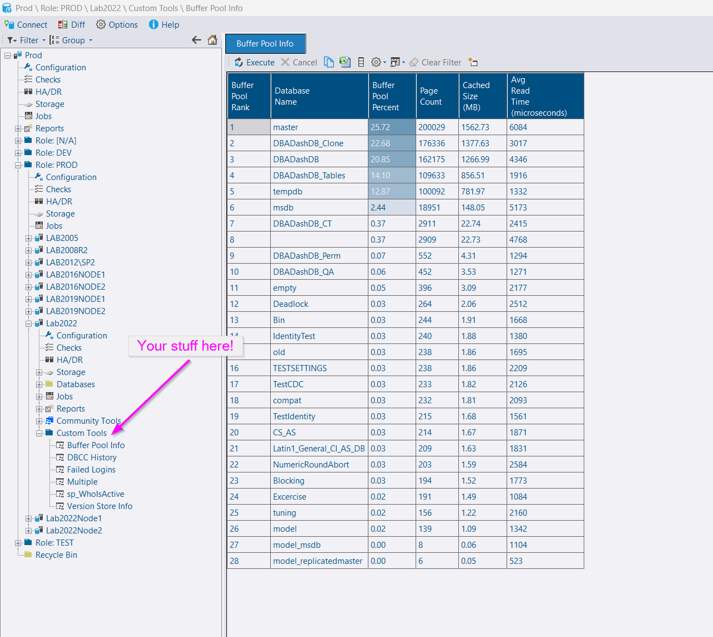

## Intro

You can now have your own stored procedures listed under the custom tools section of the tree in DBA Dash.  These procedures are run directly on your monitored instances via the [Messaging](/docs/help/messaging) feature.

This opens up a lot of possibilities from running your own diagnostic scripts to returning the contents of a queue or log table used by your application.

## Setup

* Create a stored procedure in the database that DBA Dash connects to (usually master unless you specified an initial catalog when adding the source connection)
* Add the name of the proc to *Allowed Custom stored Procedures* on the Messaging tab in the service config tool.  This is a comma-separated list.
* Ensure *Enable Communication* is also checked on the Messaging tab.
* Add users to the *Messaging* and *CustomTools* roles in the repository database to allow access.  *db_owner* has access by default.
* Refresh or re-load the GUI.
* The stored procedure is listed under the Custom Tools folder in the GUI.
* Customize using the DBA Dash GUI if required.

## Database Level

Custom tools are expected to be instance level.  If you want a tool to be available at database level, add a parameter to the stored procedure that will take the database name as input.  Any of these names can be used:

`@DB, @DBName, @DatabaseName, @Database, @database_name, db_name`

The application will automatically pass the database name to the stored procedure based on the context in the tree.  Your stored procedure needs to return the data for the associated database.  This might require dynamic SQL to change the database context and run your query.  Use the `QUOTENAME` function to build safe dynamic SQL and pass parameters where possible.

## Security

An important security consideration is that the stored procedure is executed under the context of the DBA Dash service account.  Users with *appropriate* access to the repository database can execute the defined stored procedures irrespective of their access to the monitored instances.

* Only stored procedures defined as allowed in the config tool can be run.
* Only stored procedures deployed to your monitored instances can be run.
* Only stored procedures the service account has *permission* to run can be executed.
* Only users with access to the Messaging schema in the repository can trigger anything to be executed on your monitored instances, including custom tools.  (This can be granted via the Messaging role. db_owner will also have access)
* Users also require membership of the CustomTools or db_owner roles to trigger stored procedure execution.  This is an application level restriction.

#### Best practices:

* Secure access to the service configuration.
* Encrypt the service config file
* Grant only the required level of access to the service account
* Secure access to the repository database.
* Only add trusted users to the *Messaging* role or *db_owner* role.
* Use the *AppReadOnly* role to grant limited access to the repository database.
