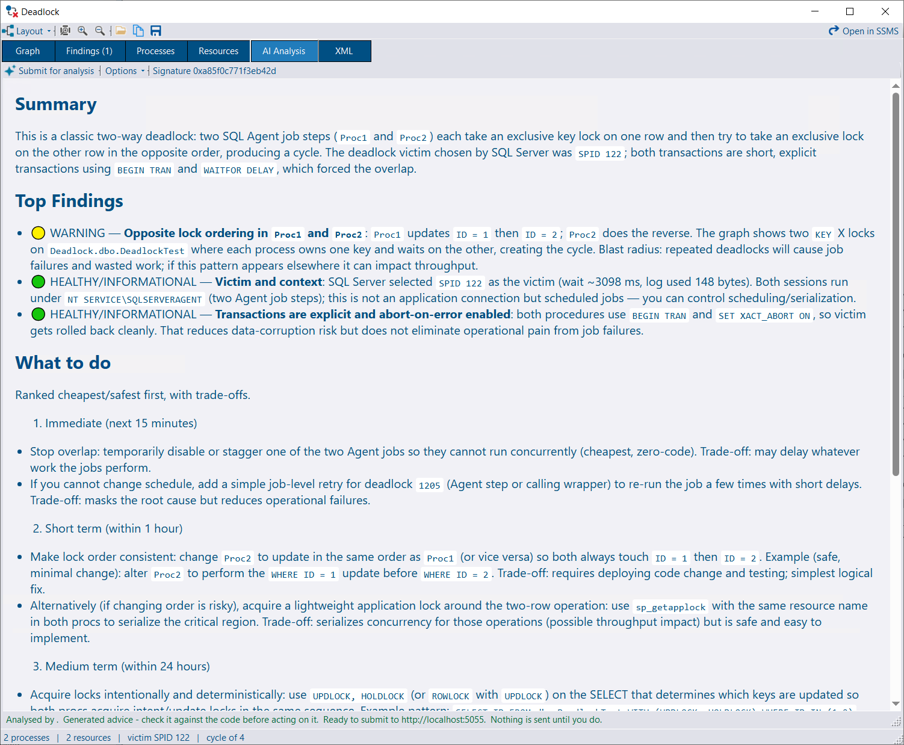


Deadlock collection is available in DBA Dash starting from 4.18.0.


DBA Dash captures deadlock graphs from an extended events session on each monitored instance, shreds them into the repository database, and groups recurrences together so that a deadlock happening two hundred times reads as one problem rather than two hundred incidents.

The Deadlocks collection is scheduled to run every 5 minutes by default, but it doesn't collect anything until you choose a capture option for each monitored instance.

## Requirements

* SQL Server 2012 or later. Extended events must be supported for the connection - on Amazon RDS this means Standard or Enterprise edition.
* Azure SQL Database is supported (a database scoped session is used). The Azure `master` database is excluded - it has no user workload to deadlock and can't hold a database scoped session.
* Azure SQL Managed Instance is supported.

### Permissions

| Capture option | Permission required on the monitored instance |
|---|---|
| Dedicated system managed session | `ALTER ANY EVENT SESSION` (the same permission slow query capture already needs), plus `VIEW SERVER STATE` |
| `system_health` | `VIEW SERVER STATE` |
| Existing session | `VIEW SERVER STATE` |

DBA Dash only ever creates, alters, resizes or flushes the session it owns (`DBADash_Deadlocks`). Any other session - including `system_health` - is read and left alone. It is never started, stopped or modified.

See the [security](/docs/help/security) document and the [permissions helper](/docs/help/permissions-helper) in the service config tool.

## Configuring

Deadlock capture is controlled by a single setting: **the name of the extended events session to read**. A blank name disables the collection. There is no separate on/off switch to get out of step with it.

### Capture options

| Option | Session name written to the config | Notes |
|---|---|---|
| **Disable Capture** | *(blank)* | The default. The collection doesn't run whatever its schedule says. |
| **Dedicated System Managed Session** | `DBADash_Deadlocks` | **Recommended.** DBA Dash creates and starts the session itself and reads only it. |
| **Use system health** | `system_health` | Nothing to deploy, read only, and it already contains recent deadlocks - but less efficient to read because unrelated events must be processed. Not available on Azure SQL Database. |
| **Use existing session** | *your session name* | A session you already run. Read only - if it isn't running that is reported as an error rather than started. Ideally it should contain only the `sqlserver.xml_deadlock_report` event. |


Prefer the **dedicated system managed session**. Each collection only reads events that are new since the last run, but `system_health` captures many other kinds of event besides deadlocks, and all of them have to be read and filtered out to find the deadlock reports. A session containing nothing but deadlock reports has nothing else to process, so reading it is much cheaper on **every** collection.

What a dedicated session gives up is history - it starts empty. The **Backfill history from system health** option covers that; see [Backfill](#backfill-from-system_health) below.


### New connections

* In the **Service Configuration** tool, click the **Deadlocks** tab under the **Source** tab before adding the connection.
* Select the capture option you want.
* Leave **Backfill history from system health** checked unless you don't want historical deadlocks.
* Click **Add/Update**.

### Existing connections

There are two ways to configure instances you have already added:

* Edit the **Deadlock XE Session** column in the existing connections grid. Set it to `DBADash_Deadlocks` (recommended), `system_health`, or your own session name. Clear it to disable capture. The **Backfill Deadlocks** column controls the backfill.
* Or select the option you want on the **Deadlocks** tab and click **Apply deadlock configuration to all existing connections**.


Applying `system_health` to all connections skips Azure SQL Database instances - there is no `system_health` session there. Any instance whose platform can't be determined at the time is skipped and reported rather than being assigned a session that might not exist.


### Schedule

The Deadlocks collection runs **every 5 minutes** by default. No schedule change is needed - choosing a capture option is all it takes to start collecting.

The schedule can be adjusted like any other collection:

* For all instances, with the **Schedule** button.
* Per instance, from the connections grid.

If the Deadlocks schedule has been cleared (for the service or for the connection), the config tool warns when you enable capture and offers to restore the default 5 minute schedule - a session with no schedule would collect nothing.

See [Schedule](/docs/help/schedule) for cron expression syntax.

### Backfill from system_health

A dedicated session starts empty. With **Backfill history from system health** enabled (the default), DBA Dash reads `system_health` **once**, after the first Deadlocks run for that connection, to pick up deadlocks from before the session was created.

* It keeps only deadlocks older than the configured session's start, so the two cover the time between them without a gap and without storing the same deadlock twice.
* It runs as a low priority background work item, so a batch of newly enabled instances can't take every collection worker.
* "First run" means there is no entry for the connection in the service's `DeadlockCursors.json`, where the backfill is recorded as pending until it has run. A service restart before it runs doesn't lose it. Losing that file repeats the backfill once - the repository deduplicates what comes back.
* It doesn't apply where there is nothing to backfill from: the option is off, capture is disabled, the configured session is already `system_health`, or the instance is Azure SQL Database.

### Service level settings

These are set in `ServiceConfig.json` (see [Config File](/docs/help/config-file)) and apply to the whole service rather than to one connection:

| Setting | Default | Description |
|---|---|---|
| `DeadlockXERingBufferKB` | `1024` | Size of the ring buffer on the session DBA Dash creates. Only affects Azure SQL Database and Azure SQL Managed Instance, which are the platforms where the managed session uses a ring buffer target. Clamped to 64-4096. |
| `DeadlockBackfillTimeLimitSeconds` | `300` | How long the one-off `system_health` backfill may run before it stops and keeps what it has read. `0` means no limit. |

The collection's query timeout can be raised in `commandTimeouts.json` like any other collection - see [Query Timeout](/docs/help/query-timeout). This matters most for the first run against a session, which has no cursor yet and reads everything the session holds.


1MB is the largest ring buffer SQL Server recommends. Above that the target's data can come back truncated, and truncated XML doesn't parse - so the whole read is lost rather than part of it. DBA Dash warns when it sees a truncated buffer. A deadlock graph is only a few KB, so 1MB still holds hundreds of them.


### Flush ring buffer (advanced)

`FlushDeadlockXERingBuffer` empties the deadlock session's ring buffer after each collection by stopping and starting the session. It is **off** by default and only ever applies to the session DBA Dash owns, and only when that session uses a ring buffer target (Azure SQL Database and Managed Instance).

A ring buffer read costs what the buffer *holds* rather than what is *new* in it - roughly half a second for a full buffer against about thirty milliseconds for an empty one, on every collection. On a database that deadlocks steadily the buffer stays full, so every run pays the full cost to return data that has mostly already been stored.

The trade-off is that a deadlock which has fired but is still in the session's memory buffer when the session stops is lost. The window is the session's dispatch latency, which the managed session deliberately keeps short (3 seconds). A flush only happens when the buffer had something in it, so an idle database is never stopped and started at all.

## How collection works

### The session DBA Dash creates

When the managed session is selected, DBA Dash creates `DBADash_Deadlocks` on first use if it isn't already there, and starts it if it exists but is stopped:

| Platform | Scope | Event | Target |
|---|---|---|---|
| SQL Server / Amazon RDS | Server | `sqlserver.xml_deadlock_report` | `event_file` - 4 files of 10MB in the instance's own log directory, next to `system_health`'s |
| Azure SQL Database | Database | `sqlserver.database_xml_deadlock_report` | `ring_buffer` |
| Azure SQL Managed Instance | Server | `sqlserver.xml_deadlock_report` | `ring_buffer` |

The session is created with `STARTUP_STATE=ON` so it survives an instance restart.

Azure uses a ring buffer because an `event_file` target there has to be written to blob storage, which would need a storage container and a credential that DBA Dash would have to be given. The ring buffer needs nothing. What it gives up is persistence - the buffer is emptied when the session stops, which includes a failover - so a deadlock is only collected if a collection runs before the next restart. With the default 5 minute schedule that window is small, and the repository is the archive.

The on-premises files are deliberately small. They exist to bridge a service outage, not to be an archive.

### Reading

* Each run resumes from a cursor held by the service (`DeadlockCursors.json`), so a read costs what is *new* rather than what the file set holds. The cursor is only advanced once the data has been written, so a failed write is re-read rather than lost.
* Events are read in batches (up to 20,000 events, up to 100 batches per run). A very large first read is bounded - the next run picks up where the previous one stopped rather than starting over.
* Reads are **read only**. Neither target is flushed and the session is never stopped or started, except for the managed session when the flush option is explicitly enabled.
* Both the server scoped and database scoped event names are accepted on both paths, so a session containing either is read correctly.

### What is stored

Each deadlock is shredded into four tables in the repository:

| Table | Contents |
|---|---|
| `dbo.Deadlocks` | One row per deadlock - event time, signature, process/victim/resource counts, parallel flag |
| `dbo.DeadlockProcesses` | One row per process involved, with application, database, login, host, procedure, statement, isolation level, wait details |
| `dbo.DeadlockResources` | One row per contended resource, with object, index, lock mode, owners and waiters |
| `dbo.DeadlockXml` | The original deadlock graph, gzip compressed |

The graph is stored separately so it can carry a shorter retention than the shredded rows - a graph runs to several KB, and a parallel deadlock over a large table can run to hundreds.

### Deduplication

Every deadlock carries a `DeadlockHash` - a hash of the graph XML with whitespace normalised but every attribute value kept. It forms part of the primary key of all four tables, so re-reading the same deadlock is harmless by construction. That covers overlapping polls, a cursor reset after a service restart, a switch of capture source, and the `system_health` backfill overlapping the dedicated session.

## Deadlock signatures

A signature is a stable identifier for the **shape** of a deadlock, serving a similar purpose to `query_hash` for queries. Two deadlocks share a signature when the same code deadlocks over the same objects in the same way.

**Included:** the modules or statements involved (literals stripped, so the same statement against different rows still groups), the objects and indexes contended, the lock modes, the isolation levels, and which process was the victim.

**Excluded:** everything that varies between occurrences of one problem - spids, transaction ids, timestamps, hosts, logins, wait times, hobt ids, lock ids, and the literal values in the statements.

The signature is what the reports group by, and what an AI analysis is cached against - the answer to "why does this deadlock" is the same answer every time it recurs.


**Signature versions.** The signature version is stored with each deadlock so that a change to how signatures are computed is visible rather than silently regrouping history. When DBA Dash is upgraded and the version changes, the service recomputes signatures for stored deadlocks in the background as a low priority work item (in batches, every 10 minutes) until there is nothing left to do, then stops. Stored AI analyses are recomputed from their own graphs at the same time, so an answer follows the deadlock it was actually about. Deadlocks older than the graph retention are skipped - there is no graph left to recompute from.


You can see exactly what a signature was computed from with the **Signature** button in the deadlock viewer.

## Reports

A **Deadlocks** folder appears in the tree under each monitored instance, containing two reports.

### Deadlock Charts

Deadlock counts over time, with pie charts breaking the total down by signature, application, database, login, host or procedure. This gives a high level view of where to focus. Every chart supports drill-down into the detail.

Toolbar options:

* **Processes** - *All involved* or *Victims only*. This selects which processes are counted and listed; it does not select deadlocks, since every deadlock has a victim.
* **Slices** - how many slices the pie charts show.

### Deadlocks

The same detail for the selected time period, in four results:

1. **Signatures** - deadlocks grouped by signature, with occurrence and victim counts, first and last seen, the objects and procedures involved, whether it's a parallel deadlock, and whether an AI analysis already exists. Clicking the occurrence count narrows every other result to that one pattern.
2. **Grouped** - counts by the dimension selected in the **Group By** picker (Application, Database, Login, Host or Procedure - Application by default). Clicking a count filters to that value.
3. **Deadlocks** - the individual deadlock events.
4. **Participants** - a row per process involved in each deadlock, unless **Victims only** is selected in the **Processes** picker.

Clicking the **Graph** link in results 3 and 4 opens the deadlock viewer.

The report opens on the signature summary deliberately: *"what deadlocks do we have"* is a more useful first question than *"what deadlocked at 14:07"*.


The **Trigger Collection** button on the toolbar runs the Deadlocks collection once, on demand. On an instance that isn't configured for deadlock capture at all, this reads that instance's `system_health` session - read only, nothing is created or altered - and what it finds is stored and reported like any other deadlock. It's the quickest way to look at an instance's recent deadlocks without configuring collection first.

Triggering a collection requires the [messaging](/docs/help/messaging) feature to be configured.


### Performance tab

The existing deadlock count on the Performance tab (derived from the `Locks\Number of Deadlocks/sec\_Total` performance counter) and the `sp_BlitzLock` drill-down remain available. With native collection enabled, `sp_BlitzLock` is no longer required.

## Deadlock Viewer

The viewer visualises the deadlock and lets you inspect the relationships between its processes and resources. It opens from the **Graph** link in the reports, and from **Tools > Open Deadlock Graph | \*.xdl** for a graph saved from SSMS, the `system_health` session or the viewer itself.

### Layout

Two layouts, chosen from the **Layout** menu and remembered for next time:

* **Ring** - the cycle drawn as a ring, with anything outside it beside the node it hangs off. Makes a two or three way cycle recognisable at a glance.
* **Columns** - left to right from the victim, the way SSMS draws a deadlock. Copes better with a graph carrying processes around the cycle.

### Interaction

* Drag objects to rearrange the graph, as in SSMS. **Reset Layout** puts them back.
* Click an object to highlight the resources it **owns** and the resources it **wants** - particularly useful on complex graphs.
* The victim process is drawn in its own colour.
* Statements are shown on the chart, with a link to load the full statement text in a code viewer.
* Rich tooltips give the detail there isn't room for on the node itself.

Right-click a node for **View Statement**, **Copy Statement**, **Copy SPID**, **Copy Object Name**, **Copy Details**, **Show in Processes Grid** / **Show in Resources Grid**, and - where the source instance is known and [messaging](/docs/help/messaging) is configured - **Plans** and **Query Store**.

Toolbar: zoom in/out, **Fit**, **Open...** (another `.xdl`), **Copy Image**, **Save As...**, **Signature**, and **Open in SSMS** (hands the graph to whatever handles `.xdl` files). Where the source file contained more than one deadlock - common for a `.xdl` saved from `system_health` - a **Deadlock** selector appears.

### Tabs

| Tab | Contents |
|---|---|
| **Graph** | The visualisation |
| **Processes** | The parsed process list - login, application, host, database, isolation level, statement, wait details. The **Plans** link opens the plans cached on the instance for that statement, with their execution stats |
| **Resources** | The parsed resource list - object, index, lock mode, owners and waiters |
| **Findings** | Static analysis of the graph. The caption carries the finding count |
| **AI Analysis** | Optional AI-driven analysis |
| **XML** | The original deadlock graph |


A deadlock graph identifies its statements by SQL handle - the handle of the whole batch or module - so there is rarely exactly one plan behind it. The **Plans** panel lists all of them; the row matching the graph's statement offset is flagged and sorted to the top. Plan XML is collected on demand through the same path the running queries screen uses, and lands in the repository on the way past.


## Findings (static analysis)

The **Findings** tab analyses the deadlock XML directly - no AI service required, nothing leaves your environment. Findings are ranked with warnings first, then advice, then information.

Examples of what it detects:

* **Lock conversion deadlock** - a lock upgrade, typically from shared to update or exclusive
* **Objects locked in opposite order** - the classic ordering deadlock
* **Key lookup deadlock** - a read taking a key lookup against a write updating both index and base table
* **Parallel (intra-query) deadlock** - a query deadlocking with itself across threads
* **A cycle of N processes**
* **Both sides are running the same module**
* **A reader is holding up a writer**
* **Running under a stricter isolation level**
* **A whole table is locked**
* **A heap is involved**
* **Application locks are involved**
* **Deadlock priority was set**
* **The victim had a lot to roll back**
* Capture quality warnings - **The capture is incomplete**, **No complete cycle in the graph**, **No victim is named**, **More than one victim**

## AI Analysis

With the [AI Assistant](/docs/help/ai-assistant) service configured, the **AI Analysis** tab can send a deadlock for detailed observations and recommendations.


Nothing is sent until you press **Submit for analysis**. The panel above the button is not a description of what will be sent - it *is* the payload, rendered by the same object that is serialised, so the two can't drift.

**Read it before pressing send.** A deadlock graph carries the statements as they ran, and those routinely include parameter values.


### Options

* **Show request** - toggles the request preview back into view after an answer has arrived.
* **Include schema** - adds the definitions of the objects the deadlock touched, taken from the repository's [schema snapshots](/docs/help/schema-snapshots) **as they were when the deadlock happened**. That point-in-time part is what makes it worth including: the procedure may have been changed twice since, and the definition that explains the deadlock is the one from before those changes. Best effort - snapshots are optional, the deadlock may predate the first one, and objects get dropped, so an empty result is an ordinary answer. Definitions are truncated to keep the payload a sensible size.

### Caching and history

Every answer is kept, and looked up by pattern as well as by occurrence:

* An answer about this exact deadlock (matched on the deadlock hash) is shown first.
* Otherwise the newest answer about its **signature** is shown - so you don't pay for the same answer twice without meaning to.
* Everything else is a click away under **Previous analyses**, newest first.

Answers are never replaced. Two runs of one model over one graph rarely say the same thing, and asking again is often a search for a better answer rather than a correction of a wrong one. Analyses are only ever created by someone pressing the button, so the table stays small.

The **Analysed** column on the Signatures report shows which patterns already have an answer.

## Data retention

Default retention for the deadlock tables:

| Table | Default retention |
|---|---|
| `dbo.Deadlocks` | 365 days |
| `dbo.DeadlockProcesses` | 365 days |
| `dbo.DeadlockResources` | 365 days |
| `dbo.DeadlockXml` | 90 days |

The graph carries a shorter retention than the shredded rows on purpose: keeping trend and grouping for a year costs little, keeping every graph for a year does not. After the graph is purged the deadlock still counts, groups and reports - only the viewer has nothing to open.

Adjust these under **Options > Data Retention** in the GUI. See [Data Retention](/docs/help/data-retention).

## Troubleshooting

**"Enable the Deadlocks collection in the service config tool to see data here."**
The Deadlocks collection has never run for the instance(s) in scope. Check that a capture option is selected for the connection, and that the Deadlocks schedule hasn't been cleared. Use **Trigger Collection** to read `system_health` once in the meantime.

**"Extended events session '\<name>' is not running."**
Deadlock collection reads the session but never starts one it doesn't own. Start the session on the instance (or on the database, for Azure SQL Database), or point the collection at a session that is running.

**Collection fails with a permissions error.**
The managed session needs `ALTER ANY EVENT SESSION` to be created and started. Either grant it, or switch to `system_health` / an existing session, which need only `VIEW SERVER STATE`.

**The first collection is slow or times out.**
The first run against a session has no cursor to resume from, so it reads everything the session holds. For `system_health` that includes all the unrelated events it captures, which can be slow. Raise the Deadlocks collection timeout in `commandTimeouts.json` ([Query Timeout](/docs/help/query-timeout)). A read that times out never advances the cursor, so it will otherwise time out on every subsequent run too.

**No deadlocks appear after enabling a dedicated session.**
A new session starts empty and captures from that point forward. Historical deadlocks come from the `system_health` backfill - check **Backfill Deadlocks** is enabled for the connection.

**Deadlocks are missing on Azure SQL Database.**
The ring buffer is emptied when the session stops, which includes a failover. A deadlock is only collected if a collection runs before the next restart. Make sure the Deadlocks collection is scheduled frequently enough, and consider increasing `DeadlockXERingBufferKB` if the service has been offline.
