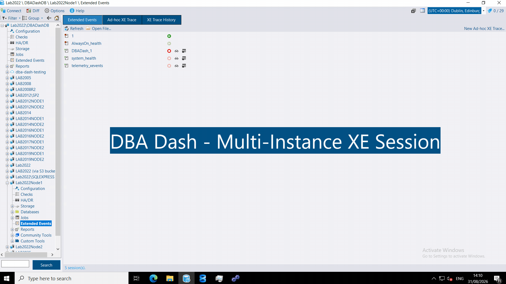
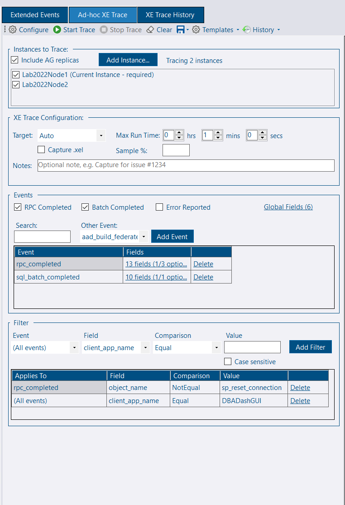
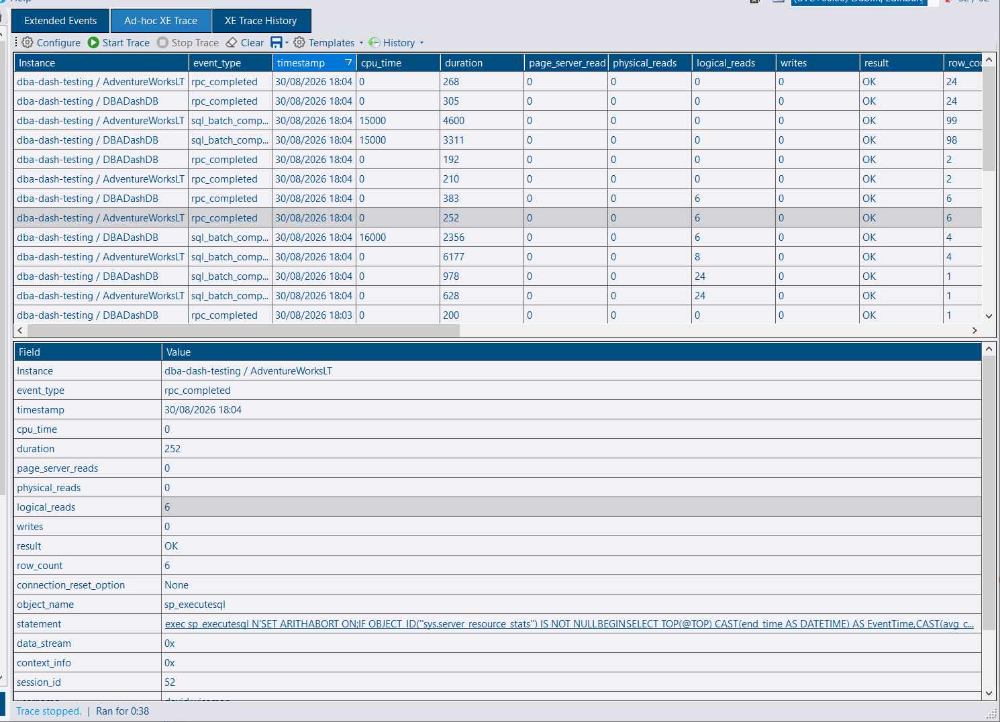
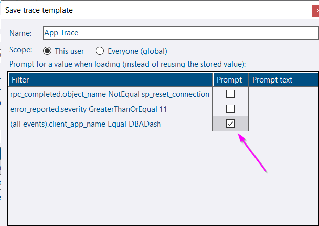
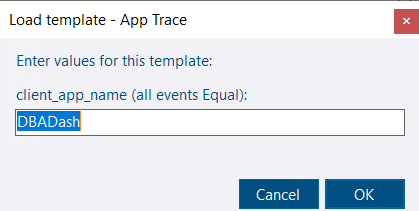
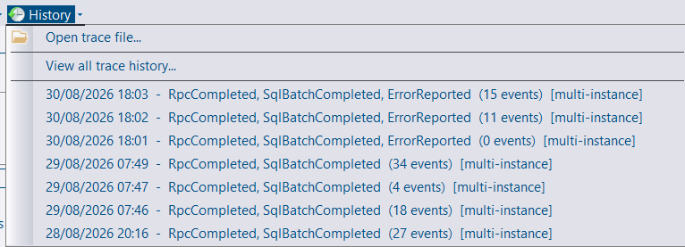
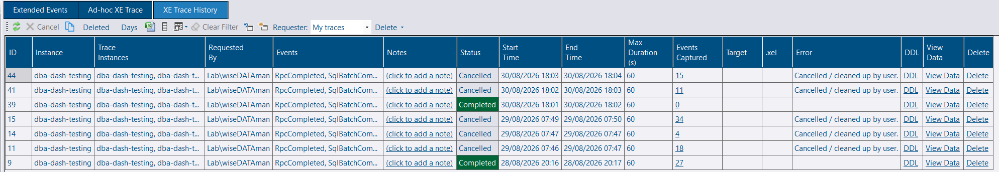
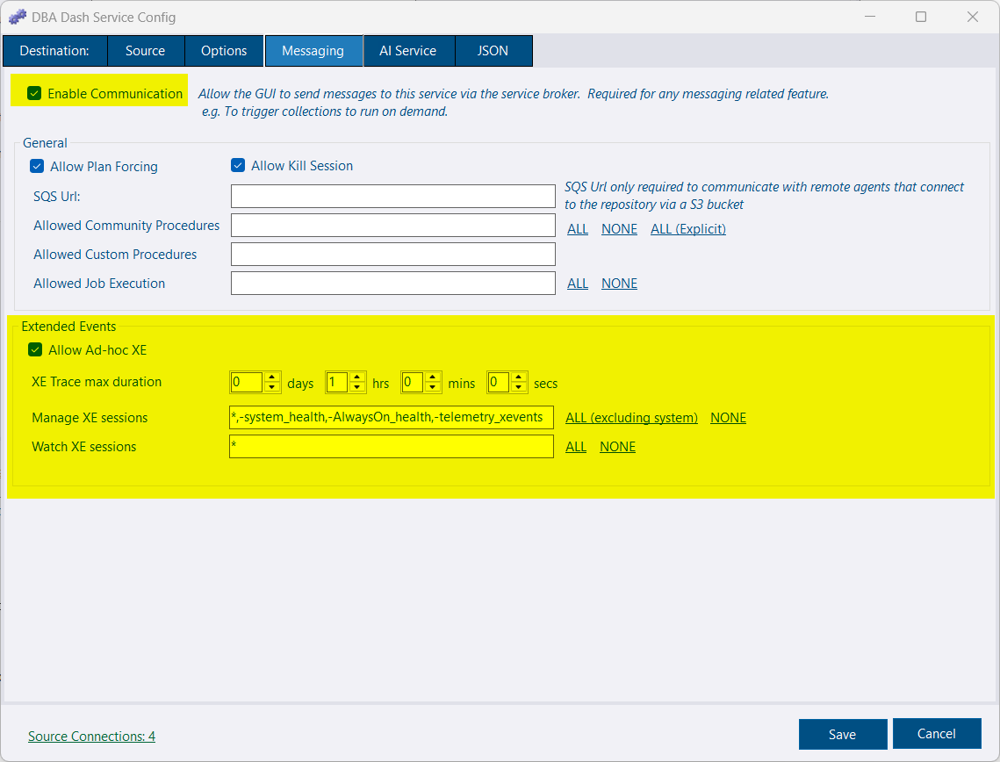

## Extended Events

This page explains how to run, save, and manage ad‑hoc Extended Events (XE) traces in DBA Dash. It covers multi‑instance tracing, templates, history, export options, and the required configuration and repository security.

### Demo

### Running an ad‑hoc trace (XE session)

1) Instances to trace

Select the instance(s) you want to trace. If you open the "Extended Events" node under a specific SQL instance, that instance is preselected. From the root you can add instances using the **Add Instance** button.


DBA Dash can trace multiple SQL instances simultaneously and present a combined result set. This is useful when tracing activity across an Availability Group (primary + replicas) or multiple Azure databases.


2) Trace configuration

Adjust the trace duration and any other properties. The default duration is 1 minute — increase or decrease as needed.

3) Events

Select which events to capture. Common events are provided as shortcuts:

- `rpc_completed` (RPC Completed)
	- Selecting this automatically filters out `sp_reset_connection` (connection pool resets). Remove the filter if you need those events.
- `sql_batch_completed` (Batch Completed)
- `error_reported` (Error Reported)
	- Selecting this automatically adds a filter for `severity >= 11` to remove informational messages. Remove or edit the filter if you wish to capture other severities.

Use the event dropdown to browse the full event list; use the search box to filter a large list. You can also select global and event-specific fields from the grid link.


Client activity typically appears as either `rpc_completed` or `sql_batch_completed` events.


4) Filters

Apply filters to limit collected events to the subset you care about:

- Choose an event (or select "(All events)")
- Select a field (event fields are marked with an asterisk)
- Choose a comparison operator
- Enter the filter value

Duration and `cpu_time` filters accept values in milliseconds (ms) by default for convenience; you can switch to microseconds, seconds, or minutes as needed.

Start the trace by clicking "Start Trace" and wait for the results to appear.

*Screenshot shows events collected from two Azure DBs.*

### Templates

Templates let you save and reload an XE configuration quickly.

You can define template parameters so the UI prompts for values when loading a template (for example, application name or `session_id`).

### History

The History menu provides quick access to recent traces for the current context.

The XE Trace History tab shows details for traces you ran, with actions to view data, delete traces, or copy the generated `CREATE EVENT SESSION` script. By default you can see only your own traces unless you are `db_owner` on the repository database.

Traces are retained for 30 days by default; retention is configurable in the data retention settings (XETraceEvent, XETraceSession tables).

Traces can be exported to disk in JSON or XML formats (compressed and uncompressed). Exported traces can be reloaded using the "Open Trace file..." option in the History menu.


Native `.xel` export is only supported when the "Capture .xel" option is enabled when creating the trace.


### Configuration and security

XE sessions are triggered from the GUI via the [messaging](/docs/help/messaging) feature. Sessions are created and managed under the DBA Dash service account. The Extended Events functionality is disabled by default and must be enabled in the Service Configuration tool (Messaging tab). Access is then controlled via repository database role membership.

#### Enable the feature

To enable Extended Events:

- Open the Messaging tab in the Service Configuration tool
- Ensure **Enable Communication** is checked
- Check **Allow Ad-hoc XE** to permit creating ad‑hoc XE traces
- Set an appropriate XE Trace maximum duration (client-side durations will be capped at this value)
- Configure **Manage XE sessions** to control which existing sessions may be started/stopped. This is a comma‑separated list of session names. Use `*` to allow all sessions and prefix a session with `-` to exclude it (for example: `*,-system_health,-AlwaysOn_health,-telemetry_xevents`)
- Configure **Watch XE sessions** to control which sessions can be viewed (blank = none, `*` = all)
- Save and restart the service for changes to take effect

#### Repository DB security

Only users with the appropriate roles in the repository database can run ad‑hoc XE sessions or manage/watch existing sessions.

- `db_owner` (or `sysadmin`) — access by default

Other users require:

- Membership in the **Messaging** role (required for all messaging access)
- Plus one or more of the application-level roles below:
	- `AdhocXE` — allows running ad‑hoc XE sessions
	- `WatchXE` — allows watching and viewing data for XE sessions
	- `ManageXE` — allows starting/stopping existing XE sessions


The application-level roles above are enforced by the application (a soft boundary). The **Messaging** role provides a stronger (hard) boundary; users without **Messaging** (or permissions that the role grants) cannot access messaging features in or outside of the application.



The service configuration must be enabled before any user can use Extended Events, regardless of repository role membership.

