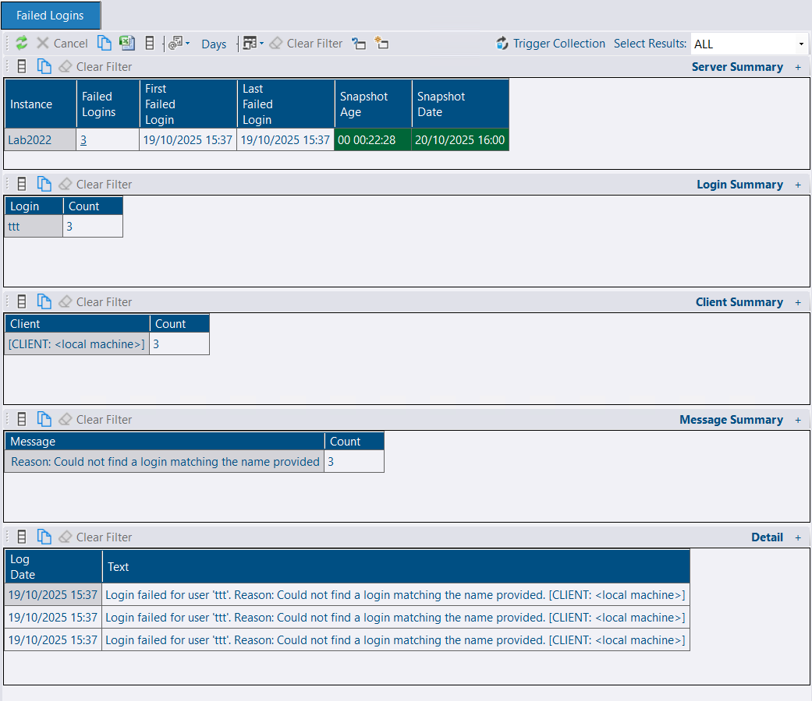

## Check Overhead

Before enabling the failed logins collection and deciding on a schedule, you should assess the impact of the collection on your monitored instances.

The overhead of collecting failed logins will vary depending on various factors, including the quantity of failed logins and overall data in the error log. The error log collection is likely to complete within a few hundred milliseconds, but you might want to test it for your own environment. You can run the [collection script](https://raw.githubusercontent.com/Trimble-OSS/dba-dash/refs/heads/main/DBADash/SQL/SQLFailedLogins.sql) manually to test the overhead.

Cycling the error log frequently (e.g., daily) by running `sp_cycle_errorlog` is likely to make this collection more efficient. This practice can also improve the usability of the error log. You will often want to increase the number of error log files retained in conjunction with scheduling a SQL Agent job to run `sp_cycle_errorlog`. SQL Server restarts will also cause the error log to be recycled. Trace flag 3226 can also be a good way to reduce noise in the error log by removing successful backup messages.

## Schedule

This collection is **disabled** by default. When enabled, it will return failed logins from the SQL Server error log with a default backfill of **24 hours**. The collection should be scheduled to run more frequently than the backfill period. For example, an **hourly** collection schedule might be appropriate, which can be specified as `0 0 * ? * *` in the [Schedule](/docs/help/schedule) section of the config tool.

## Backfill

Failed logins greater than the backfill period are returned on each collection and skipped on import if they are already imported. The default backfill aims to strike a balance that will work for most people. If you plan to run the collection more frequently, you could reduce the backfill, which will limit the data collected if you expect a large number of failed logins. Alternatively, you might want to temporarily increase it to have more data available when you enable this feature or add a new instance.

To adjust the backfill, edit the JSON on the Json tab of the service config tool to include this:

```json
{
  "FailedLoginsBackfillMinutes": 60
}
```

**Note:** If you are increasing the backfill to import more data, this might not work if data has already been collected. Only data newer than the last failed login collected is imported. You could clear out existing data using:

```sql
DELETE dbo.FailedLogins
WHERE InstanceID = ?
```

The collection script loops through each of the error logs, skipping any older than the date calculated from the backfill period.

## Reporting in the GUI

The failed logins report is available under the Reports node in the tree. It's available at the root level to show a count of failed logins by instance over the selected number of days (when first enabled, only 24 hours will be available by [default](#backfill)).

At the instance level, there is a summary by login, client, and message. There is also a list of each failed login event.


