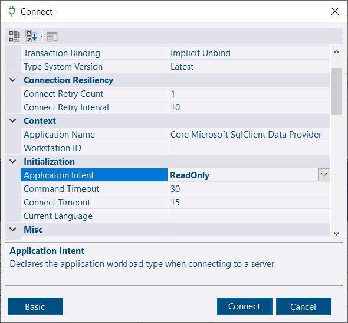
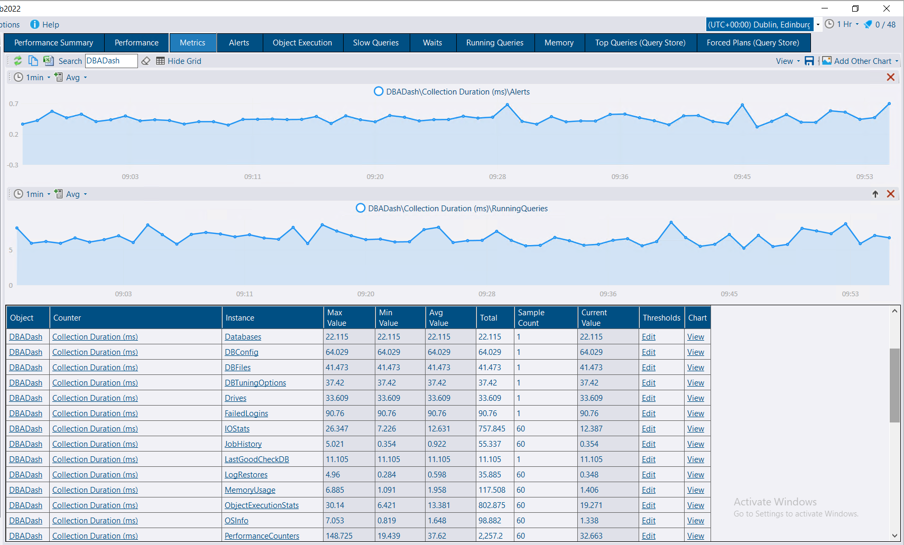

## General & About DBA Dash

- [What is DBA Dash?](#what-is-dba-dash)
- [How is DBA Dash licensed?  Is it really free?  What's the catch?](#how-is-dba-dash-licensed--is-it-really-free--whats-the-catch)
- [How does DBA Dash compare with commercial monitoring tools?](#how-does-dba-dash-compare-with-commercial-monitoring-tools)
- [Does DBA Dash collect any telemetry or usage information?](#does-dba-dash-collect-any-telemetry-or-usage-information)
- [What versions of SQL Server can I use?](#what-versions-of-sql-server-can-i-use)
- [Is Linux supported?](#is-linux-supported)
- [What's the difference between the service and the GUI?](#whats-the-difference-between-the-service-and-the-gui)
- [What is the difference between 'DBADash_{Version}.zip' and 'DBADash_GUI_Only_{Version}.zip'?](#what-is-the-difference-between-dbadash_versionzip-and-dbadash_gui_only_versionzip)
- [Is there a Web UI?](#is-there-a-web-ui)
- [Who created DBA Dash?](#who-created-dba-dash)

## Installation & Setup

- [How do I install DBA Dash?](#how-do-i-install-dba-dash)
- [How do I upgrade DBA Dash?](#how-do-i-upgrade-dba-dash)
- [How do I uninstall DBA Dash?](#how-do-i-uninstall-dba-dash)
- [Do I need to install an Agent on my monitored instances?](#do-i-need-to-install-an-agent-on-my-monitored-instances)
- [Where should I deploy the repository database?](#where-should-i-deploy-the-repository-database)
- [How do people get access to the front-end?](#how-do-people-get-access-to-the-front-end)

## Configuration & Management

- [How many instances can I monitor with DBA Dash?](#how-many-instances-can-i-monitor-with-dba-dash)
- [How do I remove an Instance?](#how-do-i-remove-an-instance)
- [How do I monitor read replicas in Azure?](#how-do-i-monitor-read-replicas-in-azure)
- [How do I create alert notifications with DBA Dash?](#how-do-i-create-alert-notifications-with-dba-dash)
- [How do I customize the tooltip length in the grid?](#how-do-i-customize-the-tooltip-length-in-the-grid)
- [How can I update the Build Reference without an internet connection?](#how-can-i-update-the-build-reference-without-an-internet-connection)

## Performance & Storage

- [What is the monitoring impact?](#what-is-the-monitoring-impact)
- [How much disk space will the repository database use?](#how-much-disk-space-will-the-repository-database-use)
- [How do I reduce the size of the repository database?](#how-do-i-reduce-the-size-of-the-repository-database)

## Community, Support & troubleshooting

- [How do I troubleshoot issues with DBA Dash?](#how-do-i-troubleshoot-issues-with-dba-dash)
- [I need help or want to ask a question](#i-need-help-or-want-to-ask-a-question)
- [How do I get notifications of new releases?](#how-do-i-get-notifications-of-new-releases)
- [I Found a bug](#i-found-a-bug)
- [I have a feature suggestion](#i-have-a-feature-suggestion)
- [How Do I Contribute?](#how-do-i-contribute)

---

## General & About DBA Dash

### What is DBA Dash?

DBA Dash is a monitoring tool for SQL Server.  It can help with performance issues, improve the health of your SQL instances as well as catalog and track changes to your environment.

### How is DBA Dash licensed?  Is it really free?  What's the catch?

DBA Dash is licensed under the popular [MIT License](https://github.com/trimble-oss/dba-dash/blob/main/LICENSE) open-source license.  This is categorized as a [permissive license](https://en.wikipedia.org/wiki/Permissive_software_license) as it imposes very few restrictions.  The license is very simple with just a few lines of text, so it's worth a quick read.

DBA Dash is completely free.  You get access to the full product without feature limitations or usage restrictions.  You even get full access to the source code and you are free to make modifications.  There is no advertising.  Your data is not collected by Trimble and will not be sold.  Unlike a lot of free software, there is no catch.

The only cost is your time and the infrastructure costs to run it.  Self-hosted also means the data collected is totally private and under your control.

### How does DBA Dash compare with commercial monitoring tools?

Compared to commercial monitoring tools, there is no SLA or guarantee of support.  There is community support available, see [here](#i-need-help-or-want-to-ask-a-question) for more info.

Many users of DBA Dash have compared DBA Dash very favorably against several popular commercial tools.  It includes a variety of unique and innovative features.

Depending on what you are looking for in a monitoring tool, DBA Dash might be a very good fit.  Even if your budget extends to a commercial monitoring tool, DBA Dash is worth your consideration.  DBA Dash can also be used to augment your commercial monitoring tool.  Providing full coverage for your whole SQL Server estate and assisting with daily DBA checks in addition to performance monitoring.

DBA Dash is [updated frequently](https://github.com/trimble-oss/dba-dash/releases) and probably outpaces many commercial tools in terms of updates.

### Does DBA Dash collect any telemetry or usage information?

**No**.  All the data that DBA Dash collects is stored in the repository database which is fully under your control.

### What versions of SQL Server can I use?

#### Monitored instances

**SQL Server 2005** through to **SQL Server 2025**.  **Azure DB**, **Managed Instance** and **RDS** are also supported.

#### Repository database

**SQL Server 2016 SP1 or later**.  Including **Azure DB⁽¹⁾** and **Managed Instance**.

*⁽¹⁾ Note: Some features (Messaging) are unavailable in Azure DB as it doesn't support service broker.*

See [requirements](/docs/setup/quick-start/#requirements)

### Is Linux supported?

Yes you can monitor SQL Servers running on Linux.  The only limitation is that [WMI](/docs/help/wmi) based collections won't work and will automatically be disabled.  Most collections work using a standard SQL connection and work the same on Linux as they do on Windows.

The GUI is a WinForms app and is only supported on Windows.

The service might work with Linux, but it's only tested with Windows.  It might require some minor alterations to work on Linux.

### What's the difference between the service and the GUI?

The GUI is the front-end that you use to monitor your SQL instances.  It's a WinForms application that can be deployed separately to client machines, and also included along with the service.  The service is a Windows service that you deploy to collect data from your monitored instances.  It's configured using a service configuration tool (Another WinForms app).

### What is the difference between 'DBADash_{Version}.zip' and 'DBADash_GUI_Only_{Version}.zip'?

'DBADash_{Version}.zip' contains both the service and the GUI as a single package.  You need the service to collect data from your monitored instances.  Start with this package.

'DBADash_GUI_Only_{Version}.zip' only contains the GUI front-end for deployment to client machines.  The service and the service config tool are not included.

### Is there a Web UI?

No. The front-end is a WinForms app.  This has some advantages, but the main limitation is that the data is less accessible than with a web front-end.

You can deploy the GUI to multiple client computers, if they are able to access the repository database using a standard SQL connection. Once the repository database is upgraded, clients are prompted to upgrade automatically so keeping clients up-to-date is not a significant burden.

DBA Dash is open-source and you are free to create your own web dashboards using Grafana, Power BI or other tools.  If you create something interesting, consider sharing it with the community!  Pull requests are welcome!

### Who created DBA Dash?

DBA Dash was created by [David Wiseman](https://github.com/DavidWiseman), an employee of [Trimble](https://www.trimble.com/) working in the UK.  It's provided under [Trimble's open-source](https://github.com/trimble-oss) GitHub organization.  A number of [other people](https://github.com/trimble-oss/dba-dash/graphs/contributors) have now [contributed](#how-do-i-contribute) to DBA Dash.  [Contributions](#how-do-i-contribute) from the SQL Server community are welcome.

---

## Installation & Setup

### How do I install DBA Dash?

[Start here](/docs/setup/quick-start/)

### How do I upgrade DBA Dash?

[See here](/docs/setup/upgrades/)

### How do I uninstall DBA Dash?

[See here](/docs/setup/uninstall/)

### Do I need to install an Agent on my monitored instances?

No.  DBA Dash installs as a Windows service which needs to be deployed somewhere on your network.  The service can monitor many SQL Server instances and doesn't need to be deployed directly to your monitored instances.  It can run on your monitored instances if you have no suitable alternative.

### Where should I deploy the repository database?

Any SQL instance that meets the [requirements](/docs/setup/quick-start/#repository-db) will work.  The repository database is ideally located on a SQL Server that is separate from your critical production SQL instances.

If your production SQL instances are under stress, it's better for the monitoring systems you rely on for diagnosis to be separate.  Also, locating the repository database elsewhere minimizes the monitoring impact.  SQL Server Express edition will work if you need a free option, but you will need to [manage the size](/docs/help/data-retention) of the repository database carefully to stay within the express edition database size limits.  If you are considering Express, SQL 2025 increases the database size limit from 10GB to 50GB.  Standard edition is also a good option.

### How do people get access to the front-end?

The front-end GUI is a .NET WinForms application.  You can [deploy](/docs/setup/deploy-gui/) this separately to client machines.  End users only need to be granted access to the repository database using the *App* or *AppReadOnly* roles.

---

## Configuration & Management

### How many instances can I monitor with DBA Dash?

There are no licensing restrictions or hard coded limits on the number of instances you can monitor with DBA Dash.  There are some practical limitations to consider which will impact how you deploy DBA Dash.  The DBA Dash GUI isn't designed for thousands of instances.  Collecting data from a large number of instances could also be a challenge. This will put additional pressure on the DBA Dash agent and the central repository database.  The size of the central repository database will also increase with the number of instances monitored. There are options if you have a large number of instances:

* Increase the ServiceThreads value in the ServiceConfig.json file to allow the DBA Dash agent to work with a larger number of instances.

*Note: The default value of -1 (or any number less than 1) allows the system to decide the thread count. This is currently set to 10.  Set this value to a positive integer to override the thread count.  When the service starts, the thread count should be output in the log file:*

`2024-07-21 12:48:48.738 +01:00 [INF] Threads 10 (default) <10>`

* Use multiple DBA Dash agents.
*Tip: Multiple agents can also be deployed to the same server.  Change the ServiceName in the ServiceConfig.json file to configure a unique name for each service.*
* Split the instances between multiple DBA Dash repositories.
*Starting with version 2.40.0, the DBA Dash GUI can fast switch between multiple repositories.*
* Cleanup old instances in the service config file.  These can consume threads as they try to connect.
* Adjust the collection schedules as required.  You could reduce the frequency of collection if appropriate or have offset schedules configured (easier to do with multiple DBA Dash services).  Remove any collections you are not interested in monitoring.
* The repository database might grow large.  The data retention can be adjusted and/or collection schedule to keep the repository database size under control.  For many collections there is a *_60MIN* aggregate that can be used for longer term trends and requires less storage space.

Automation also becomes important as the number of instances increase.  DBADashConfig.exe can be used for automation.  To get started run:

`DBADashConfig --help`

You can also add multiple connections at a time in the service config tool.

### How do I remove an Instance?

* First remove the instance from the service config tool to prevent data from being collected for the instance.  From version 3.12 you will be prompted to mark the instance deleted in the repository database, making this a one step process.

If you need to delete the instance in the GUI, right-click the instance.  Select delete from the Instance Actions context menu Available from 3.12. Or Options\Manage Instances for older versions.

The mark deleted is a soft delete operation that will hide the instance from display.  The recycle bin folder Available from 3.12 allows you to restore an instance or remove it completely. In *Options\Repository* Settings, you can configure the application to automatically hard delete an instance after a specified period of time after the last collection.

The **dbo.Instance_Del** stored procedure is used to perform both hard and soft delete operations.

> **Note**
>  You must wait at least 24hrs after stopping the collection for an instance before you can perform a hard delete.

```SQL
/*  Find InstanceID:
    SELECT InstanceID FROM dbo.Instances WHERE InstanceName =''
*/
EXEC dbo.Instance_Del @InstanceID = ???, @HardDelete = 1

/*
    This script will provide the command to hard delete each instance marked deleted
    This takes into account the 24hr waiting period since the last collection date.
*/
SELECT	I.InstanceDisplayName,
		I.Instance,
		CONCAT('EXEC dbo.Instance_Del @InstanceID = ',InstanceID,', @HardDelete = 1') AS DeleteCommand
FROM dbo.Instances I
WHERE IsActive=0
AND NOT EXISTS(SELECT 1
				FROM dbo.CollectionDates CD
				WHERE CD.InstanceID = I.InstanceID
				AND CD.SnapshotDate> DATEADD(d,-1,GETUTCDATE())
				)
```

### How do I monitor read replicas in Azure?

In the service config tool add the `ApplicationIntent=ReadOnly` option to the connection string when adding the connection in the Source tab.

The Application Intent option is available to configure by clicking the *Advanced* button on the connection dialog. (Available from 3.27.3)

[](connect-dialog-advanced.png)

This can also be done by clicking the *{Other Options}* link or you can append this to the connection string in the Source text box.  When you click Add/Update, the Connection ID will be appended with "|ReadOnly" to ensure it's identified as a separate SQL instance from the primary replica.

Ensure you are using version 3.10 or later.

### How do I create alert notifications with DBA Dash?

Alerts are now available in DBA Dash starting from 3.17.0.  [See here](docs/help/alerts/) for more info.

### How do I customize the tooltip length in the grid?

The tooltip length can be adjusted using the script below.  A value of 0 will disable tooltips.

```sql
DELETE dbo.Settings WHERE SettingName='GUICellToolTipMaxLength'
INSERT INTO dbo.Settings(SettingName,SettingValue)
VALUES('GUICellToolTipMaxLength',1000)
```

### How can I update the Build Reference without an internet connection?

If you have an internet connection on any computer running the GUI application, click the *Update Build Reference* button on the *SQL Patching* tab.  The build reference is provided by dbatools from this URL: [https://dataplat.dbatools.io/assets/dbatools-buildref-index.json](https://dataplat.dbatools.io/assets/dbatools-buildref-index.json).

Alternatively, you can download the build reference on another computer and copy it to the location where the DBA Dash service is installed.  The file should be renamed to `BuildReference.json`.  The build reference is updated when the service is restarted.

This PowerShell command can be used to download the build reference from dbatools, on a computer with internet access.

`Invoke-WebRequest -Uri 'https://dataplat.dbatools.io/assets/dbatools-buildref-index.json' -OutFile 'BuildReference.json'`

An updated build reference is included with each new version of DBA Dash.

---

## Performance & Storage

### What is the monitoring impact?

All monitoring tools add *some* overhead, but minimizing this is a key design goal for DBA Dash. The impact of monitoring a server with DBA Dash should be negligible in most cases with an out of the box configuration.

DBA Dash has a lot of flexibility - you can adjust the collection schedules, add your own collections, enable features and tweak various settings that will all affect the impact on your monitored instances.  Also, SQL instances can vary greatly from one another.  If your SQL instance has 1K databases, the cost of running any per database collection will be higher than on a SQL instance with 100 databases.  If you have databases with an extremely large number of tables this will also impact certain collections (e.g. Schema snapshots, identity collections, table size collection)

The more SQL instances you monitor, the more resources will be required for the SQL instance that hosts the repository database and server that hosts the DBA Dash service.

#### Tips to reduce overhead

* Run the DBA Dash repository database on a separate SQL instance
* Run the DBA Dash service on a separate server.
* Adjust the schedules of collections.  *e.g. Run collections less frequently.  Schedule collections to run at a time when your servers are not busy.*
* Collections scheduled to run at the same time are run serially.  This helps to limit the overhead and it's something to be aware of when adjusting schedules.
* Disable any collections/features that you won't use or have determined have too high a cost for your environment.
* Carefully evaluate the impact of adding your own custom collections.

#### Start small

If you are worried about the monitoring impact, start small.  Instead of adding all your SQL instances to DBA Dash, start with a handful of non-production SQL instances.  After a period of observation, roll it out slowly to the rest of your SQL instances.

#### How to evaluate the overhead for your own environment

DBA Dash is very transparent about what collections it runs and when.  With very few exceptions, you can find the queries for all the collections [here](https://github.com/trimble-oss/dba-dash/tree/main/DBADash/SQL).  You could run any of these manually to test against your own SQL instances.

The DBA Dash service will report itself with the application name *DBADash* and the GUI will report as *DBADashGUI*.  You can use the template scripts below as a starting point if you want to capture activity from DBA Dash.

```sql
/* Service XE */
CREATE EVENT SESSION [DBADash_Service] ON SERVER
ADD EVENT sqlserver.rpc_completed(
    ACTION(sqlserver.client_app_name,sqlserver.client_hostname,sqlserver.database_id,sqlserver.session_id,sqlserver.username)
    WHERE ([sqlserver].[client_app_name]=N'DBADash')),
ADD EVENT sqlserver.sql_batch_completed(
    ACTION(sqlserver.client_app_name,sqlserver.client_hostname,sqlserver.database_id,sqlserver.session_id,sqlserver.username)
    WHERE ([sqlserver].[client_app_name]=N'DBADash'))
ADD TARGET package0.ring_buffer
WITH (MAX_MEMORY=4096 KB,EVENT_RETENTION_MODE=ALLOW_MULTIPLE_EVENT_LOSS,MAX_DISPATCH_LATENCY=2 SECONDS,MAX_EVENT_SIZE=0 KB,MEMORY_PARTITION_MODE=NONE,TRACK_CAUSALITY=OFF,STARTUP_STATE=OFF)
GO

/* GUI XE */
CREATE EVENT SESSION [DBADashGUI] ON SERVER
ADD EVENT sqlserver.rpc_completed(
    ACTION(sqlserver.client_app_name,sqlserver.client_hostname,sqlserver.database_id,sqlserver.session_id,sqlserver.username)
    WHERE ([sqlserver].[client_app_name]=N'DBADashGUI')),
ADD EVENT sqlserver.sql_batch_completed(
    ACTION(sqlserver.client_app_name,sqlserver.client_hostname,sqlserver.database_id,sqlserver.session_id,sqlserver.username)
    WHERE ([sqlserver].[client_app_name]=N'DBADashGUI'))
ADD TARGET package0.ring_buffer
WITH (MAX_MEMORY=4096 KB,EVENT_RETENTION_MODE=ALLOW_MULTIPLE_EVENT_LOSS,MAX_DISPATCH_LATENCY=2 SECONDS,MAX_EVENT_SIZE=0 KB,MEMORY_PARTITION_MODE=NONE,TRACK_CAUSALITY=OFF,STARTUP_STATE=OFF)
GO
```

In the *Options* tab of the service config tool, there is a checkbox for logging internal performance counters.  If enabled you will be able to track each collection duration on the Metrics tab.  The XE sessions can be a better option as they allow you track how much CPU and IO each collection is using which can be more important than the duration.  If you enable internal metrics, it will increase the size of the PerformanceCounters/PerformanceCounters_60MIN tables in the repository database.

[](internal-metrics.png)

### How much disk space will the repository database use?

The repository database can grow quite large depending on the number of SQL instances you monitor, the data retention settings and various other factors.  The default [retention](/docs/help/data-retention/) settings keep data around for a long time and can be reduced to save disk space.  Some collections have a `_60MIN` aggregation table that is used for longer term analysis.  Longer retention can be used on these tables as the disk space requirements are much lower.

### How do I reduce the size of the repository database?

See [here](/docs/help/data-retention/) for information on how to configure data retention.  Many tables in DBA Dash are partitioned by date which allows for efficient data removal.

Instances are soft deleted by default.  If you need to reclaim space from a deleted instance you can remove the instance from the recycle bin.  Note: This won't use partition switching and the operation could take some time to complete.  Data will typically be removed in batches.

If you need to reclaim space on disk, you would need to [shrink the database files](https://learn.microsoft.com/en-us/sql/t-sql/database-console-commands/dbcc-shrinkfile-transact-sql?view=sql-server-ver17).


---

## Community, Support & Troubleshooting

### How do I troubleshoot issues with DBA Dash?

The [troubleshooting](/setup/troubleshooting/) document covers common issues and what to do when you encounter errors.

### I need help or want to ask a question

You can ask questions via the [discussions](https://github.com/trimble-oss/dba-dash/discussions) on GitHub.  There is also a **#dbadash** channel on the [SQL Server Community slack](https://dbatools.io/slack).  Before submitting a query, please check if there is an answer to your question in the documentation.  Also search the discussions to see if a similar question has already been asked. DBA Dash is an open source project that relies on community support to help answer queries.

### How do I get notifications of new releases?

Click the GitHub "Watch" button at the top of this page.  A drop down will appear.  Select "Custom".  Check "Releases" and click apply - this will only notify you when releases are published.

If you prefer a RSS feed, you can use [this link](https://dbadash.com/blog/index.xml) for all blog content or [this link](https://dbadash.com/categories/releases/index.xml) just for release information.  Blog posts are not created for minor bug fix releases.

### I Found a bug

Please create an [Issue](https://github.com/trimble-oss/dba-dash/issues).  Before submitting an issue, please check if there is an existing issue for the bug.  Include as much information as possible about your environment and how to reproduce the bug, including full error messages.  Be careful not to include any security sensitive data in your issue.

Are you able to fix the bug yourself?  Please mention this in the issue.  We accept pull requests!

### I have a feature suggestion

Please create an [Issue](https://github.com/trimble-oss/dba-dash/issues).  Before submitting an issue, please check if there is an existing issue for the feature request. Provide a clear description for the feature.  If you are willing to help develop the new feature, please mention this in the issue.  DBA Dash is an open source project and will improve through community contributions.

### How Do I Contribute?

There are some [guidelines here](https://trimble-oss.github.io/contribute/) for Trimble employees.  We also accept external contributions and anyone is free to contribute. Start by creating an [issue](https://github.com/trimble-oss/dba-dash/issues) of what you plan to do, indicating that you are willing to work on the new feature or bug fix.  If you create and issue first, feedback can be provided before you invest time working on it.  It also lets the project maintainers and other people know what you are working on, avoiding duplication.

Contributions are subject to review.  All good open-source projects need a careful review process to maintain quality, ensuring contributions are safe and a good fit for the project.  Keeping the monitoring overhead as low as possible is a key design consideration.

We hope people decide to contribute back to the main repository, but you are also welcome to maintain your own fork of DBA Dash.  You might want to do this if you need to make very bespoke changes or your pull request was rejected for some reason.  You might also have propriety code that you are unable to share with the community.
