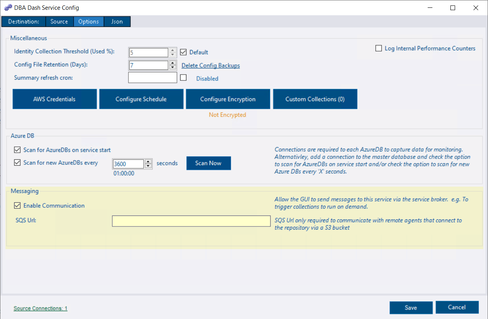
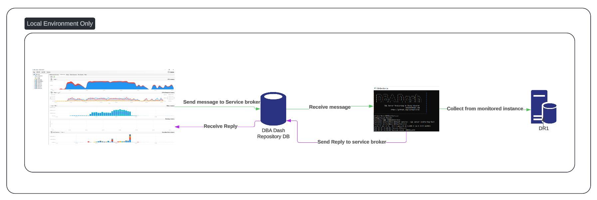
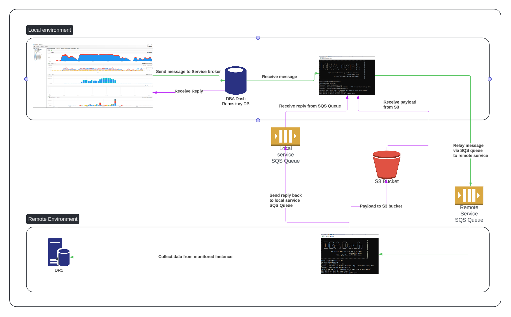

## What is Messaging?

Messaging is a feature that allows communication between the GUI and the DBA Dash service.  This allows you to trigger collections to run on demand from the GUI.  In future this feature might enable additional functionality.

The DBA Dash GUI has no direct connection to your monitored instances.  The GUI only connects to the repository database.  The service collects data on a schedule and imports it into the repository database. 

## Enabling Messaging

In most cases, enabling messaging is just a case of checking the **Enable Communication** checkbox in the **Options** tab of the service configuration tool.

You might be prompted to populate the ConnectionID for your monitored instances.  When you trigger a collection in the GUI, the service needs to be able to associate the instance this with a connection in the config and this is done through the ConnectionID.

## Enable Messaging for remote DBA Dash services

The service has the option to send data to a S3 bucket instead of directly to your repository database.  This is useful in situations where you don't have direct connectivity to some of the instances that you want to monitor.  A local DBA Dash service is then configured with the S3 bucket as a source connection instead of a SQL instance.

To enable communication to the remote service in this scenario, we need to configure each service with a SQS queue.

* Enable Communication needs to be set on both services
* The SQS Url needs to be set on both services.  e.g.

  * https://sqs.eu-west-1.amazonaws.com/12345/dba-dash-service-1
  * https://sqs.eu-west-1.amazonaws.com/12345/dba-dash-service-2

* Each service should be able to read/write to both SQS queues.  The following actions should be granted:

  * SQS:ChangeMessageVisibility
  * SQS:DeleteMessage
  * SQS:ReceiveMessage

* A single shared queue can be used but isn't recommended

## Security


The messaging feature enables users with repository database access to interact in a **limited** capacity with monitored instances, even if they do not have direct access to those instances.


To use **any** messaging functionality users need to have:
* Access to the repository database with EXECUTE permission on the Messaging schema.  This can be granted through the **Messaging role**.
* Messaging needs to be enabled in the service configuration tool.  Enabled by default.

Query Plan Forcing requires:
* Allow Plan Forcing in config tool checked.  *Disabled by default*.
* Membership of the *AllowPlanForcing* or *db_owner* roles in the repository database. (*Application Level constraint*)

Community script execution requires:
* Script listed in *Allowed Community Scripts* in the config tool (Or all scripts allowed).  *Disabled by default.*
* Membership of the *CommunityScripts* or *db_owner* roles in the repository database. (*Application Level constraint*)
* Community script deployed to the SQL instance & DBA Dash service account needs to have permissions to execute the stored procedure.

Agent Job execution requires:
* Allowed Job Execution configured in the service configuration tool.  This is a comma separated list of allowed job names, categories and IDs. A hyphen (-) prefix can be used to deny.  Use * or % as wildcard characters. *Disabled by default*
e.g.
`*` = Allow All
`*,-%backup%` = Allow all except jobs with "backup" in their name or category.
`%backup%` = Only allow jobs with "backup" in their name or category.
* Membership of the *AllowJobExecution* or *db_owner* roles in the repository database. (*Application Level constraint*)


Some of the role membership checks are *application level* constraints and could potentially be circumvented by users that have EXECUTE permission on the Messaging schema.


The DBA Dash service account needs permissions to execute SQL agent jobs, which can be granted through the **SQLAgentOperatorRole** role.

## How it works

### Typical local example

The GUI sends a message to the service broker queue in the repository database.  The conversation is started on the **DBADashServiceInitiatorQueue** and is delivered to the target queue associated with the service that collected the data for the monitored instance.  For each monitored instance we store the CollectAgentID and ImportAgentID which allows us to identify which queue to send the messages to.  The IDs come from the **DBADashAgent** table.

The service listens for messages on it's associated queue.  One of the advantages of using service broker is that messages are processed immediately as they enter the queue without need for frequent polling.  You might notice some long running queries with a wait type of `BROKER_RECEIVE_WAITFOR` which is normal.  These sessions are idle waiting for messages to enter the queue.

Once a message is received, the service processes the requested task and sends a reply back to the initiator queue where the GUI is waiting for responses associated with the conversation that it started.  This could be a simple progress report to indicate that the message is in process or complete.  It can also send data back to the GUI.

### Remote service example

If you are monitoring instances in a remote environment via a S3 bucket, you can use SQS queues to establish communication between the local and remote DBA Dash service.

The communication starts similar to the local example, with the GUI sending a message to the service broker queue associated with the local service that imported the data for the monitored instance (ImportAgentID).  In this case there is a different CollectAgentID and the local service needs to relay the message to the SQS queue associated with the service that collected data for the monitored instance.  The SQS queue URL for the remote service is stored in the **DBADashAgent** table (sent automatically from the remote service).

The message is sent to the SQS queue and the remote service is listening and processing messages on this SQS queue.  The message includes the SQS queue url of the local service where replies should be sent.  The reply back to the local service is sent to this queue.  SQS is only designed to handle small messages of up to 256KiB.  The same S3 path used for communication between the two services is used to support larger message payloads with a link to the URL stored in the SQS message.

The local service is listening for messages on it's own queue and receives the reply from the remote service. It processes the response and sends a reply message back to the GUI via the service broker initiator queue.

Note: It's *possible* for two services to use the same queue as the service checks the DBADashToIdentifier message attribute to ensure that it's the intended destination for the message.  If it's not the intended recipient, the visibility timeout is adjusted to allow the message to be picked up by another service.  After 1hr the message is removed regardless of the recipient service to avoid constant re-processing of messages if the target is not available to process the message. Using a shared queue results in additional processing and delay in handling messages. Separate queues might also work out slightly cheaper based on the current [pricing model](https://aws.amazon.com/sqs/pricing/) for SQS which charges per request rather than per queue.

[Long polling](https://docs.aws.amazon.com/AWSSimpleQueueService/latest/SQSDeveloperGuide/sqs-short-and-long-polling.html) (20 seconds) is used to reduce costs.
