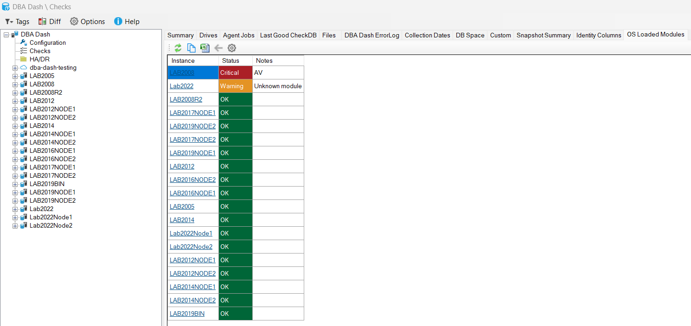
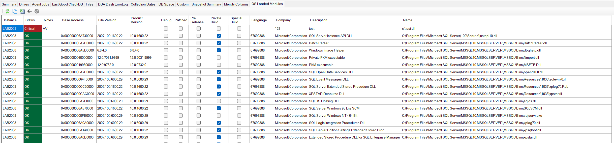
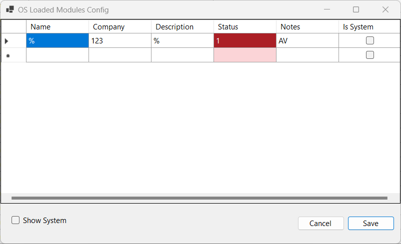

The [OS Loaded Modules collection](https://github.com/trimble-oss/dba-dash/blob/main/DBADash/SQL/SQLOSLoadedModules.sql) captures data from [sys.dm_os_loaded_modules](https://learn.microsoft.com/en-us/sql/relational-databases/system-dynamic-management-views/sys-dm-os-loaded-modules-transact-sql).  This DMV returns a row for each module loaded into the SQL Server address space.

## Why collect this data?

Some modules such as antivirus software are known to cause issues when loaded into SQL Server address space.  These problems might vary from performance issues to weird bugs and corruption. 

More information:
* [Performance and consistency issues when certain modules or filter drivers are loaded](https://learn.microsoft.com/en-us/troubleshoot/sql/performance/performance-consistency-issues-filter-drivers-modules).  
* [Detours or similar techniques may cause unexpected behaviors with SQL Server](https://learn.microsoft.com/en-US/troubleshoot/sql/general/issue-detours-similar-techniques).
* [How to choose antivirus software to run on computers that are running SQL Server](https://support.microsoft.com/en-us/topic/how-to-choose-antivirus-software-to-run-on-computers-that-are-running-sql-server-feda079b-3e24-186b-945a-3051f6f3a95b)

## Reporting

If you go to the OS Loaded Modules tab under the "Checks" node in the tree, you will see if there are issues with loaded modules for any instance.

If you see any instances highlighted red, review the Notes column and click to drill down for more information.  You might need to update your AV software configuration.

## Configuring

If you see a warning for a "Unknown Module", you can update the configuration to display either red or green after evaluating the module.  Click the configuration button on the toolbar.  

The LIKE operator is used to match on Name, Company and Description.  Leave any value as % to match all values - for example, you might want to match on just the Module name.  The status column should be specified as:

* <r>1 - Critical (Red)</r>
* <o>2 - Warning (Orange)</o>
* 3 - N/A (Grey)
* <g>4 - OK (Green)</g>

The Notes column is used to provide some context information about this rule.

If you click the "Show System" checkbox, you will see the system provided values.  The system values can't be updated or deleted.

To delete a rule, click the row header and press the Delete button on the keyboard.

## How status is determined 

It's possible that a module will match multiple rules.  The first match with the highest status value will be used to assign the status.  If a module matches 4 - OK and 1 - Critical, the status will be 1 - Critical.
