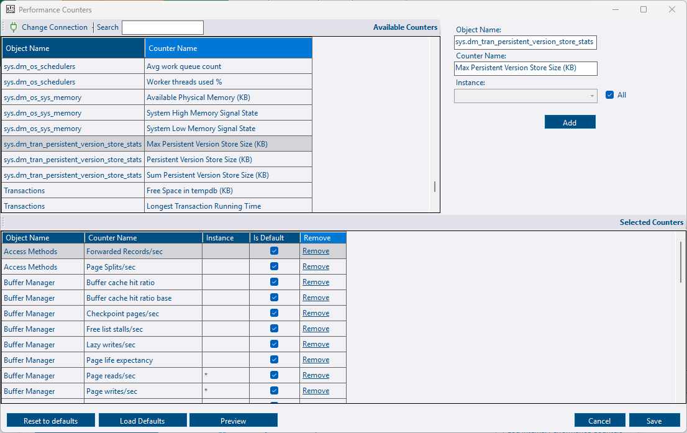

## Summary

DBA Dash will automatically capture key performance metrics from the sys.dm_os_performance_counters DMV.  e.g. Page reads/sec, Memory Grants Pending, SQL Compilations/sec and more. The performance counters collected can easily be customized - adding additional counters or removing counters that you are not interested in.  It's also possible to add your own application performance metrics by creating a stored procedure that will return this data in a specified format.

## OS Performance Counters

Performance Counters can be customized by clicking the *Performance Counters* button on the *Options* tab of the service configuration tool.

[](custom-performance-counters.png)

#### Adding a counter

* The available performance counters are automatically loaded from the first source connection.  Click *Change Connection* to select a different instance if required.
* Select a performance counter from the *Available Counters* grid.
* The selected counter is loaded to the right of the grid.
* Select an instance of the counter or click the *All Instances* checkbox to collect all instances of the counter.
* Click *Add* to add the counter.
* Repeat as needed and click *Save*
* The changes will apply after a service restart

#### Removing a counter

* Click the Remove link.  Alternatively, select the rows in the grid and click the delete button on the keyboard.
* Click *Save*
* The changes will apply after a service restart

#### Application defaults

Once customized, the application defaults will be overridden with your own preferences.  Over time, performance counters might be added/removed from the application defaults.  You won't receive any updates automatically.  If you want to add all application defaults, click the *Load Defaults* button to append all the default counters.  If you want to remove all your customizations, click the *Reset to defaults*.  Alternatively, delete the *PerformanceCountersCustom.xml* file.

The *Is Default* column will indicate which counters are application defaults.

#### XML file

Custom performance counters are saved in "PerformanceCountersCustom.xml".  You can create/edit this file manually if you prefer, but it's easier to use the service config tool starting with DBA Dash 3.26.

A short version of the XML file is listed below:

```XML
<Counters>
  <Counter object_name="Buffer Manager" counter_name="Buffer cache hit ratio" instance_name="" />
  <Counter object_name="Buffer Manager" counter_name="Buffer cache hit ratio base" instance_name="" />
  <Counter object_name="Buffer Manager" counter_name="Lazy writes/sec" instance_name="" />
</Counters>
```

For the object_name this should be everything after the colon symbol ":".  e.g. "Buffer Manager" instead of "SQLServer:Buffer Manager".  The value before the colon can vary for named instances or Azure DB so this is excluded.

If the counter is of type "537003264" or "1073874176" you will need to include the base counter to allow the counter to be calculated - as with "Buffer cache hit ratio" above.  Also, check that there is a row in the CounterMapping table in the DBADash repository database.

If the instance_name is specified in the XML (including a blank string) the counter will filter for that specific counter instance.  If you want to collect all instances of a counter you can omit the instance_name attribute from the XML.

## Custom SQL Counters

You are not limited to the counters available in os performance counters DMV - It's possible to create a stored procedure to return any custom metric.  The stored procedure needs to return the data in a specific format - the same format as the data collected for os performance counters.  This allows your custom metrics to be collected and treated in the same way as os performance counters.

Example stored procedure:

```SQL
CREATE PROC [dbo].[DBADash_CustomPerformanceCounters]
AS
-- Table variable isn't needed but it ensures the data is returned in the required format.
DECLARE @Return AS TABLE(
	SnapshotDate DATETIME2(7) NOT NULL DEFAULT(SYSUTCDATETIME()),
	object_name NVARCHAR(128) NOT NULL,
	counter_name NVARCHAR(128) NOT NULL,
	instance_name NVARCHAR(128) NOT NULL,
	cntr_value DECIMAL(28,9) NOT NULL,
	cntr_type INT NOT NULL DEFAULT(65792)
)
-- ********************** Insert your own counters here **********************
-- Ommitting SnapshotDate and cntr_type columns as these are supplied by table defaults
INSERT INTO @Return
(
    object_name,
    counter_name,
    instance_name,
    cntr_value
)
SELECT
    N'User Counters',
    N'Random Counter',
    N'_Total',
    CAST(RAND()*100 AS DECIMAL(28,9))

-- ***************************************************************************

-- Return the data in the required format
SELECT SnapshotDate, -- Time in UTC
       object_name, -- Name of the object.  e.g. "User Counters"
       counter_name, -- Name of the counter.  e.g. "App Response Time (ms)"
       instance_name, -- Name of the instance.  e.g. "", "_Total", "DATABASE_NAME" etc
       cntr_value, -- The value of the couner (decimal)
       cntr_type -- follows the types ued in sys.dm_os_performanance_counters.  Use 65792 in most cases to use the value as is without further calculation.  Valid values: 65792,272696576,537003264,1073874176
FROM @Return

 ```

The stored procedure needs to be created on your monitored instances in the database that DBA Dash is configured to connect to (master by default).  If you want to use a different database, ensure that it's specified as the initial catalog in the connection string on the *Source* tab of the service configuration tool.  Also ensure that the service account has permissions to EXECUTE the stored procedure.  The permissions helper can be used to grant EXECUTE.  Additional permissions might be required depending on the content of your stored procedure.
