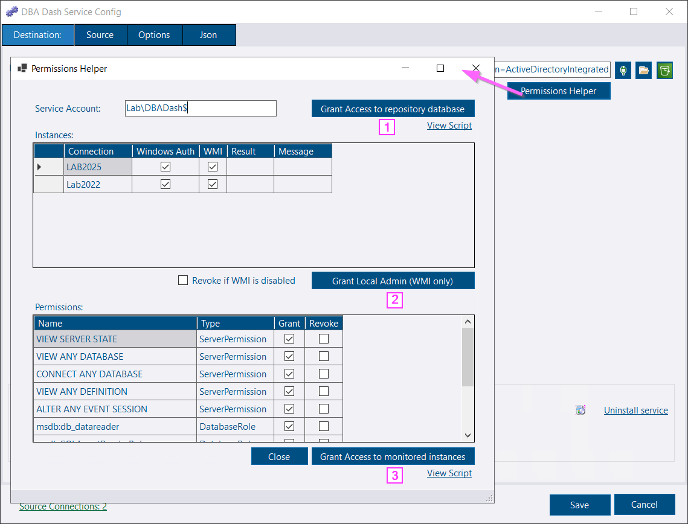

## Intro

The permissions helper is included in the service config tool to help you grant the required permissions that will allow the service account to collect data from your monitored instances.

It will also help grant the required permissions to the repository database (db_owner), or the permissions that will allow the service account to create the database if it doesn't already exist.

[](permissions-helper.png)

## Prerequisites

Use the config tool to configure the destination and source connections.  Use Windows authentication where possible.  The permissions helper tool is designed to connect to the monitored instances as your own user account to grant the appropriate permissions to the service account.

If you use SQL auth, you can still use the tool to generate a script.  The tool will also allow you to assign permissions 1 instance at a time, prompting you for the credentials to use that will provision access.

If you run the tool after installing as a service, the name of the service account is populated automatically.


The permissions helper is designed to work with Windows authentication.  It doesn't currently support Azure DB.  SQL Server 2014 and older are also not supported.


## Granting Access

Clicking the *Permissions Helper* button on the destination or source tab will load all the connections.  You can delete any from the grid that you don't want to include.  You can also click the "Grant permissions to service account" link when adding a new instance to grant permissions just to that 1 instance.

#### 1. Grant Access to the repository database

This button allows the service account to create the repository database if it doesn't already exist.  Otherwise it ensures the service account is a db_owner for the repository database.  Click the *View Script* to see what will be run.

#### 2. Grant Local Admin (WMI Only)

[WMI collections](/docs/help/wmi) require the service account to be local admin to work.  This button will make the service account local admin on the monitored instances listed below with a tick in the WMI column.  If you prefer not to grant local admin, click the No WMI option in the config tool.

If the Revoke checkbox is ticked, it will remove the user from the local admin group for instances where WMI is unchecked.

#### 3. Grant access to monitored instances.

This grants the service account the permissions needed to collect data from the monitored instances listed.  You can customize the permissions assigned in the Permissions grid, including revoking permissions that were previously assigned.

The tool doesn't grant sysadmin by default, which isn't needed for most things.  It does allow a small amount of additional data to be collected if WMI isn't used.  See the [security doc](/docs/help/security) for more info.


If you have custom collections, custom checks or custom SQL performance counters, the service will be granted EXECUTE permissions to the associated procedures.  This might not always be enough to allow execution of the stored procedure.
Access to execute community scripts can optionally be granted.

sp_Blitz, sp_BlitzIndex & sp_LogHunter are currently excluded as they require additional permissions.  Access can be provisioned by using certificates or making the service account sysadmin.

e.g.
```sql
USE master;
GO
CREATE CERTIFICATE DBADashCert
ENCRYPTION BY PASSWORD = '<YourPassword>'
WITH SUBJECT = 'Certificate for DBA Dash to grant access to stored procs that require sysadmin access.',
START_DATE = '20130711', EXPIRY_DATE = '21000101';

CREATE LOGIN DBADashCertLogin FROM CERTIFICATE DBADashCert;

CREATE USER DBADashCertLogin FROM CERTIFICATE DBADashCert;

GRANT EXECUTE ON dbo.sp_Blitz TO DBADashCertLogin;

ALTER SERVER ROLE [sysadmin] ADD MEMBER DBADashCertLogin;

ADD SIGNATURE TO sp_Blitz BY CERTIFICATE DBADashCert
WITH PASSWORD = '<YourPassword>';

GRANT EXECUTE ON dbo.sp_Blitz TO [Domain\DBADash$];
```



#### Results

After clicking [2] or [3], check the **Result** and **Message** columns to see the success/failure of the operation for each instance.  The tool relies on Windows authentication to connect to the monitored instances as your own user account to provision access to the account that will be used to run the service.  The account running the config tool is expected to be sysadmin or have sufficient permissions to provision access to the service account.
