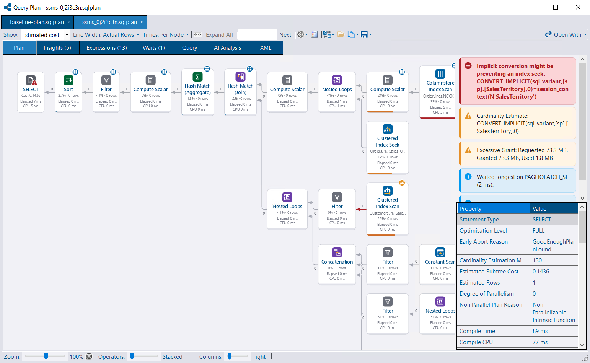
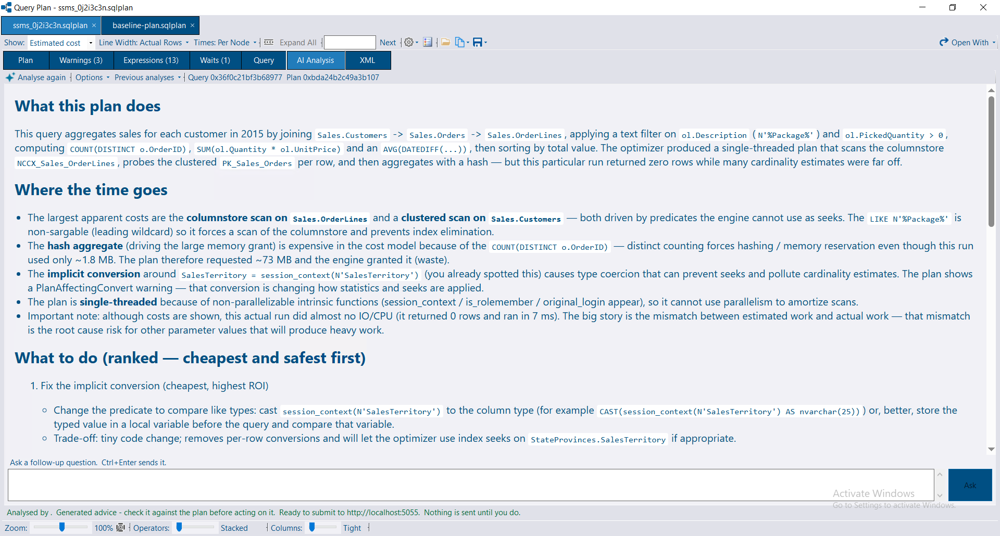


The query plan viewer is available in DBA Dash starting from 4.19.0. It's also available without DBA Dash in the standalone [DBA Dash Visualizer](/docs/help/dba-dash-visualizer/).


## Opening a plan

* Click a query plan link anywhere in DBA Dash - e.g. Running Queries, Slow Queries or the deadlock viewer's **Plans** panel.
* **Tools > Open Query Plan | \*.sqlplan** to open a saved plan.
* Drag and drop `.sqlplan` files onto the viewer window.
* Pass files on the command line.
* From SSMS, using the [SSMS extension](/docs/help/ssms-extension/).

Each plan opens in its own tab, so a fast run and a slow one can be compared side by side. Deadlock graphs open as tabs in the same window. **Ctrl+W** closes a tab.

DBA Dash can optionally register itself as a handler for `.sqlplan` files from the viewer's **Settings** menu, in the same way as for `.xdl` files. This is opt-in and per user. When several files are opened at once from Explorer, they open as tabs in a single window.

The plan can still be opened in another application registered for `.sqlplan` files, such as SSMS, using the **Open With** button.

## Reading the plan

### Operator bars and colors

Bars and heat coloring on each operator can rank operators by:

* Estimated cost
* Rows
* CPU
* Elapsed time
* Logical reads
* Estimate error

Showplan only reports subtree costs, and a row mode operator's time includes the time of everything feeding it. The viewer works out each operator's own cost and time from its children's figures. The operator with the highest estimated cost is often not the one that took the most time - switching between measures makes this easy to spot.

### Arrows

Arrow thickness can be based on rows or data size, using actual or estimated counts. Arrows are colored by how far the estimate was out.

### Badges

Operators are badged for things worth a closer look:

* Warnings
* Row estimates that are an order of magnitude out
* Parallelism
* Batch mode
* Rows read and discarded
* A missing index on the table the operator reads

### Legend

Click **Legend** on the toolbar for an explanation of the badges, colors and other visual cues.

### Plan shape

Choose the layout from **Settings > Plan Shape** (also on the right-click menu):

* **Aligned to First Input (SSMS)** (default) - an operator sits level with its first input, as SSMS draws a plan. The main branch of the plan is on a single row, producing a much shorter plan.
* **Centred on Inputs** - an operator sits level with the middle of its inputs. This makes joins easier to follow, at the cost of a taller plan.

Line width, column spacing, operator descriptions and node IDs can also be adjusted from the **Settings** menu.

## Navigation

| Action | How |
|---|---|
| Zoom | Mouse wheel (zooms around the pointer) |
| Pan | Drag |
| Fit the whole plan in the window | **0** or **Fit to Window** |
| Move between operators | Arrow keys |
| Collapse / expand an operator's inputs | **Space** |
| Find an operator, table, index, predicate or node ID | **Ctrl+F**, then **F3** for the next match |
| Follow Data Path | Right-click an operator, or use the toolbar. Fades everything not on the path back to the root. **Escape** leaves it. |

Collapsed operators are shown as stacked cards with a count of the hidden operators. **Expand All** shows everything again.

## Statements

A plan with several statements gets a statement selector above the graph. Statements can be ranked by cost, elapsed time or estimate error, making it easy to find the statement that matters in a large batch or procedure. Use **Save As** to save the selected statement as a `.sqlplan` file of its own.

## Tabs

| Tab | Contents |
|---|---|
| **Plan** | The graph, plus the selected operator's properties and insights |
| **Insights** | Plan warnings from SQL Server and DBA Dash's own [insights](#insights), worst first, each linked back to its operator |
| **Operators** | Every operator in the plan listed in a grid, with a link back to its place on the chart |
| **Missing Indexes** | Missing index requests with a `CREATE INDEX` statement |
| **Expressions** | Computed expressions and where they are worked out |
| **Parameters** | Compiled and runtime values, scriptable as `DECLARE` statements |
| **Waits** | Wait stats from an actual plan, with a link to what each wait type means |
| **Query** | The statement text and the `SET` options |
| **AI Analysis** | Optional AI-driven analysis (DBA Dash only - not available in the Visualizer) |
| **XML** | The raw plan XML |

Tabs are hidden when there is nothing to show.

The operator properties include the memory grant for each operator (memory fractions and per-thread input/output/used memory), so it's clear which operators the grant went to. Estimated Available Memory Grant, Max Compile Memory and Estimated Pages Cached are formatted under Optimizer Hardware Dependent Properties the way SSMS shows them. Where SQL Server's memory grant feedback has resized the grant, the adjusted and originally estimated values are both shown, so a resized grant isn't mistaken for the optimizer's estimate.

A statement's Query Hash and Query Plan Hash properties link to Query Store when the plan was opened from DBA Dash against an instance it can message. The standalone Visualizer has no instance to look them up on, so these stay as plain text there.

## Copy and save

The **Copy** menu can copy the whole plan or the current view as an image, the plan XML, the query text, the operator properties, the missing index T-SQL, or the parameters as `DECLARE` statements.

**Save As** saves the whole plan, the selected statement, or an image of the plan.

## Insights

Similar to the [deadlock viewer's findings](/docs/help/deadlocks/#findings-static-analysis), the plan viewer performs static analysis of the plan. No AI service is required and nothing leaves your environment. Examples include:

* **Scalar UDFs** - including where a T-SQL scalar function prevents a parallel plan.
* **Plan affecting conversions** - implicit conversions that affect cardinality estimates or seek choices.
* **Excessive memory grant** - on actual plans, a grant of 1 GB or more with less than 15% used. On estimated plans, a desired grant of 1 GB or more.
* **Memory grant waits** - with an explanation of `RESOURCE_SEMAPHORE` queuing.
* **Optional parameters** - catch-all predicates such as `WHERE (col = @p OR @p IS NULL)`, `col = ISNULL(@p, col)` or `col = COALESCE(@p, col)` without `OPTION (RECOMPILE)`. One cached plan can't seek on these conditions. The insight lists the fixes and their costs: `OPTION (RECOMPILE)` (showing this plan's compile CPU next to its run CPU), dynamic SQL with `sp_executesql`, or SQL Server 2025's optional parameter plan optimization. Plans already compiled by SQL Server 2025 as optional parameter variants are reported as information.
* **No partition elimination** - a partitioned scan or seek that reads every partition. A common cause is a predicate whose data type doesn't exactly match the partition function, e.g. `DATETIME` against a `DATETIME2` partition function, or `DATETIME2(7)` against `DATETIME2(3)`.
* **Early abort** - e.g. optimization that stopped due to a memory limit.
* **Warnings and missing indexes** - repeated warnings are grouped together.
* **Top waits** - what the query waited on longest.

The **Insights** tab lists these alongside the warnings SQL Server includes in the plan. The **Source** column shows whether each one came from **SQL Server** or **DBA Dash** - the DBA Dash insights won't appear in SSMS.

## Compare plans

Use the **Compare** menu on the toolbar to compare the current statement with:

* Another plan open in the window
* Another statement in the same plan
* A plan opened from a file

The comparison opens in its own tab. Use the **Before** and **After** drop-downs to switch either side to any statement of any open plan, or click **Swap**.

### Summary

The summary starts with the **Key Differences**, followed by statement-level figures grouped by run time, I/O, memory grant, estimates, parallelism, plan shape and compilation. Each change is marked as better or worse, depending on which direction is better for that figure.

* A noise threshold means small timing differences are treated as similar.
* Estimated figures such as cost and requested memory grant are flagged as weaker signals.
* Runtime figures and warnings (spills, grant warnings, waits) aren't judged when comparing against an estimated plan.

The status bar summarizes the comparison - e.g. whether the plan shape and query hash differ, and how many figures are better or worse. Use the copy button to copy the summary as text.


If the query hashes differ, the plans may be for different queries, so compare with care.


### Plans

The two plans side by side, or stacked if you click **Stacked**. Selecting an operator in one plan selects the matching operator in the other.

### Other tabs

| Tab | Contents |
|---|---|
| **Operators** | Operators grouped by type. Operators are grouped rather than paired, as pairing is unreliable once the plan shape changes |
| **Objects** | Objects grouped by table, index and access method |
| **Waits** | Wait stats from each plan |
| **Parameters** | Parameter values, including the sniffed compiled values |
| **Insights** | SQL Server warnings and DBA Dash insights for each plan |
| **Query** | A side-by-side diff of the query text |

Tab captions show the number of changes, e.g. **Operators (1 changed)**.

## AI Analysis

With the [AI Assistant](/docs/help/ai-assistant/) service configured, the **AI Analysis** tab can send the plan for detailed observations and recommendations.

For providers that accept a model per request (Anthropic, Ollama), an **Options > Model** menu lists the configured default plus whatever models the service reports as available, so you can pick a different model for an analysis without changing the server-side configuration. The choice is shared with the [deadlock viewer](/docs/help/deadlocks/#ai-analysis) for the rest of the session.


Nothing is sent until you press **Submit for analysis**, and the exact request is shown first. **Read it before pressing send** - plans can include parameter values and literals.


The analysis is scoped to the selected statement. Along with the plan XML, the request includes what the viewer already knows: insights, missing indexes, waits, parameters, and the operators ranked by their own cost.

### Large plans

Plans can be very large. For a plan over 512 KB, the XML is excluded by default and only the summary is sent. You can choose to include it - the size is shown in tokens as well as bytes, as tokens are what a model's context limit is measured in. There is a hard limit of 2 MB.

### Caching and history

Analyses are stored against two identities:

* **Query hash** - the query across all the plans it has had.
* **Query plan hash** - this shape of plan for the query.

An answer about the plan on screen is shown first. Previous analyses are available from the drop-down, including answers about a different plan for the same query. This can be useful when investigating a plan regression, but a conversation about a different plan can't be continued from this plan.

If the plan doesn't include a query hash or query plan hash, the viewer computes its own. A computed identity only matches another computed identity.

### Follow-up questions

You can ask follow-up questions to continue the conversation. The initial analysis is stored in the repository database and shared with other users. Your follow-up questions and answers are private to you - see [AI conversations](/docs/help/ai-assistant/#ai-conversations).
