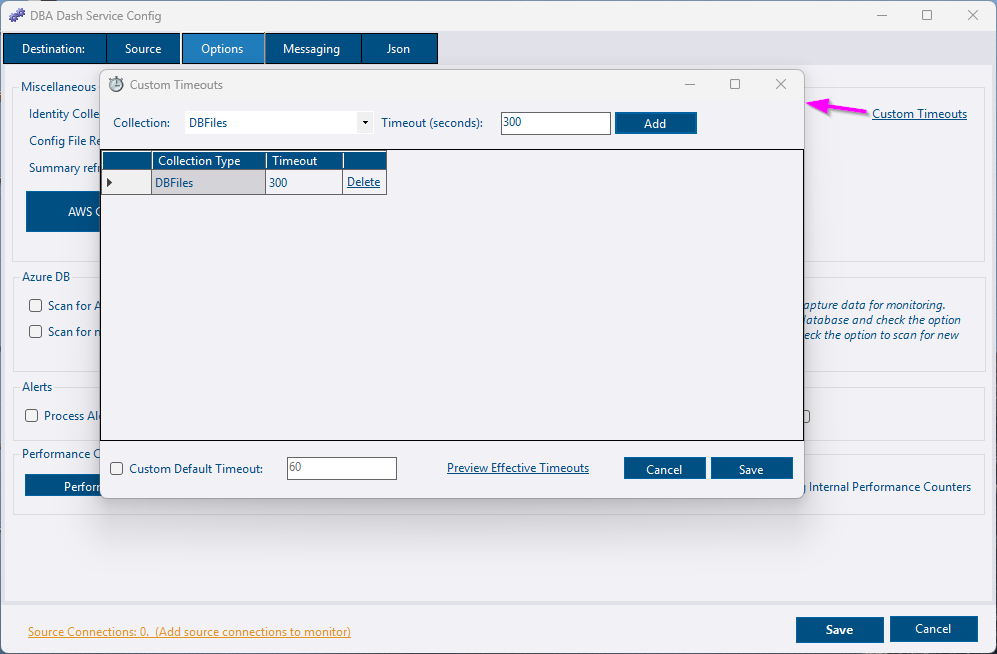
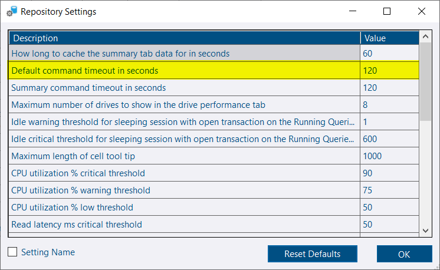

The default query timeouts should work for most deployments of DBA Dash. If you regularly experience query timeouts for a particular collection in your environment you should consider either increasing the timeout or disabling the collection.

For example, you might experience query timeouts with the IdentityColumns collection if you have a large number of databases on your SQL instance.  You might also experience issues if you have databases with very large numbers of tables.  The collection only runs once a day so you might decide to increase the query timeout rather than disable the collection.

Note: The service loops through the databases rather than processing them in parallel to minimize the impact on the monitored instance.

## Configuring collection timeouts

Collection timeouts can be configured using the *Custom Timeouts* link on the *Options* tab of the service configuration tool.



* Select a collection from the *Collection* drop down.
* The default timeout will be shown in the textbox to the right.  Edit this to the value required.
* Click *Add*
* Click *Save* to save the timeouts.

### Default timeout

The default timeout applies to any collection without an explicitly defined timeout.  This can be changed by checking the *Custom Default Timeout* checkbox and editing the timeout value.  An explicitly defined user timeout will take priority, then a built-in timeout if configured for the collection.  If no timeout is defined for the collection, the user default timeout is used or the system default timeout if a user default is not specified.

To see what timeout values will actually be used, click the *Preview Effective Timeouts* button.

### Json

Custom timeouts are stored in the **commandTimeouts.json" file**.  If the file doesn't exist, the application default timeouts will be used.  You can now use the service config tool to edit timeouts or you can create/edit the json file manually if you prefer.

```json
{
  "CollectionCommandTimeouts": {
    "DatabasePermissions": 900,
    "DatabasePrincipals": 900,
    "DatabaseRoleMembers": 900,
    "IdentityColumns": 900,
    "SlowQueries": 90
  },
  "DefaultCommandTimeout": 60
}
```

You only need to specify the collection timeouts that you want to set/override.  If you just want to override the IdentityColumns collection:

```json
{
  "CollectionCommandTimeouts": {
    "IdentityColumns": 1800
  }
}
```
For any collections not specified, the application defaults for that specific collection will be used if available otherwise the DefaultCommandTimeout will apply.  If you change the "MinimumLevel" to "Debug" in  the **serilog.json** file, you will see the timeout values that will be used in the Log file when the service is started.

## Monitoring collection times

In the Options tab on the DBA Dash service config tool you can click the option to "Log Internal Performance Counters".  If this option is enabled, the collection duration will be available in the "Metrics" tab in the DBA Dash GUI.

## Additional timeouts

These additional timeouts can be configured in the **ServiceConfig.json** file.

* ImportCommandTimeout - timeout for inserting data into the repository database.  60 seconds default.
* PurgeDataCommandTimeout - timeout for managing data retention.  600 seconds default.
* AddPartitionsCommandTimeout - timeout for creating new partitions. 300 seconds default.

```json
{
  "ImportCommandTimeout": 60,
  "PurgeDataCommandTimeout": 600,
  "AddPartitionsCommandTimeout": 300,

}
```

## GUI Timeouts

The default timeout for the GUI can also be adjusted if needed. Select *Repository Settings* from the *Options* menu and adjust the *Default command timeout in seconds* as required.


