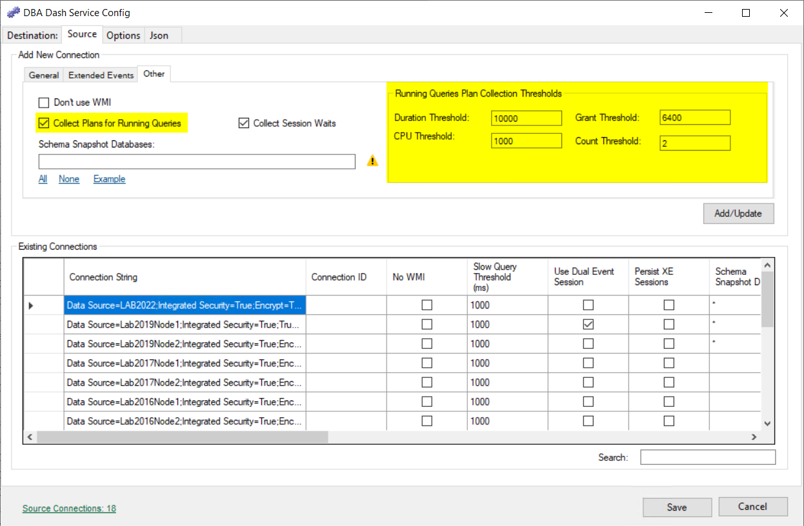

[RunningQueries](https://github.com/trimble-oss/dba-dash/blob/main/DBADash/SQL/SQLRunningQueries.sql) captures queries that are currently executing.  This takes inspiration from the likes of [sp_whoisactive](http://whoisactive.com/) and [sp_BlitzWho](https://github.com/BrentOzarULTD/SQL-Server-First-Responder-Kit/blob/dev/sp_BlitzWho.sql) - both of which are great tools.  It captures queries that are currently executing as well as sleeping sessions with open transactions.  This point in time snapshot might not be representitive of your SQL Server load but it provides a piece of the puzzle that can help diagnose performance issues.  For example, the data captured is useful to diagnose blocking issues, tempdb contention and memory grant issues.

## Enable Plan capture
Query plan capture is disabled by default.  To capture query plans, check the open in the DBA Dash Service Config tool:



The following json will be added to your source connection to enable the plan collection.  The thresholds can be modified by editing the json if required.  
```json
"RunningQueryPlanThreshold": {
"CPUThreshold": 1000,
"MemoryGrantThreshold": 6400,
"DurationThreshold": 10000,
"CountThreshold": 2,
"PlanCollectionEnabled": true
},
```
There is some extra overhead in capturing query plans but it can be useful to have this data available.  

## Efficient capture
DBA Dash focuses on providing lightweight collection of running queries to a central repository. In the [query](https://github.com/trimble-oss/dba-dash/blob/main/DBADash/SQL/SQLRunningQueries.sql) used to capture running queries, there is no call to sys.dm_exec_sql_text to capture query text or sys.dm_exec_text_query_plan/sys.dm_exec_query_plan to capture query plans.  Instead the query returns the sql_handle and query_plan_handle which can later be used to get the query text and plans.  

DBA Dash gets a distinct list of sql_handles and captures the associated query text.  If you have multiple instances of the same query running - the text will be collected and stored <ins>once</ins>.  The sql_handles of the text collected are cached.  If the same query appears in another running queries snapshot later - we won't need to capture the text for it.  This provides a more efficient way to capture and process running queries for regular collection.  

Capturing query text isn't generally that expensive but it can be a bit more expensive to capture query plans.  The cost isn't something to worry about for adhoc troubleshooting but we should pay attention for queries that run regularly.  DBA Dash doesn't collect plans by default so you can decide if you want to enable this feature.  If you decide to enable the feature, DBA Dash has an efficient method to capture query plans that you can tune for your needs. 

The system for capturing query plans is similar to capturing query text.  The plan_handle is captured with the statement start/end offsets which can be used to capture the query plans.  If you have multiple queries executing that are using the same plan - the plan is captured once.  Additionally, caching is done on the plan_handle in combination with the query_plan_hash and statement offsets. If we see the same plans in future running queries snapshots - we won't need to capture them again.   

Additionally thresholds are used for plan capture to reduce the overhead of collecting and storing plans that are unlikely to be of interest. By default, plans are not captured but if you enable plan collection these thresholds will be used:

 1,000ms CPU, 10,000ms Duration, 6400 pages (50MB) memory grant, query count: 2

Plans will be collected for queries that exceed **any** of the specified thresholds.  The thresholds can be configured in the ServiceConfig.json file.