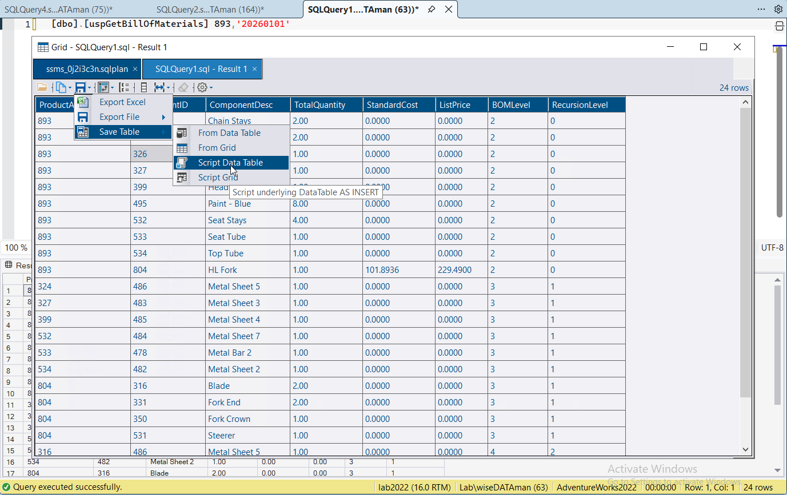
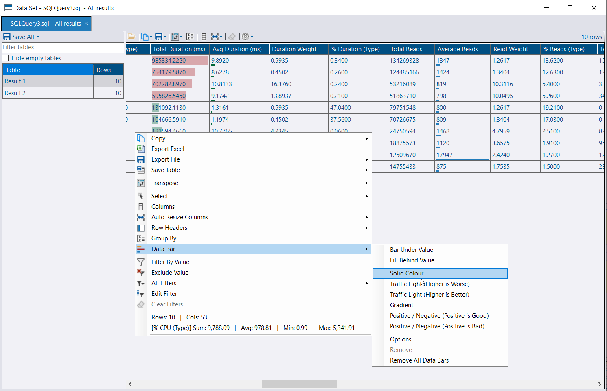


The SSMS extension is available starting from 4.20.1. It supports SSMS 21 and 22.


The extension adds an **Open in DBA Dash Visualizer** option to SSMS for:

* **Execution plans** - the execution plan right-click menu.
* **Deadlock graphs** - a right-click menu the extension adds to deadlock graph tabs.
* **XML** - a plain XML tab holding a plan or deadlock graph, such as the output from `sp_BlitzLock`.
* **Results grids** - the results grid right-click menu.
* **All results** - **Open All Results in DBA Dash Visualizer** is shown when the query window has more than one results grid.

The option is also on the **Tools** menu, with **Ctrl+Alt+Shift+D** as a keyboard shortcut.

[](ssms-extension.png)

Items open in [DBA Dash Visualizer](/docs/help/dba-dash-visualizer/). If the Visualizer isn't installed, they open in DBA Dash instead.

## Install

The extension is included with DBA Dash and DBA Dash Visualizer - there's nothing separate to download.

* **DBA Dash:** **Options > SSMS Extension > Install SSMS Extension...**
* **Visualizer (or DBA Dash viewers):** **Settings > Install SSMS Extension...**

The extension is installed with the SSMS VSIX installer. Close SSMS if prompted, and start it again once the install completes. Installing also records the path of the app it was installed from, which the extension uses to launch the viewer.

If the installed extension is older than the app, you'll be offered an update. Use **Uninstall SSMS Extension...** from the same menus to remove it.

## Results grids

[](results-grid.png)

Opening an SSMS results grid in the Visualizer gives you features that aren't available in SSMS:

* Sorting and filtering
* Group By
* Hide, show and reorder columns
* XML and JSON columns shown as links
* Plans and deadlock graphs in a cell open in their viewers
* Copy as Markdown, and export to Excel, JSON, XML, Markdown, HTML or SQL

Column data types are preserved when the grid is read from SSMS. Large result sets are read in the background with a cancellable progress dialog.

### All results

**Open All Results in DBA Dash Visualizer** sends every result set from the query window in one go. They open on a single tab, named after the query window, with a table per result set. **Save All** saves them as a data set file (XML or JSON) that can be re-opened later, or as an Excel workbook with a sheet per result set.

### Data bars

[](data-bar.png)

Right-click a numeric column or cell and select **Data Bar** to draw a bar in each cell, sized by the value's share of the column's range.

* **Bar Under Value** or **Fill Behind Value**.
* **Solid Colour**, **Traffic Light (Higher is Worse)**, **Traffic Light (Higher is Better)**, **Gradient**, or **Positive / Negative**. Bars for negative values run left from a zero line, and bars for positive values run right.
* **Options...** sets the colors, a fixed minimum and maximum, and warning and critical thresholds. Select **Thresholds are values, not % of scale** to compare the thresholds with the cell value - e.g. amber from 5ms and red from 50ms.
* **Copy to All Numeric Columns** applies the same style to the other visible numeric columns. Each column keeps its own scale.
* **Remove** and **Remove All Data Bars** take bars away.

By default, a bar is scaled to the values showing, so it rescales when you filter, group or refresh. Data bars are remembered and re-applied to the next result set with the same column names and types.

Data bars are available in grids throughout DBA Dash, not just result grids. They can also be saved with [custom reports](/docs/how-to/create-custom-reports/#data-bars).

### Script as INSERT

Right-click the grid and select **Save Table**:

| Option | Description |
|---|---|
| **Script Grid** | Script the visible columns, using the grid's column headers |
| **Script Data Table** | Script all the underlying columns |
| **From Grid** / **From Data Table** | Save directly to a table in a SQL Server database |

The script creates a `#DBADashGrid` temp table, inserts the rows (in batches of 1,000), and selects them back. Rows are filtered the same way as the grid.

```sql
IF OBJECT_ID('tempdb..#DBADashGrid') IS NOT NULL
BEGIN
    DROP TABLE #DBADashGrid
END
GO
CREATE TABLE #DBADashGrid (
    ...
);
INSERT INTO #DBADashGrid (...)
VALUES (...),
(...);

SELECT ...
FROM #DBADashGrid
```

Run the script in SSMS to re-create the results you saw in the grid, then query the temp table to slice the data further. This is useful for sharing a result set with someone else, or for keeping a copy of it to compare against later. **Export File > As SQL (INSERT)** saves the same script to a file.

### Saving and re-opening grids

**Export File** saves the grid as JSON or XML (optionally compressed), which can be re-opened later in the Visualizer or in DBA Dash with **Tools > Open Grid or Data Set**. Results saved from SSMS with **Save Results As** XML can also be opened - by drag and drop, from Explorer, or with the **Open** button. **Tools > Open Grid or Data Set** in DBA Dash also opens DataSets written to the DBA Dash service's `Failed` folder, which can help with troubleshooting collection issues.

## How it works

The extension writes the plan, deadlock graph or grid data to a randomly named temp file and launches `DBADashVisualizer.exe` (or `DBADash.exe`). It finds the app by checking, in order:

1. The path recorded when the extension was installed.
2. DBA Dash's registered file associations.
3. The default Visualizer install location.
4. `PATH`.


SSMS doesn't provide a supported API for reading execution plans, deadlock graphs or results grids. The extension relies on SSMS internals, so a future SSMS update could break some of these options until the extension is updated. If the data can't be read, a warning message is shown.

