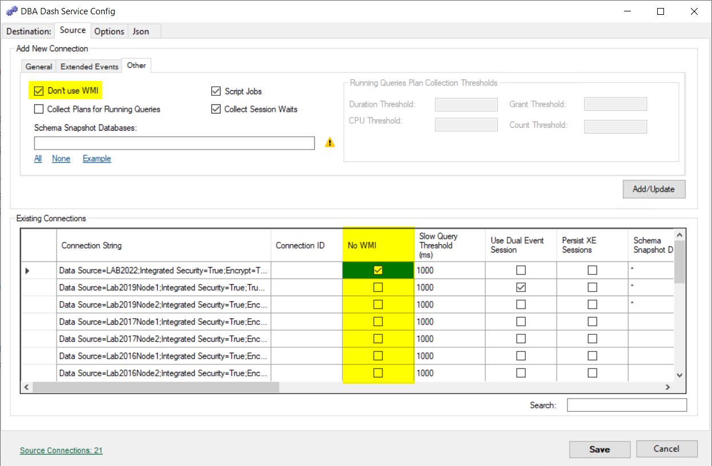

WMI *(Windows Management Instrumentation)* is a way to query information about a computer system.  DBA Dash collects most of it's data through a SQL connection, but this is supplemented with some WMI queries in a couple of places.  The WMI collections can be disabled by selecting the "No WMI" option when adding a connection.

## What data is collected with WMI?

* Drives (Win32_Volume)

Drive capacity, free space, name and label are collected using WMI.  If WMI is disabled or the WMI collection fails, this data will be collected using a [SQL query](https://github.com/trimble-oss/dba-dash/blob/main/DBADash/SQL/SQLDrives.sql) instead.  The SQL query uses sys.dm_os_volume_stats which is limited to return drive space information only for the drives that contain database files.  This would exclude a dedicated OS volume or a volume used for backups.  Using WMI allows us to collect data for all volumes.

* Drivers (Win32_PnPSignedDriver)

Driver information is obtained from WMI which might be useful to help detect out of date drivers.  For instances on AWS it's important to make sure you have up-to-date PV drivers, NVMe drivers and ENA network drivers.  The PV driver version is obtained by reading the value from the registry key.

* Power Plan (Win32_PowerPlan)

The "Hardware" tab in DBA Dash shows the current power plan and highlights if it's not set to high performance.  The power plan is collected using a WMI query. If WMI is disabled, the power plan might still be collected via [this query](https://github.com/trimble-oss/dba-dash/blob/main/DBADash/SQL/SQLServerExtraProperties.sql).  The SQL query requires xp_cmdshell to be enabled and account to have access to use it.  If the power plan hasn't been collected via SQL and WMI is enabled, it will be obtained using Win32_PowerPlan.

* Manufacturer/Model (Win32_ComputerSystem)

This data is shown on the "Hardware" tab in DBA Dash. In AWS the model shows you the instance type used which is useful (e.g. r6id.xlarge, x2idn.16xlarge etc).  If WMI is disabled this data will be collected using [this query](https://github.com/trimble-oss/dba-dash/blob/main/DBADash/SQL/SQLServerExtraProperties.sql).  The SQL query uses xp_instance_regread and requires sysadmin permissions. This is collected as part of the server extra properties collection if WMI is enabled.  

* OS Caption (Win32_OperatingSystem)

This data is shown on the "SQL Patching" tab - showing the version of Windows used (e.g Microsoft Windows Server 2022 Datacenter).  It's collected as part of the server extra properties collection if WMI is enabled.  

## Provisioning Access

On servers WinRM should be enabled by default.  If you need to [enable it manually](https://learn.microsoft.com/en-us/powershell/module/microsoft.powershell.core/enable-psremoting?view=powershell-7.2), run this on the monitored instance:

```powershell
Enable-PSRemoting -SkipNetworkProfileCheck -Force
```

This does a number of tasks including creating the firewall exception (port 5985).  

The DBA Dash service account should be a member of the local administrators group on the monitored instance.

```powershell
## Option to add new service account to local admins to get WMI calls to work
Invoke-Command -ComputerName SQL1,SQL2 -ScriptBlock {Add-LocalGroupMember -Group "Administrators" -Member "DBADash$" }
```



By default DBA Dash now uses WSMan/WinRM so these are no longer required.

* Windows Management Instrumentation (ASync-In)
* Windows Management Instrumentation (DCOM-In)
* Windows Management Instrumentation (WMI-In)



## Disable WMI collections

If you don't want to grant the service account local admin privelages, WMI collections can be disabled.  It's easy to disable WMI collections and doing so will prevent WMI related errors appearing in the log and slowing down your collections.  WMI collections can be disabled on the "Source" tab in the service configuration tool.

[](nowmi.png)


## Under the hood

Starting with version [2.24.2](/blog/whats-new-in-2.24.2/), WMI collections are done using Microsoft.Management.Infrastructure and default to the WSMan/WinRM protocol.  The WSMan protocol might fail in [some situations](https://github.com/trimble-oss/dba-dash/issues/299) and DBA Dash will automatically switch to using DCOM.  WSMan/WinRM is the newer protocol and has the advantage of using a single dedicated firewall port (5985).  

The WMI collections are similar to using Get-CimInstance in PowerShell:

```powershell
Get-CimInstance -Class Win32_computerSystem -ComputerName "NAME_HERE"
```

The older DCOM collection is similar to using Get-WMIObject or using Get-CimInstance with the DCOM protocol.

```powershell
[Microsoft.Management.Infrastructure.CimCmdlets.ProtocolType]$Protocol = 'DCOM'

$option = New-CimSessionOption -Protocol $protocol
$session = New-CimSession -ComputerName "LAB2012" -SessionOption $option
Get-CimInstance -CimSession $session -ClassName Win32_computerSystem
```

If you want to know which method is been used, it's available in the log files.  It's only available if you change the logging level from "Information" to "Debug" though.  Edit "MinimumLevel" in "serilog.json" to "Debug" and restart the service.  You will now see some entries in the log similar to:

```text
2022-10-26 15:53:25.050 +01:00 [DBG] Cache WMI options WSMan on SQLINSTANCE1 <7>
2022-10-26 15:53:25.052 +01:00 [DBG] WMI Connection succeeded using WSMan on SQLINSTANCE1 <7>
..
2022-10-26 15:55:24.963 +01:00 [DBG] Set WMISessionOptions from cache to WSMan on SQLINSTANCE1 <28>
```