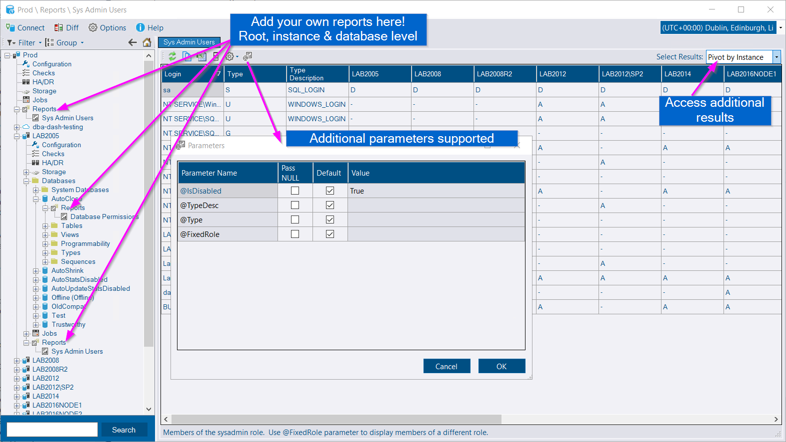
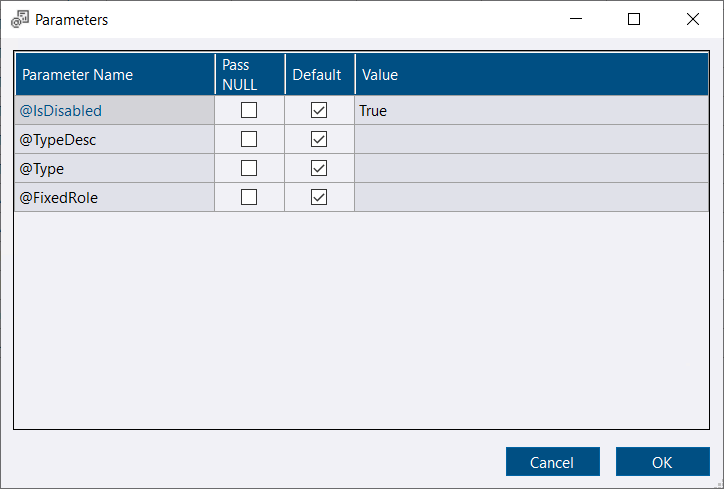
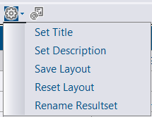
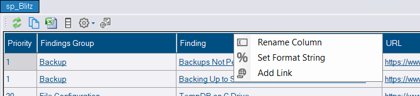
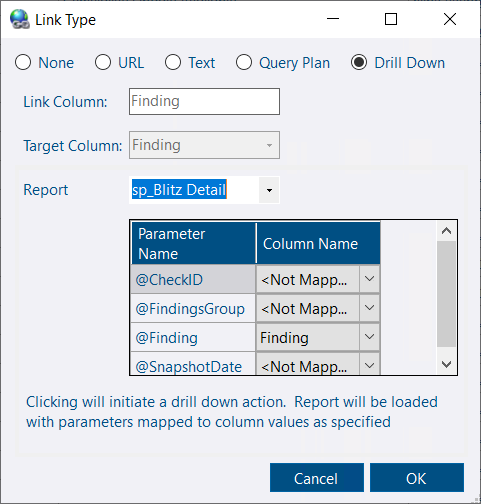
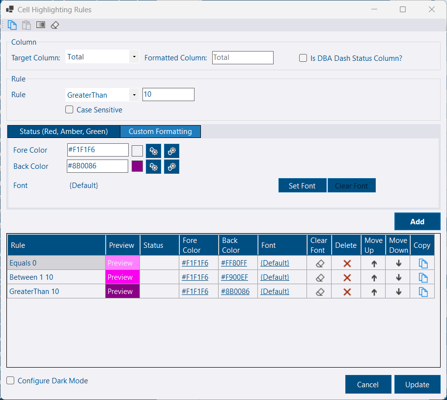
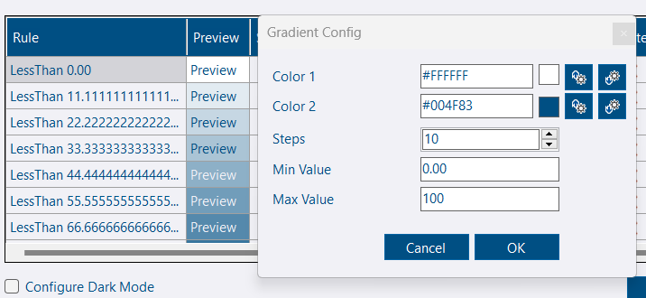
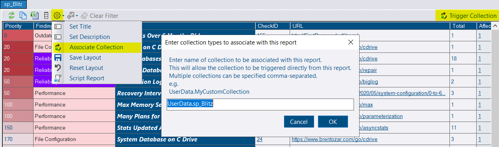
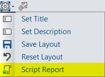

[](custom-reports.png)

## Intro

This feature allows you to extend the functionality of DBA Dash, by creating your own bespoke reports.  It's really easy to get started if you are familiar with writing T-SQL code.


Breaking changes will be minimized where possible, but forward compatibility is not guaranteed for any custom reports you create.


## Stored procedure & parameters

To create a custom report, you need to create a stored procedure in the **UserReport** schema with at least one of these parameters.  The parameters below are used by the app to provide context information - which instances or database the report should run for.

* @InstanceIDs IDs

*IDs is a user defined table type.  The application will pass a list of InstanceIDs.  If you run the report at instance level, the app will pass the InstanceID for all instances that match the selected filters.  When navigating down to a specific instance this table will contain a single row.  Note: For Azure DB, there is an InstanceID associated with each database.*

* @InstanceID INT

*The @InstanceID parameter provides the InstanceID associated with the selected instance. Use this parameter instead of @InstanceIDs to have the report listed at instance level instead of root level*

* @DatabaseID INT

*The @DatabaseID parameter provides the DatabaseID parameter associated with the selected database.  This is the DBA Dash DatabaseID associated with the dbo.Databases table and it uniquely identifies a specific database (not the database_id from sys.databases). Use this parameter if you want your report to appear at database level*

If your procedure has @FromDate and @ToDate parameters, the application will display the date range filter and supply these parameters to the report.  The dates are supplied are UTC.

If you add additional parameters to the report, the user is able to supply them manually.  If you want the report to run automatically, provide default values for the additional parameters.

[](custom-report-params.png)

**Once you create the procedure, the report will be available the next time you load the application.  Custom reports will also be refreshed when you click the Clear All option in the filter menu or switch repository connections.**

## Examples

### Root & Instance level report

This basic example lists the SQL instances associated with the current context in the app.  This report might not be very useful but it demonstrates the basics needed to create a report.

```sql
CREATE PROC UserReport.RootAndInstanceLevelTest(
	@InstanceIDs IDs READONLY
)
AS
SELECT I.ConnectionID
FROM dbo.Instances I
JOIN @InstanceIDs T ON I.InstanceID = T.ID
```

### Instance only report

This report will just list the name of the current instance.  The report will only appear at instance level as we don't have an @InstanceIDs parameter of type IDs.

```sql
CREATE PROC UserReport.InstanceOnlyTest(
	@InstanceID INT
)
AS
SELECT I.ConnectionID
FROM dbo.Instances I
WHERE I.InstanceID = @InstanceID
```

### Database only report

This report will only work at database level and it will list the name of the current instance and database.

```sql
CREATE PROC UserReport.DatabaseLevelTest(
	@DatabaseID INT
)
AS
SELECT	I.ConnectionID,
		D.name as DB
FROM dbo.Databases D
JOIN dbo.Instances I ON D.InstanceID = I.InstanceID
WHERE D.DatabaseID = @DatabaseID
```

### Real world example - report to display sysadmin users

DBA Dash collects permissions and role membership by default but it doesn't display this information anywhere in the GUI.  This is a good example for a custom report...

The stored procedure below will list the logins that are members of the **sysadmin** role (or other roles using @FixedRole parameter which we default to sysadmin).  The stored procedure returns 3 results.  The second and third results pivot the data by instance and login.  In addition to creating the stored procedure, the script below also inserts the customizations made in the GUI to set a description for the report and to rename the results.

```sql
CREATE OR ALTER PROC [UserReport].[SysAdminUsers](
	@InstanceIDs IDs READONLY,
	@IsDisabled BIT=NULL,
	@TypeDesc NVARCHAR(60)=NULL,
	@Type CHAR(1) = NULL,
	@FixedRole NVARCHAR(128)='sysadmin',
	@IncludeHidden BIT =0
)
AS
/* Base query into temp table */
SELECT I.InstanceDisplayName AS Instance,
		SP.name AS Login,
		SP.type AS Type,
		SP.type_desc AS [Type Description],
		SP.is_disabled AS [Is Disabled],
		SP.create_date AS [Created Date],
		SP.modify_date AS [Modified Date]
INTO #T
FROM dbo.ServerPrincipals SP
JOIN dbo.Instances I ON SP.InstanceID = I.InstanceID
WHERE EXISTS(
		SELECT 1
		FROM dbo.ServerRoleMembers SRM
		JOIN dbo.ServerPrincipals R ON SRM.role_principal_id = R.principal_id
		WHERE SP.principal_id = SRM.member_principal_id
		AND R.type = 'R'
		AND R.name= @FixedRole
		AND R.is_fixed_role=1
		AND SRM.member_principal_id = SP.principal_id
		AND SRM.InstanceID = I.InstanceID
		AND R.InstanceID = I.InstanceID
		)
AND EXISTS(SELECT 1
		FROM @InstanceIDs T
		WHERE T.ID = I.InstanceID
		)
AND (SP.is_disabled = @IsDisabled OR @IsDisabled IS NULL)
AND (SP.type_desc = @TypeDesc OR @TypeDesc IS NULL)
AND (SP.type = @Type OR @Type IS NULL)
AND	(I.ShowInSummary=1 OR @IncludeHidden=1)

/* Raw data */
SELECT Instance,
       Login,
       Type,
       [Type Description],
       [Is Disabled],
       [Created Date],
       [Modified Date]
FROM #T

/* Dynamic pivot by instance */
DECLARE @SQL NVARCHAR(MAX)
SET @SQL = N'
SELECT	T.Login,
		T.Type,
		T.[Type Description]
		' + (SELECT ',MAX(CASE WHEN T.Instance = ' + QUOTENAME(T.Instance,'''') + ' AND  T.[Is Disabled] =1 THEN ''D'' WHEN T.Instance = ' + QUOTENAME(T.Instance,'''') + ' AND T.[Is Disabled]=0 THEN ''A'' ELSE ''-'' END) AS ' + QUOTENAME(T.Instance)
		FROM #T T
		GROUP BY T.Instance
		ORDER BY T.Instance
		FOR XML PATH(''),TYPE).value('.','NVARCHAR(MAX)') + '
FROM #T T
GROUP BY	T.Login,
			T.Type,
			T.[Type Description]
ORDER BY T.Login
OPTION(RECOMPILE)'

EXEC sp_executesql @SQL

/* Dynamic pivot by login */
SET @SQL = N'
SELECT	T.Instance
		' + (SELECT ',MAX(CASE WHEN T.Login = ' + QUOTENAME(T.Login,'''') + ' AND  T.[Is Disabled] =1 THEN ''D'' WHEN T.Login = ' + QUOTENAME(T.Login,'''') + ' AND T.[Is Disabled]=0 THEN ''A'' ELSE ''-'' END) AS ' + QUOTENAME(T.Login)
		FROM #T T
		GROUP BY T.Login
		ORDER BY T.Login
		FOR XML PATH(''),TYPE).value('.','NVARCHAR(MAX)') + '
FROM #T T
GROUP BY T.Instance
ORDER BY T.Instance
OPTION(RECOMPILE)'

EXEC sp_executesql @SQL

GO
/* Optional - Add metadata. (Customizations done in the GUI) */

DELETE dbo.CustomReport
WHERE SchemaName = 'UserReport'
AND ProcedureName = 'SysAdminUsers'

INSERT INTO dbo.CustomReport ([SchemaName], [ProcedureName], [MetaData])
VALUES
( N'UserReport', N'SysAdminUsers', N'{
  "ReportName": "Sys Admin Users",
  "Description": "Members of the sysadmin role.  Use @FixedRole parameter to display members of a different role.",
  "CustomReportResults": {
    "0": {
      "ColumnAlias": {},
      "CellFormatString": {},
      "DoNotConvertToLocalTimeZone": [],
      "ColumnLayout": [],
      "ResultName": "Raw Data"
    },
    "1": {
      "ColumnAlias": {},
      "CellFormatString": {},
      "DoNotConvertToLocalTimeZone": [],
      "ColumnLayout": [],
      "ResultName": "Pivot by Instance"
    },
    "2": {
      "ColumnAlias": {},
      "CellFormatString": {},
      "DoNotConvertToLocalTimeZone": [],
      "ColumnLayout": [],
      "ResultName": "Pivot By User"
    }
  }
}' )
```

## Viewing your report

Once the procedure is created it will be available the next time you start the application.  The report will be available in the **Reports** folder.  You will find this folder at root, instance and database level depending what context parameters you created for your report.  If your report has a **@InstanceIDs** parameter you should see it at root level and instance level.

The name of your report will be the name of the stored procedure.  Once you select your report a grid will be shown with the output of your stored procedure.  If your report contains multiple result sets, you will see a drop down on the right-hand side to select which table to display.

## Customization

[](menu-options.png)

[](column-options2.png)

### Report Title

The report title is automatically set to the name of the stored procedure.  In the **Configure** menu, select "Set Title" to adjust the name of the report.

### Report Description

In the "Configure" menu, select "Set Description" to set a description for the report.  This will display in a status bar at the bottom of the report.  This can be used to provide some additional information about the report.

### Remove Columns

Columns can be removed using the columns menu.  If you want the changes to be persisted, click the **Save Layout** option in the **Configure** menu.

### Re-order Columns

Use drag & drop to re-order columns. If you want the changes to be persisted, click the **Save Layout** option in the **Configure** menu.

### Reset Layout

Use **Reset Layout** from the **Configure** menu to undo any customizations to column order, size or visibility.

### Add Link

[](add-link.png)

Links can be added to a column.  The options available are:

* None

Remove link

* URL

Navigate to a website.  A different Target Column can be selected to navigate to a URL in a different column.

* Text

Load text in a new window with formatting options for SQL, PowerShell or plain text.  A different target column can be selected to load the text in a different column.

* Query Plan

Open Query plan in the default app for *.sqlplan files. A different target column can be selected to load the query plan from a different column.

* Drill Down

Load a report and pass parameter values from the selected row.  Configure columns to map to parameters as needed.

### Column Alias

To rename a column, right-click the column header and select **Rename Column**

### Column Format

To set a column format, right-click the column header and select **Set Format String**.  This allows you to change how numbers or dates are displayed in the grid.  e.g.

* **N1** = Numeric with 1 digit
* **P1** = Percent with 1 digit
* **yyyy-MM-dd** - Date.  e.g. 2023-10-25

More options:

- [Standard Numeric Format Strings](https://learn.microsoft.com/en-us/dotnet/standard/base-types/standard-numeric-format-strings)
- [Custom Numeric Format Strings](https://learn.microsoft.com/en-us/dotnet/standard/base-types/custom-numeric-format-strings)
- [Standard Date Format Strings](https://learn.microsoft.com/en-us/dotnet/standard/base-types/standard-date-and-time-format-strings)
- [Custom Date Format Strings](https://learn.microsoft.com/en-us/dotnet/standard/base-types/custom-date-and-time-format-strings)

### Timezone Conversion

Dates are assumed to be in UTC format and are converted automatically to the local/selected timezone. To prevent this automatic conversion, right-click the column header and uncheck **Convert to local timezone**.

### Cell Highlighting Rules

Apply conditional formatting to cells based on the cell value or the value of another cell in the row.  Right-click the column header of the column you want to format and select **Highlighting Rules**.

[](cell-highlighting-rules.png)

* Set Target Column
*The target column is what the rule will be evaluated against - typically this will be the same column as the one you want to format.  If you check **Is DBA Dash Status Column**, status formatting will be applied based on these values: 1 = Critical, 2 = Warning, 3 = NA, 4 = OK, 5 = Acknowledged, 6 = WarningLow, 7 = Information.  Leave this unchecked to apply your own formatting rules.*
* Configure the Rule.  The following options are available.

	* Equals =
	* GreaterThan >
	* GreaterThanOrEqual >=
	* LessThan <
	* LessThanOrEqual <=
	* Between *>=value1 and <=value2*
	* BeginsWith *matches start of string*
	* EndsWith *matches end of string*
    * Contains *value is somewhere in the string*
    * NotContains *value is not contained somewhere in the string*
    * Like *RegEx match*
	* NotLike *RegEx does not match*
    * IsNull *value is NULL*
    * IsNotNull *value is NOT NULL*
    * All *Matches everything*

The rules are evaluated in order and the first rule that matches is applied.  If you have the **All** rule defined as your first rule, this would match everything and no other rules would be evaluated - so this should be the last rule you add as a catch all.  You can change the order of your rules in the grid by clicking the up/down arrows after they have been created.

If you want to perform case sensitive string matches, click the **Case Sensitive** checkbox.

* Set for formatting

If you want to use a Red, Amber, Green status - select a status from the drop down.  This makes it easier to have formatting applied that fits with the rest of the application and it's quicker than configuring your own custom colors.  If you want more control, select the **Custom Formatting** tab.  Here you can set the ForeColor, BackColor and Font.  Click the Square box to pick your color or enter the hex value of the color in the textbox.  If you also want to configure separate colors for the DarkMode theme, click the **Configure Dark Mode** option.

* Click Add

Your rule will appear in the Grid.  The grid provides basic options to update colors and font for your rules.  You can also move your rule up and down or delete your rule.  The copy icon in the grid can be used if additional customization is required that is not supported in the grid.

Repeat the steps above to define all your conditions.

* Click Update.

You cell formatting is now in effect.

#### Copy/Paste Rules

The copy button in the toolbar can be used to copy the entire set of rules.  You can then select a different column and use the paste button to copy the rules to the new column.

#### Gradient

The Gradient button in the toolbar can be used to generate a set of rules that will create a gradient effect.  This might be useful for % columns for example.  Just set a start color, end color, number of steps and min/max values for the rule.



## Trigger Collections

You can associate a collection with your custom report which allows you to trigger the collection to run on demand directly from the report.  The name of the available collections can be found on the *Collection Dates* tab.  A [custom collection](/content/docs/help/custom-collections/) will start *UserData.*




Triggering collections requires the [messaging](/content/docs/help/messaging/) feature to be enabled.

Triggering collections currently only works at the instance level.


## Security

To run a custom report a user needs to have EXECUTE permissions on the stored procedure.  If a user doesn't have EXECUTE permissions, the report won't be visible and the user won't be able to run the report. You can add a user to the **RunUserReports** role to grant access to all custom reports.

## Sharing Reports

[](script-report.png)

🤝It's easy to share your report creations with the community.  Click the **Script Report** option from the **Configure** menu (gear icon) of your custom report (Available in 2.50 and later).  This includes the stored procedure you created and any report customizations made in the GUI. Post it on your blog and/or add a 🙌[Show and tell](https://github.com/trimble-oss/dba-dash/discussions) post.
