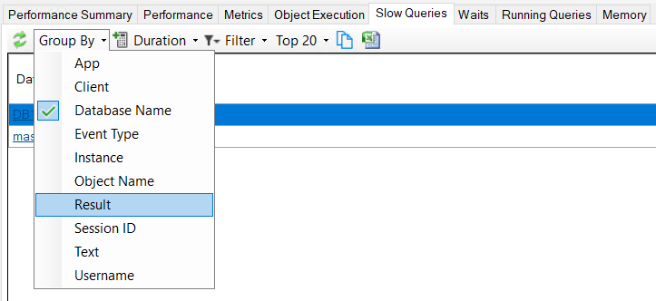
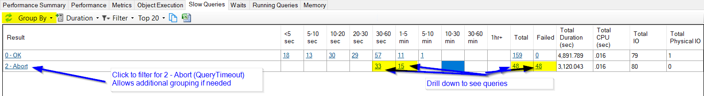
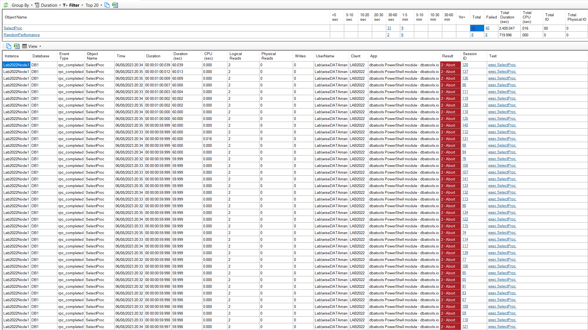
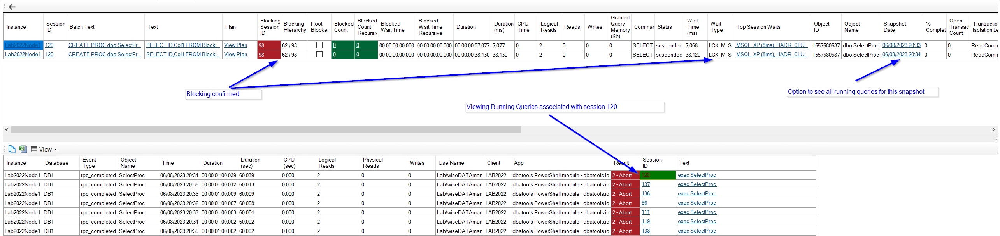
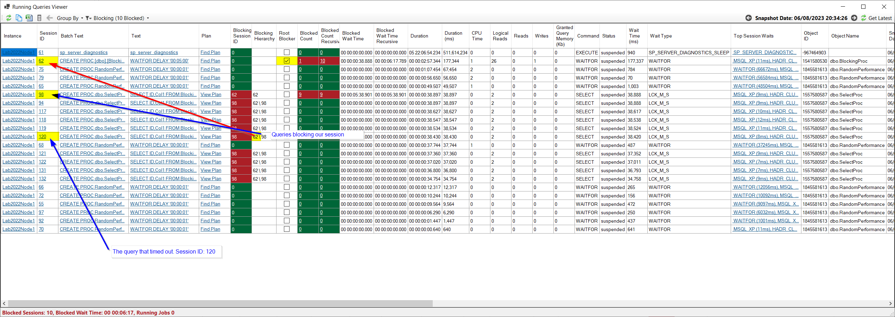

Client applications can specify a query timeout when they query SQL Server.  If data isn't returned within the configured amount of time, the query is cancelled by the client application.  The default timeout in .NET is 30 seconds unless a developer specifically overrides this timeout.  

It's important to specify a timeout value that is appropriate for your query - too long or too short query timeouts can both cause issues.  Adjusting the timeout is an option to consider but it's important to understand why the query is slow and address the root cause where possible.

DBA Dash makes it easy to troubleshoot query timeouts.  You can identify queries that have failed due to a timeout and more importantly work out exactly what made the query slow, causing it to exceed the specified timeout.

*Note: This post focuses on **query timeouts** rather than **connection timeouts**. A connection timeout occurs while establishing a connection to your SQL instance where a query timeout occurs when executing a query.*

## Prerequisites

[Slow Query capture](/docs/help/slow-queries/) is disabled by default and should be enabled to allow troubleshooting of query timeouts.  Set the **Slow Query Threshold** to 1000 in the service config tool to capture queries that take longer than 1 second to run.  You can use a different threshold if you prefer but the threshold needs to be less than the application level query timeout.

[Running Queries](/docs/help/running-queries) will also be used to troubleshoot query timeouts, but this should already be enabled by default.  You might want to adjust the [schedule](/docs/help/schedule) to run more frequently though.  The default schedule is every 1min.  If you are dealing with 30 second timeouts, we might only capture a point in time snapshot of the queries execution 50% of the time which can make things harder to troubleshoot.  It can still be sufficient if you have a large number of timeouts.  The 1min schedule is also enough if you are dealing with longer query timeout durations like 5 or 10min where we will expect to see multiple point in time snapshots of a queries execution.  If you want to have more snapshots available, consider adjusting the threshold to 30 seconds.

## Identification

Timeouts are easy to identify:

* Go to the **Slow Queries** tab.
* Adjust the date range if needed. (Top Right)
* Change the **Group By** to Result.

* Query timeouts will have result **2 - Abort**.  
* Click the **2 - Abort** link to filter

* You can adjust the **Group By** again to your preference.  If you want a breakdown by App, Database etc.
* Click the **Total** column or one of the duration groupings to drill down and view the queries.

*Note: **2 - Abort** isn't necessarily just query timeouts.  If you hit the stop button in SSMS, this will also generate **2 - Abort** for example.  It indicates that the client has cancelled the query request and typically this will be the result of an exceeded timeout*

## Diagnosis

In the details grid after drilling down we have a number of things that could indicate why the query timed out.

* A large number of physical reads indicates that we needed to read data from disk.  The data pages been read from disk instead of memory could explain why this particular execution was slow.
* If CPU time and Duration are similar, we know the query was doing some work. It's likely you can replicate the slow performance by running the query in SSMS.  If you can't replicate the issue it could be the result of a bad query plan which can be the result of [parameter sniffing](https://www.brentozar.com/blitzcache/parameter-sniffing/) optimization. 
* If the CPU time is small, the query must have been waiting on something.  If we don't see physical reads it's possible that the query was blocked.
* We have the full query text along with the parameter values which is very useful if we wanted to try to re-produce the issue.

*In the example above we have a duration of 60 seconds with less than 1ms CPU time and no physical reads.  This suggests that the query might have been blocked.*

The running queries capture allows us to see a point in time snapshot of the query as it was executing. Depending on how frequently we capture running queries and how long the query took to execute, we might have multiple snapshots available.  With multiple snapshots available we can see exactly what the query was doing at various stages of it's execution.  Even a single snapshot is sufficient to get an idea what the problem might be - particularly if we have multiple query timeouts to investigate.

To see the associated running query snapshots, click the "Session ID" column in the detail grid.  The top grid is replaced with the running query snapshots associated with this query.  

*Note: If the query duration was 30 seconds we might only have a single row 50% of the time with the default running queries schedule. You might need to investigate multiple queries to see any running query snapshots. See [Prerequsites](#prerequisites)*

*In the example above we can see the query was blocked at the snapshot 7 seconds into the queries execution and still blocked at 38 seconds into the queries execution.  The query was blocked by session 98 which is blocked by session 92.*

The running query snapshots provide a wealth of information that will allow you to troubleshoot exactly what caused the query to timeout.  Some tips:

* Each row represents a point in time snapshot of what the query was doing at that particular moment - including the statement currently executing.  
* The **Duration** column shows how far into the queries execution each snapshot represents.
* Pay attention to the **Wait Type**.  This provides one of the biggest clues to identify the root cause of the performance problem.  If you are unsure about a particular wait type, use the [SQLSkills.com wait type library](https://www.sqlskills.com/help/waits/) to get some more information on the wait type.
* Top waits are also shown for the session which can be useful.  This only includes waits that have completed and it could include waits for other queries ran using the same session.
* You can click the **Snapshot Date** column to see everything else that was running in the captured running query snapshot.  If you identify that your query is been blocked, this will allow you to identify the query that is causing the blocking.

*In the example above we can see that the root blocker is session 62.  This is just a demo and we can see the root blocker is running a WAITFOR command.  What's interesting is our blocked query is just a SELECT statement.  In this situation you might consider RCSI (Read Committed Snapshot) or snapshot isolation level. You might also want to tune the blocking query and keep the transaction as short as possible.*

* The query plan might be available depending on the [plan capture settings](/docs/help/running-queries/#enable-plan-capture) or the link will provide a query you can use to attempt to retrieve the plan from the SQL Instance.  Having the query plan available will help you diagnose an issue with a bad query plan.
  
## Summary

A multitude of factors can impact the execution time of a query and cause a query that normally has good performance to exceed its query timeout. Other queries might get progressively slower over time as data volumes grow or experience a sudden performance degradation due to a change in query plan. The intermittent issues are harder to troubleshoot, but with DBA Dash you can easily capture these queries and the information you need to identify the root cause.

