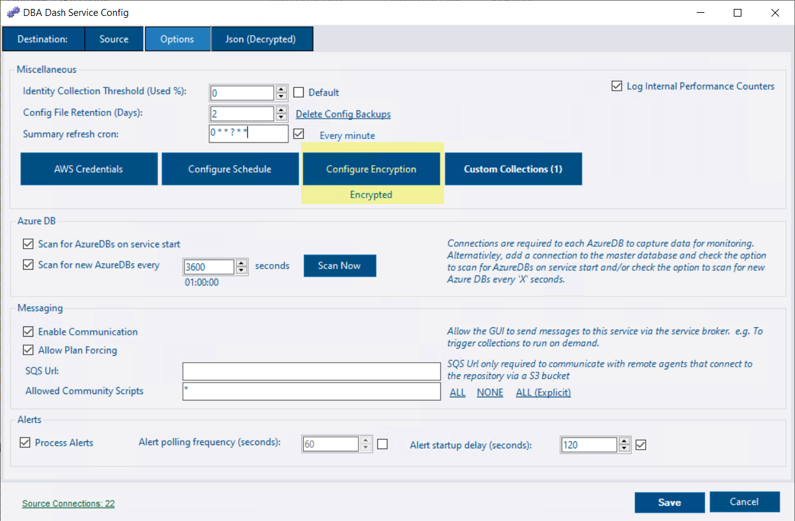
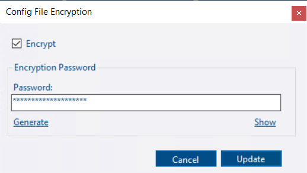
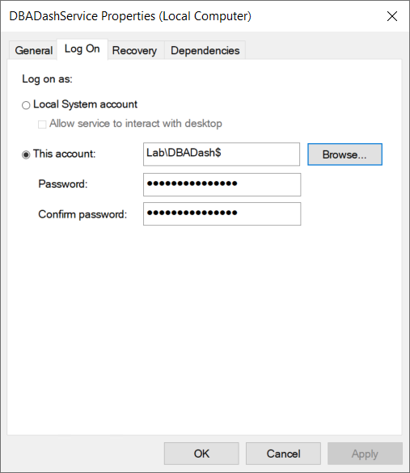

## New service account preparation

Review the [security document](https://dbadash.com/docs/help/security/#service-account).  A managed service account is a good option is you are considering changing the service account.

* Ensure the service account has [permissions](https://dbadash.com/docs/help/security/#running-with-minimal-permissions) to collect data from your monitored instances.

*If you are using [WMI](/docs/help/wmi), the service account also needs to be local admin on the monitored instances*

* Ensure the service account has permissions to write to the application folder (For writing to Log Folder).
* Ensure the service account has *db_owner* [permissions](https://dbadash.com/docs/help/security/#repository-database-permissions) on the repository database to allow it to write to the database and perform upgrades when deploying new versions.

## Change service account

* Check if the config file is encrypted (recommended)

* If the config file is encrypted, click *Configure Encryption*.  Click *Update*


This step is necessary to create a temporary key to allow the new service account to decrypt the config file.


* Open the services console (Start/Run **services.msc**)
* Find the DBA Dash service (*DBADashService* by default)
* Stop the service
* Right-click the service & select *Properties*
* Click the *Log On* tab

* Change the service account using the dialog.
*If you are using a managed service account, leave the password blank.*

* Start the service & check it's working.

*Check the DBA Dash ErrorLog tab in the GUI and the service Logs folder to troubleshoot issues*


If you prefer, you can also use the service config tool to uninstall and re-install the service.

