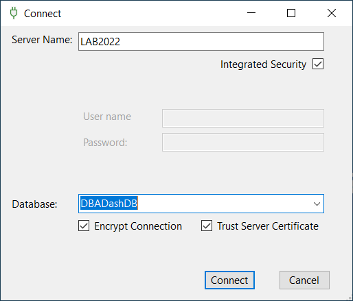

## Introduction

The GUI is packaged along with the DBA Dash service for convenience, but you might want to deploy this separately.

## Requirements

* Windows machine with [.NET 8 Desktop Runtime](https://dotnet.microsoft.com/en-us/download/dotnet/8.0/runtime)
* DBA Dash repository DB already [deployed](/docs/setup/quick-start).

## Security

To run the GUI, users only need access to the repository database.  No access is required to any of the monitored instances. Consider creating a group that grants access to DBA Dash.  To grant minimum permissions:

* Add the user/group to the "App" role in the DBA Dash repository database.  The role has SELECT and EXECUTE permissions.
* Optionally add the user to the ManageGlobalViews database role.  This allows users to save customized Metrics views for all users.

## Setup

1. [Download](https://github.com/trimble-oss/dba-dash/releases) the GUI_Only package
2. Extract it to a folder on your PC
3. Run DBADash.exe
4. Connect to the repository database.

Use Windows authentication where possible.

The connection details are persisted on a per user basis in the AppData folder, encrypted using the DPAPI. The GUI will initially use the connection defined in the ServiceConfig.json file if it’s available (where the service is deployed). 

 ## Upgrades

Users will automatically be prompted to upgrade if the GUI version is different from the repository. [See here](/docs/setup/upgrades/#upgrading-gui-clients)

 ## Other deployment options

 * Deploying the GUI to a network share is possible.  This might make upgrades harder with locked files though.
 * Deploying to a Google Drive is an option.
