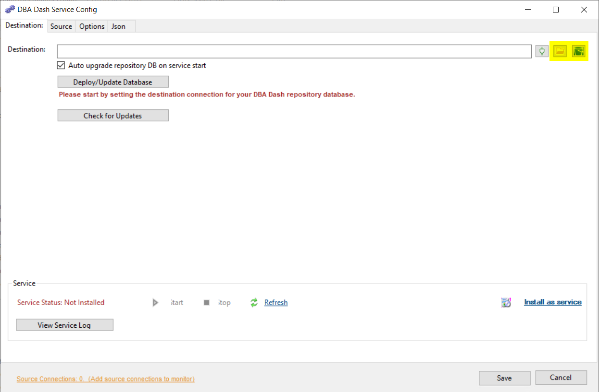
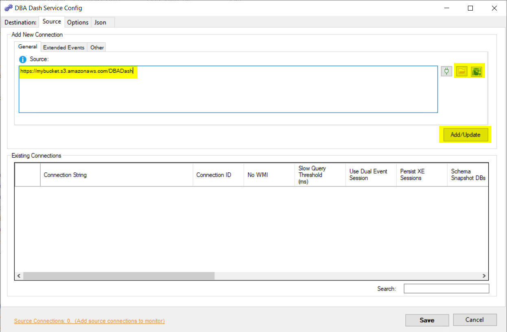
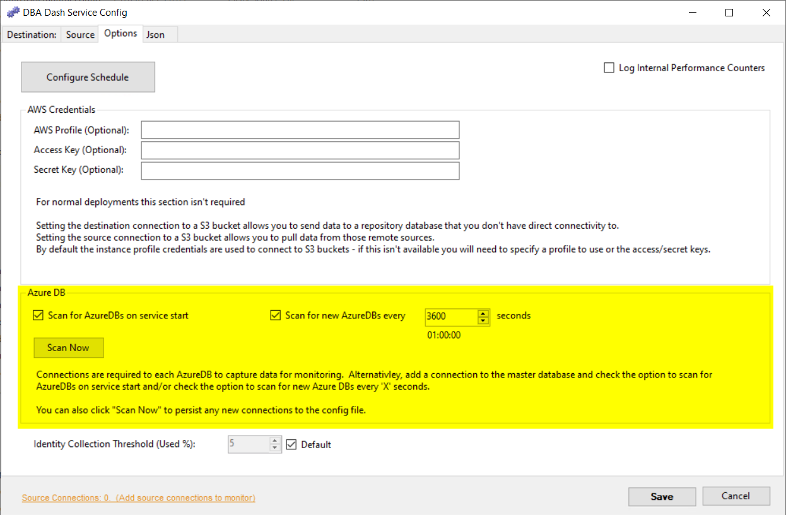
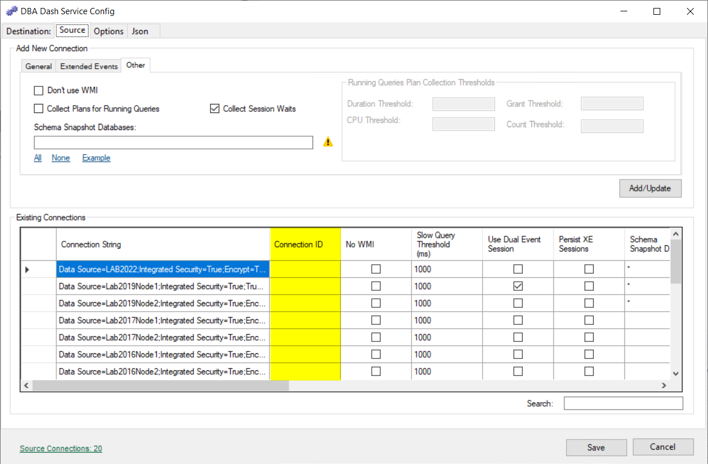
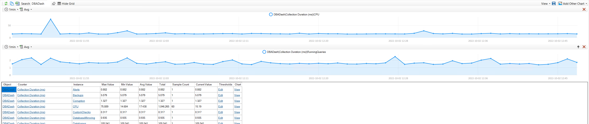
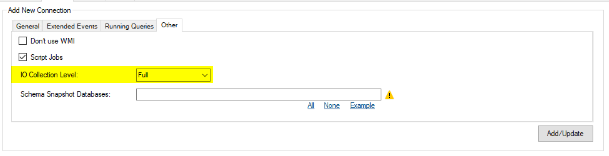

## Destination Connection

The destination connection is usually the connection to the DBA Dash repository database but you can also set this as a S3 bucket or folder.  You might do this if you don't have any connectivity between your monitored instances and your DBA Dash repository database.

Click the icons highlighted below to set the destination connection to a S3 bucket or folder.



You can also set it manually.  e.g.
`https://mybucket.s3.amazonaws.com/DBADash`

There are various methods you can use to configure access to S3 buckets.  You could add the permissions to an IAM role associated with the instance if it's a EC2 instance in AWS.  If you want to provide a AWS profile or Access/Secret key combination, that can be done in the Options tab.

Please avoid storing the credentials in the config if possible.  If it's not possible, ensure the config file is encrypted.

## Secondary Destinations

A secondary destination can be used to write to multiple repository databases.  For example, you might want to have a local DBA Dash repository database and also push the data to a more central repository via a S3 bucket.  Secondary destinations can be configured by editing the **ServiceConfig.json file**.  You can use the "Json" tab in the service configuration tool or a text editor.  Here is an example writing to 3 secondary destinations (4 in total including the primary destination) - S3 bucket, folder, SQL Database.

```json
  "SecondaryDestinations": [
    "https://mybucket.s3.amazonaws.com/DBADash",
    "c:\\DBADashDestinationFolder",
    "Data Source=LOCALHOST;Initial Catalog=DBADashDB;Integrated Security=True;Encrypt=True;Trust Server Certificate=True;Application Name=DBADash"
  ],
```

## Source Connection

Similar to the destination connection, your source connection can also be a folder or S3 bucket.  This allows the DBA Dash service that has connectivity to your repository database to import the data collected via the remote DBA Dash agent.  Set the source connection the same as the destination connection used by the remote agent and click Add/Update.



## Azure DB

DBA Dash supports monitoring Azure DB.  Each database is treated like an individual SQL instance, but you only need to add a connection to the master database to the config.  By default the application will add collection schedules for each database when the service starts and also look for new databases created every hour.  You can disable these features if required.  The "Scan Now" button can be used to add the databases as connections in the config.  You might want to do this to have different collection configurations for each database.  You might also want to monitor specific databases.



## Schedules

Schedules can be customized if required.  You can configure schedules at the agent level or have customized schedules for each monitored instance.  See [here](/docs/help/schedule/) for more information.

## Slow Query capture - Extended Events

Slow query capture can be enabled to capture RPC/Batch completed events that take longer than a specified duration.  See [here](/docs/help/slow-queries/) for more information.

## Query plan capture

Query plans can be captured for running queries.  See [here](/docs/help/running-queries/) for more information.

## Schema snapshots

See [here](/docs/help/schema-snapshots/) for information on schema snapshots.

## ConnectionID

The ConnectionID can be edited in the existing connections grid on the Source tab of the service configuration tool.  By default the output from @@SERVERNAME is used to uniquely identify an instance in the DBA Dash repository database.  You might want to change the ConnectionID if @@SERVERNAME isn't unique for your environment.  You might also want to set the ConnectionID if you want to migrate to a new server and maintain history from the old instance as if it was the same server.



## Identity Collection Threshold

DBA Dash collects identity column information for any identity columns that have used 5% of their identities.  You can adjust this threshold in the Options tab of the service configuration tool.

## Log Internal Performance Counters

If you enable internal performance counters, you will be able to track how long each collection took to run as well as some other internal metrics.  This information will be available on the Metrics tab along with the os performance counter metrics that get collected.

[](internalcounters.png)

 Enabling internal performance counters will increase the size of the PerformanceCounters tables.

Internal performance counters track the time taken from the client side.  If you are interested in evaluating the monitoring impact of DBA Dash, you could create an extended event session to capture RPC and Batch Completed events for application name starting with "DBADash".

## Multiple agents running on the same host

It's possible to have multiple DBA Dash agents running on the same host.  To do this you need to give each a unique service name.  The default service name is **DBADashService**.  To change this, edit the "ServiceName" in the ServiceConfig.json file or click the "Json" tab in the service configuration tool.  On the "Destination" tab you will need to click the "Refresh" button to pick up the new service name.

## Service Threads

The default value is -1 which is determined by the application.  The number of threads used is shown in the service log when the service starts up. If you have a large number of instances to monitor, you might need to increase the service threads to allow the collections to fire for each instance. It's also possible to distribute the monitored instances between multiple agents.  Multiple agents can point to the same DBA Dash repository database or you could also use multiple repository databases.

## IO Collection Level



By default IO metrics are captured at the file level using sys.dm_io_virtual_file_stats.  This level of granularity can be a problem if you have a very large number of database files. You can choose these options in the service configuration tool:

* Full - the default option that will collect IO metrics at the file level. This option provides the most detail but also has the highest storage cost.
* InstanceOnly - IO stats will be aggregated at the instance level.  You will see the big picture in terms of IO metrics and significantly reduce the amount of data stored.  You will lose the ability to identify which drive/database/file the IO activity is associated with.
* Drive - This option should also significantly reduce the cost of storing IO metrics while still allowing you to see drive level IO stats.
* Database - This option allows you to see database level IO stats.  It might not provide as much benefit in reducing the cost of storing IO metrics if you have a large number of databases.
* DriveAndDatabase - This option will provide most of the benefits of Full with some small benefit in reducing IO storage costs. You lose file level IO metrics with this collection.

*Note: If you have log shipping setup on an instance, the data won't be aggregated on collection for databases in a restoring or standby state.  The associated IO metrics can appear/disappear for these databases in the sys.dm_io_virtual_file_stats table - leading to some very misleading spikes in IO metrics.  The data will automatically be aggregated when importing into the DBA Dash repository database instead to avoid this bug with unusual IO spikes.*


Instead of aggregating IO metrics at the collection level, it's also possible to aggregate on importing the collections into the DBA Dash repository. You can leave the collection level at FULL and aggregate the data on import instead. The BitMask used represents the aggregations that will be stored.  The value 31 is the default - this includes all the aggregations.  The script below can be used to adjust the setting.

```sql
DECLARE @InstanceName NVARCHAR(128)= 'ServerName'
/*
	1 = Instance
	2 = File level
	4 = DB
	8 = DB, Drive
	16 = Drive
	31 = Everything
*/
DECLARE @BitMask INT = 17 /* Instance + Drive */
DECLARE @InstanceID INT = 6  /* Get InstanceID from dbo.Instances table */


UPDATE dbo.InstanceSettings
SET SettingValue = @BitMask
WHERE InstanceID = @InstanceID
AND SettingName = 'IOStorageBitMask'

IF @@ROWCOUNT=0
BEGIN
	INSERT INTO dbo.InstanceSettings(InstanceID,SettingName,SettingValue)
	VALUES(@InstanceID, 'IOStorageBitMask', @BitMask)
END
```


