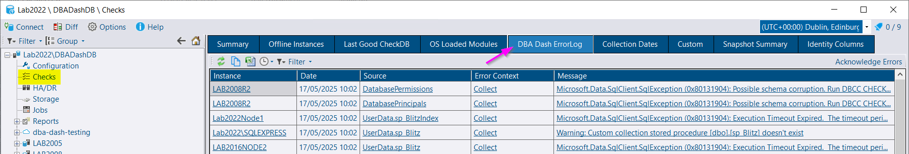

## Where to look for errors

DBA Dash logs errors in the *dbo.CollectionErrorLog* table in the repository database and also the *Logs* folder.

### CollectionErrorLog table

The errors logged in the database can be viewed in the GUI on the *DBA Dash ErrorLog* tab under the *Checks* node of the tree.

The *DBA Dash ErrorLog* tab tends to be the most convenient place to look for errors.  It contains only errors and warnings.  It can be searched and filtered for a specific instance.  It might not contain all errors - if there is a problem writing to the repository database for example.

### Logs folder

The *View Service Log* button on the service config tool can be used to view the logs.

Or you can access the logs in the *Logs* folder and open them with your favorite text editor.

These logs contain detailed information about what the service is doing in addition to errors.  You can look for **[ERR]** and **[WRN]**.


If you don't have log files or a Logs folder, this probably means that the account running the service doesn't have permissions to write to the logs folder.


### Event Viewer

The last place to look is the Windows event log (Start\Run\eventvwr).  DBA Dash doesn't log any errors here, but in the case of a total application failure, there might be some information here.

## Common Issues

### Instance is not visible in the tree / no data

* Check that the instance exists in the config.
* Ensure that the service has been *restarted* since adding the instance.
* Check the *Recycle Bin* folder in the GUI - it's possible the instance has been deleted.
* Check the *DBA Dash ErrorLog* tab for any errors relating to the instance.
* Check the *Logs* folder for any errors relating to the instance.
* Ensure that the service account has permissions to connect to the monitored instance.  See the [security doc](/docs/help/security)
* Ensure the service account has permissions to write to the repository database.


If there is a permissions issue connecting to the monitored instance, the error will be shown in the *DBA Dash ErrorLog* tab and *Logs* folder.  If there is a permissions issue connecting to the repository database, the error will only be in the *Logs* folder.


### A collection isn't working

* Check the *DBA Dash ErrorLog* tab and/or *Logs* folder for errors relating to the collection.
* Check the collection [schedule](/docs/help/schedule).  Note: Schedule can be configured at service level and instance level.
* If the issue is related to WMI, see [WMI related errors](#wmi-related-errors)
* If the collection is failing due to a timeout, [see here](/docs/help/query-timeout)
* Ensure the service account has the required [permissions](/docs/help/security).
* If there is a bug, please log an [issue](https://github.com/trimble-oss/dba-dash/issues)

### Issues after changing service account or moving DBA Dash to a new instance

* If you encrypted the config file, the service account will need access to decrypt the file.  Open the service config tool & click the *Configure Encryption* button on the *Options* tab.  Click the *Update* button to create a temporary key.
* The new service account user will need [permissions](/docs/help/security) to the repository database and monitored instance.

See:
* [Change Service Account](/docs/setup/change-service-account/)
* [Move Service](/docs/setup/move-service/)

### WMI related errors

* Check the [WMI](/docs/help/wmi) doc.
* WMI is optional & most functionality is available without it.  Check the **No WMI** option in the service config tool to disable it.
* If you want to use WMI, ensure the service account is local admin on the monitored instance.

### You get a 'Operation will cause database event session memory to exceed allowed limit.' error on AzureDB

You will typically run into this issue when using elastic pools.  You might need to be selective about which databases you enable slow query capture for.  [See here](https://github.com/trimble-oss/dba-dash/discussions/138) for more info.

### The stored procedure names are not showing

Object names might display as {object_id:1234567}.  This can occur if the DBA Dash service account doesn't have permissions to collect the object name.  [Review the permissions](/docs/help/security) assigned to the service account.

### The Slow Queries tab doesn't show any data

* Ensure this collection is enabled in the config for the monitored instance. (*Slow Query Threshold* is greater than 0. Typically 1000 or higher. *)
* Ensure the service account [has permissions](/docs/help/security) to create extended events.
* Try running a query that will be over the set threshold.  e.g. `WAITFOR DELAY '00:00:30'`

## Where to get help

Please report bugs by logging an [issue on GitHub](https://github.com/trimble-oss/dba-dash/issues).  You can also create a [discussion](https://github.com/trimble-oss/dba-dash/discussions) for general questions.  The #dbadash channel on [SQL Server community slack](https://dbatools.io/slack) is also a good place to ask questions.
