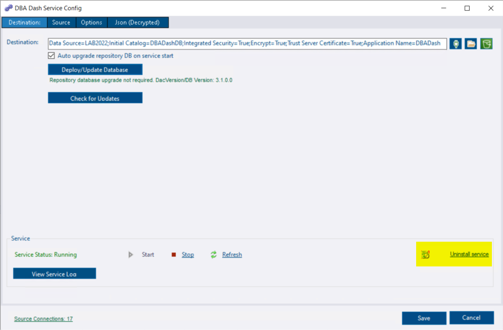

* Uninstall the service

Open the service configuration tool and click **Uninstall Service**. 



*The service can also be removed from the commandline using `DBADashService uninstall` or the [sc delete](https://learn.microsoft.com/en-us/windows-server/administration/windows-commands/sc-delete) command.*

* Delete the application folder

* Delete the repository database (optional)

```sql
DROP DATABASE DBADashDB
```

* Monitored instance cleanup

If slow query capture is enabled it's possible an extended event might get left behind on the monitored instances.  This will usually be **cleaned up automatically** each time the service shuts down but you might want to verify that it has been removed.  In SSMS, look for a session with a name starting **DBADash** and delete it.

*The extended event isn't removed if the **Persist XE sessions** option is used, the service didn't have a clean shutdown or was unable to contact the monitored instance when it was shutdown.*