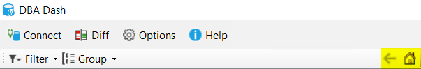
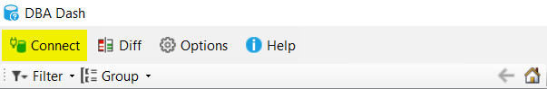

## Back & Home Navigation buttons added

Use the Back navigation button to take you to the previous tab/node in the tree.  This button will also activate the current control's backward navigation feature if applicable before taking you to the previous node/tab.  The mouse back button is supported as a shortcut.

The Home button will take you back to the Summary tab of the root node in the tree.

The location of the Filter and Group menu items has changed.

## Connect to a different repository

In most cases you will have a single DBA Dash repository for all your SQL instances.  You can filter and group your instances by Tag for organizational purposes.  

You might choose to split your instances between multiple repositories in some circumstances.  For example, the instances might be split by the teams responsible for managing the instances. Or you might want to have a separate repository to allow you to use different retention settings for production/non-production.  Multiple repositories could also make sense if you have a very large number of instances to monitor.

The GUI was previously designed to work with a single repository database.  You could deploy multiple copies of the GUI each pointed at a different repository database to work around this limitation.  It's now possible to switch the repository database by clicking the "Connect" button and selecting the repository database you want to switch to.  This could be improved in future versions with the option to save connections and select them from a menu.

## Other

[See here](https://github.com/trimble-oss/dba-dash/releases/tag/2.26.0) for a full list of changes.
