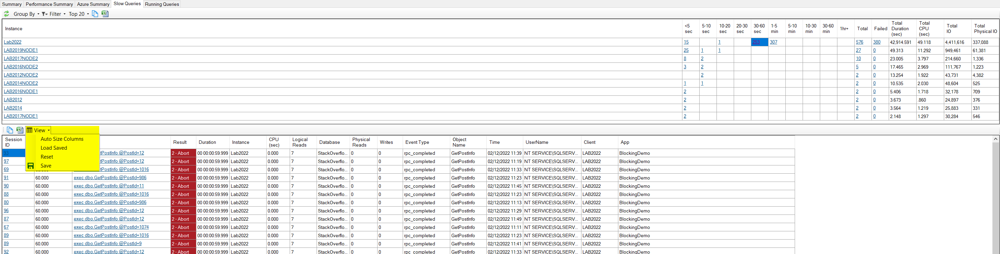

## Option to save column layout in Slow Queries tab

You can now save the size/position of the columns in the Slow Query tab:

## Support for monitoring contained availability groups in SQL 2022

[See here](/docs/help/availability_groups/) for information on availability group support in DBA Dash.  The changes in 2.27.0 set the ConnectionID to the name of the availability group when connected to the listener of a contained availability group.

## is_ledger_on Is now captured for SQL 2022

This information is available in the DB Options tab under the "Configuration" node in the tree.  You can also query this information in the [dbo.Databases](https://github.com/trimble-oss/dba-dash/blob/main/DBADashDB/dbo/Tables/Databases.sql) table.

## Other

This version also includes some bug fixes and code refactoring.  [See here](https://github.com/trimble-oss/dba-dash/releases/tag/2.27.0) for a full list of changes.
