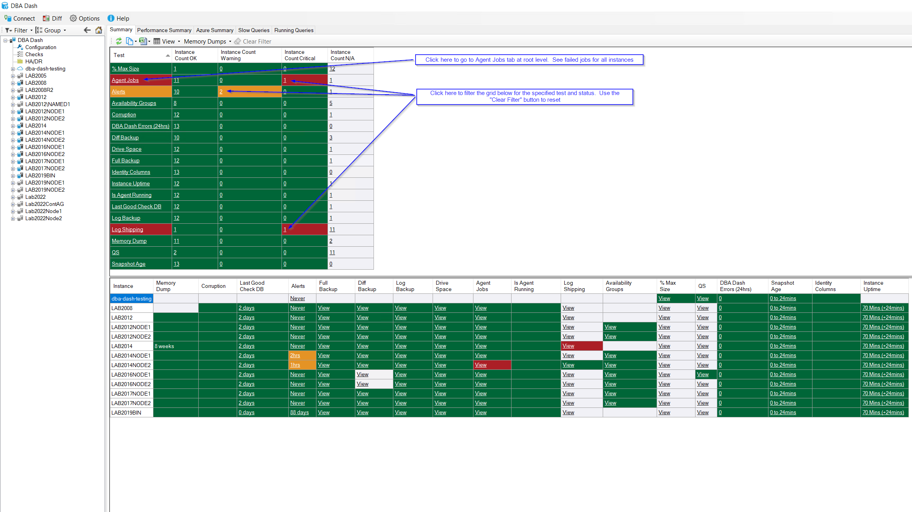

## Test Level Summary

There is an extra test level summary grid on the Summary page.  This shows a row for each of the tests with a count of instances that are OK, Warning, Critical or N/A.  

You can click the count of instances to filter the grid below to show the instances that match the selected test/status. 

The test level summary also allows you to click the test link to see all instances with Critical/Warning status for the selected test.  Previously you would need to either drill down for each instance or navigate manually to the tab page at root level.  

If you don't want to see the test level summary it can be removed by clicking "View\Show Test Level Summary".  Click the "Save" button to persist the changes.

The test level summary might be particularly useful if you have a large number of instances.  You can also use the "Focused View" to highlight the areas that need attention.

## Hide Instances

This feature allows you to hide instances from the root level tab pages but still have the instances visible in the tree.  A separate grey icon is used in the tree to make it easy to identify hidden instances.  

Use this feature to retire a instance but still have it accessible in the tree.  Or hide an instance temporarily until it's fully configured.

Previously the "Show In Summary" feature could be used to hide instances from the Summary tab. If you go to Options\Manage Instances the "Show In Summary" column has been replaced with a "Hidden" column that shows if the instance is hidden. Also, instances marked hidden will now be removed from all tabs at root level instead of just the summary page. If you want to see all instances you can click "Options\Show Hidden".

## Other

See [here](https://github.com/trimble-oss/dba-dash/releases/tag/2.30.0) for a full list of changes.
