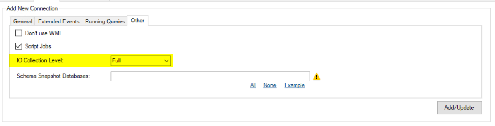

## Fast switching between repositories

DBA Dash now offers enhanced support for managing multiple repository databases. You can effortlessly add new repository connections and seamlessly switch between them with just a single click.

In most cases you can use a single repository database to monitor all the SQL instances in your environment. There might be some reasons to consider using multiple repositories such as:

* To monitor a very large number of SQL instances
* To allow you to grant access to a subset of databases to certain groups of people.
* To manage retention differently between groups of databases.  

With the older version of DBA Dash you would have to enter the connection details each time you switched repositories.  You can now save your repository connections and switch between then at the click of a button.

Connections to the repository database are now saved on a per user bases in the AppData folder.  The connection in the ServiceConfig.json will initially be used if it's available to provide a seamless upgrade.  

## IO Collection/Storage Level

DBA Dash collects IO metrics from sys.dm_io_virtual_file_stats DMV.  The file level granularity of this collection can be a problem for instances with a very large number of databases or database files.  This data can now be [aggregated on collection](/docs/setup/options/#io-collection-level) or when importing into the repository database.  This can significantly reduce the amount of data you need to store while still giving you a high level view of your IO metrics.  The defaults should be good in most cases but this setting provides additional flexibility beyond having IO metrics turned on/off.

## Other

See release notes for a full list of fixes:

* [2.40.0](https://github.com/trimble-oss/dba-dash/releases/tag/2.40.0)

* [2.40.1](https://github.com/trimble-oss/dba-dash/releases/tag/2.40.1)

*2.40.1 is a minor patch to allow importing IOStats data collected with versions of DBA Dash prior to 2.40.0 (imported from a newer version via S3 bucket or folder).*  
