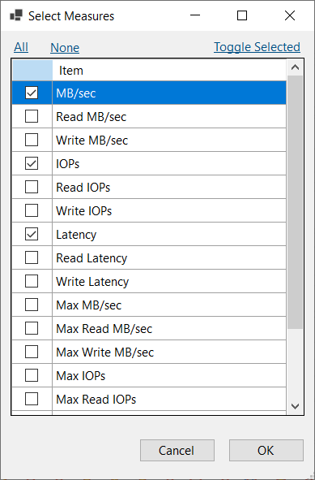
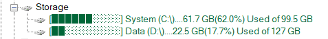
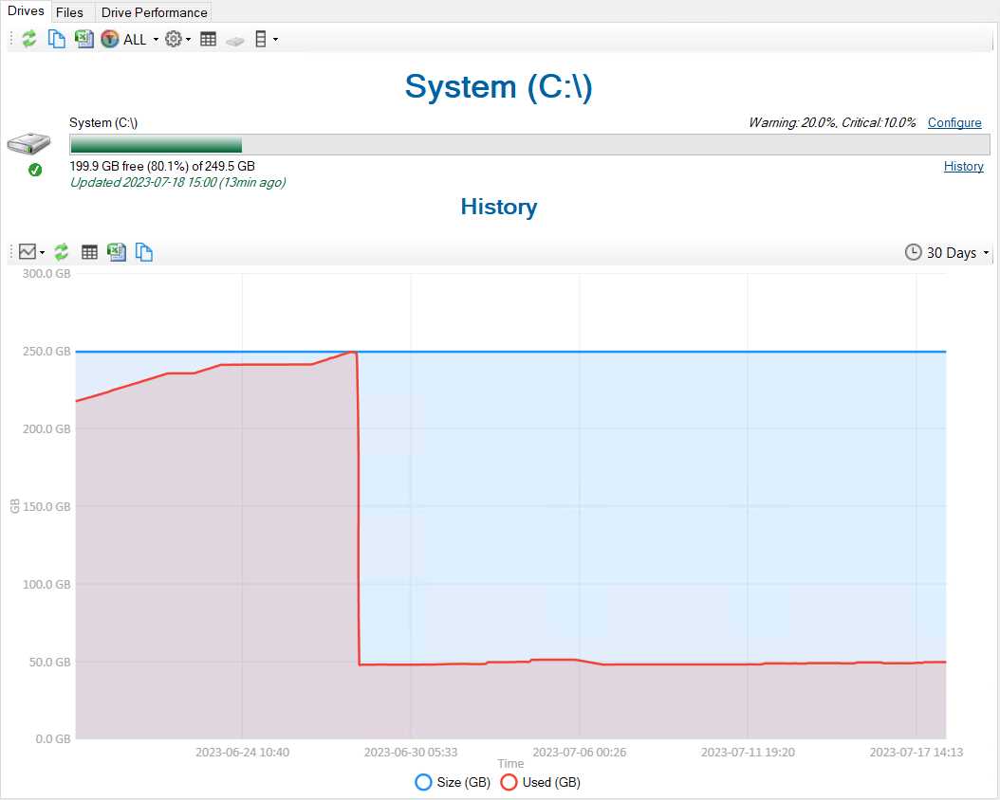
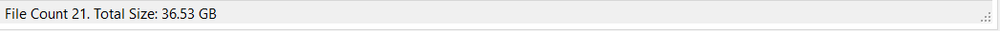

## Storage node added to the tree

The storage node provides better organization for anything file or drive related.  A new **Drive Performance** has been added which is visible at the instance level.  This makes it easy to see the activity for each of your drives on a single page.  The axis are synchronized by default which makes it easier to compare the activity of each drive relative to each other.  

The charts display average MB/sec, IOPs and Latency by default.  The old menu selection for metrics has been replaced by a picker to improve usability.  

The latency axis max value can now be adjusted where previously it was fixed at 200ms.  Ideally latencies should be in the single-digit millisecond range.  The fixed axis makes it easier to see if we are dealing with high disk latencies which can now be adjusted to your preference.

Expanding the storage node at instance level will list drives associated with the instance.  

Clicking the drive node in the tree will show you the current disk space and history.  

The Files tab will show all the files on that drive.  This tab will now show a file count and total size in the status bar.  

The drive performance tab is also available at this level to show the IO performance for the selected drive.

💡 *IO metrics are calculated using the [sys.dm_io_virtual_file_stats](https://learn.microsoft.com/en-us/sql/relational-databases/system-dynamic-management-views/sys-dm-io-virtual-file-stats-transact-sql?view=sql-server-ver16) DMV.  IO Operations performed outside of SQL Server are not included.*

## Other

See [2.43.0](https://github.com/trimble-oss/dba-dash/releases/tag/2.43.0) release notes for a full list of fixes.

