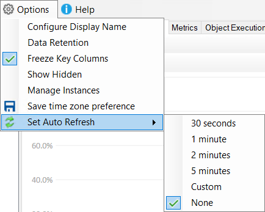

## Slow Queries - Group By Time

New group by options added to **Slow Queries** tab:

* **Time - Hour**
* **Time - Day**
* **Time - Custom** *(A custom grouping specified in minutes)*

### Example of why this is useful

I recently made a modification to a stored procedure in order to address poor performance. The object execution statistics were not helpful in evaluating the performance impact, making this case a bit more challenging.

The stored procedure is executed frequently, but it's only a minor percentage of the executions, specifically when a certain parameter is passed in, that are impacted. So, I needed a more nuanced way to identify the issue.

Utilizing the object/text filters, I managed to pinpoint the affected executions in the slow query tab. However, I really needed the ability to group by date, in order to track any changes in the slow executions since applying the fix.

At that time, this grouping functionality was not available. So, as a workaround, I manually adjusted the date filter repeatedly and copied the data into Excel. 

The new group by time feature will simplify such analysis in future.

## Auto Refresh

The new auto refresh feature can be enabled from the **Options** menu. Once enabled, the data in the current tab will auto refresh at your defined interval.  The auto refresh feature will be disabled automatically when you navigate to a new tab and will be paused if you minimize the application.  

## Other

See [2.45.0](https://github.com/trimble-oss/dba-dash/releases/tag/2.45.0) release notes for a full list of fixes.