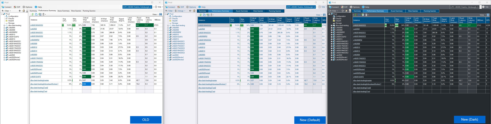
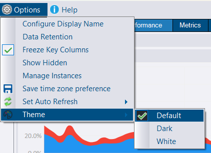

## Themes - Including Dark Mode!

DBA Dash 2.47 includes cosmetic changes that improve the overall look and feel of the application.  The application now has support for Themes, including a **Dark Mode**.  

The screenshot below compares the old version of the application to the new default and dark mode themes.  There is also a White theme if you prefer a dazzling bright white background.  

You can switch themes using the options menu:

## Other

See [2.47.0](https://github.com/trimble-oss/dba-dash/releases/tag/2.47.0) release notes for a full list of fixes.