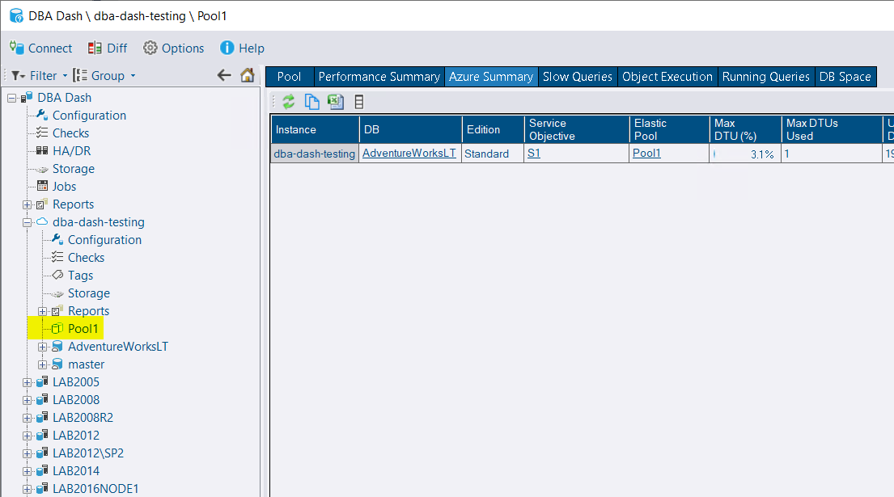

## Elastic Pool Node added to Tree

A node has been added to the tree for each elastic pool.  This makes it easier to evaluate resource consumption at the elastic pool level.  It provides access to the following tabs:

* Pool - Elastic Pool resource usage
* Azure Summary - Resource usage for each database in the pool
* Slow Queries - RPC/Batch completed events captured for databases in the pool
* Object Execution - Stored procedure/function/trigger execution stats for all databases in the pool
* Running Queries - Access running query snapshots for each database in the pool
* DB Space - Used space for each database in the pool.

## Other

See [3.3.0](https://github.com/trimble-oss/dba-dash/releases/tag/3.3.0) release notes for a full list of fixes.