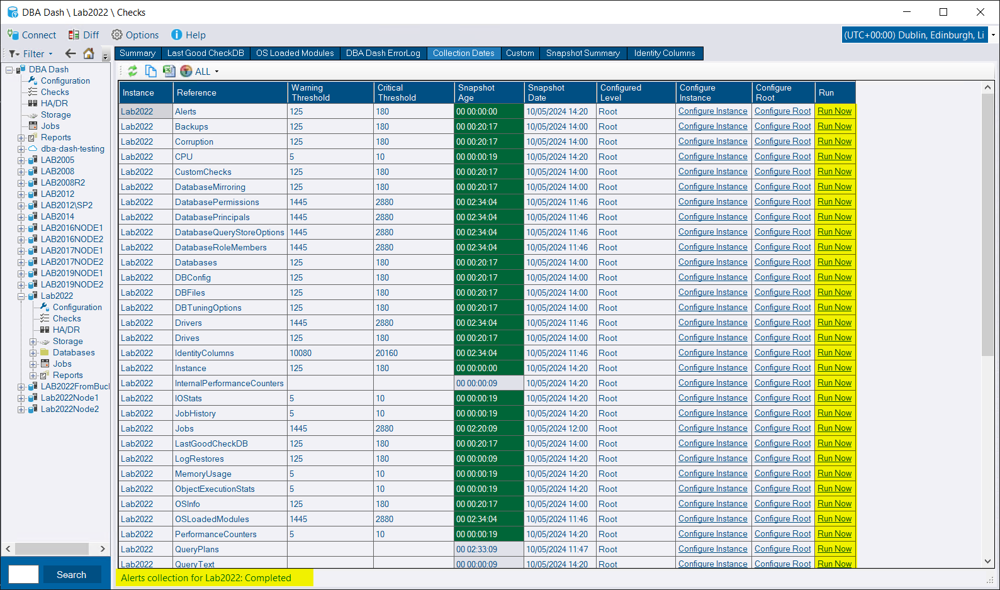
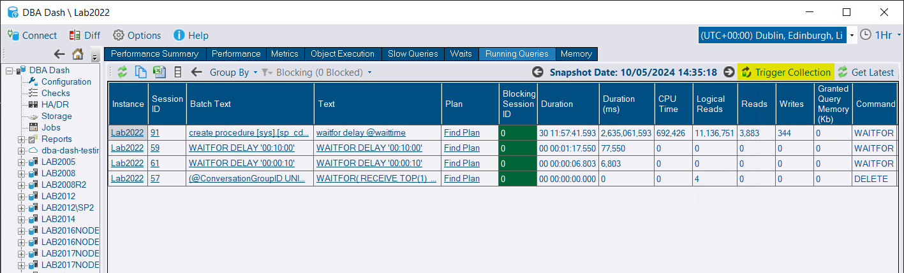
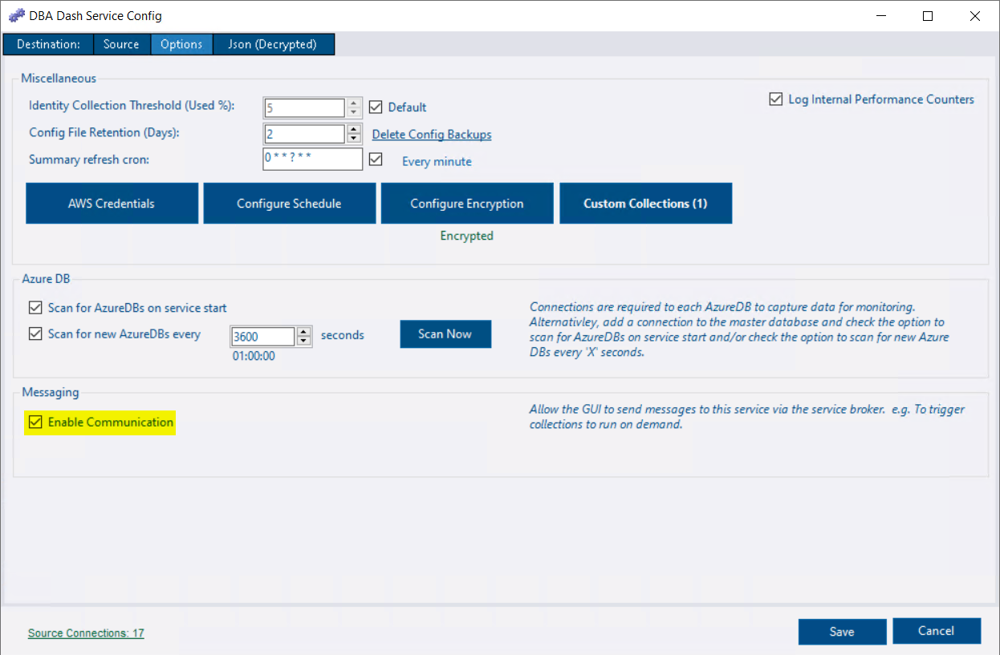

## Messaging / Trigger collections

Communication between the GUI and the DBA Dash service is now possible with the new messaging system.  In this release users can **trigger collections to run on demand** from the GUI.  With this communication mechanism established, future releases can leverage it for a variety of additional purposes.

DBA Dash collects data on a schedule and previously the only way to trigger a collection to run outside of the schedule was to restart the service (most collections are set to run on service start by default).  Now you can trigger the collection to run on the **Collection Dates** tab.

It's also possible to trigger the **RunningQueries** collection to run on demand directly on the running queries tab.  If you are troubleshooting a live issue, you might want to see what's running **right now** rather than what was running at the last collection.

### Enable Messaging

There is a checkbox to click in the options tab of the service configuration tool to enable messaging.  This will prompt you to automatically update the ConnectionID in the config file.  This is how a connection is uniquely identified.  If it's not set, it will use `@@SERVERNAME`, unless it's a Azure DB connection.  There shouldn't be any downside to having this explicitly defined in the config file and it's required to enable communications with the monitored instance.

### Security Considerations

Previously, the service solely transmitted data to the repository database from the monitored instances, while the GUI exclusively interfaced with the repository database. Although this setup remains unchanged, a new communication channel has been established, enabling users to initiate queries on monitored instances, which they may not have direct access to. These queries execute within the context of the service account.

Key points to note:

* Messaging functionality is deactivated by default, posing no additional security risk if left disabled.
* To send messages, users require EXECUTE permissions on the Messaging schema. This permission can be granted via the **Messaging** role, distinct from the App & new AppReadOnly role. Granting access to the GUI does not automatically confer messaging privileges, ensuring controlled access.
* Presently, messaging functionality is limited to triggering pre-existing collections.
* Security risks can be mitigated by adhering to the principle of least privilege.  See the [security doc](/docs/help/security) for recommendations for the service account.

***The messaging system offers only minimal functionality for interacting with the monitored instances via the GUI.  Additionally, that functionality can be restricted if required and is totally disabled by default.***

### How it works

This feature utilizes **service broker**. The GUI sends messages to the DBADashServiceInitiatorQueue, which then directs the message to the target queue associated with the service responsible for the desired instance. Depending on the number of services with messaging enabled, there can be multiple target queues, each corresponding to a service. The service is able to process messages immediately as they reach the target queue. The message instructs the service to execute a collection task. Subsequently, the collected data is imported into the repository database as usual, and a response message is sent back to the GUI. The GUI, in turn, awaits responses on the DBADashServiceInitiatorQueue after initiating a collection. Each GUI instance processes only its own responses, as the RECEIVE operation is limited to the conversation_group_id it initiated.

Utilizing service broker offers the advantage of immediate message processing, eliminating the need for frequent database polling. In practical terms, triggering the running queries collection gives the impression that the GUI is retrieving data directly from the monitored instance.

### Limitations

* Messages cannot be relayed to remote services if data is pulled from monitored instances via an S3 bucket. Consideration is being given to including this capability in a future release.
* Service broker is not supported on AzureDB. If your repository database is on AzureDB, messaging cannot be enabled. However, AzureDB can still be used for the repository database without messaging support. All messaging-related components are created using dynamic SQL to maintain compatibility with AzureDB.

## Other

See [3.5.0](https://github.com/trimble-oss/dba-dash/releases/tag/3.5.0) release notes for a full list of fixes.