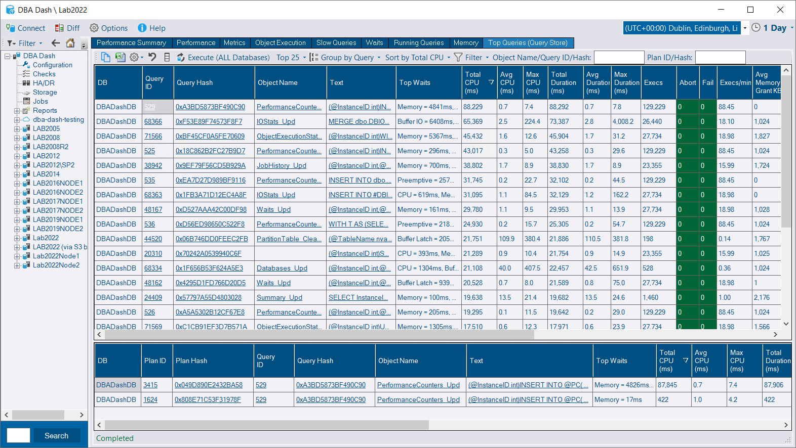

## 100 💯🎉🚀

**3.7.0** marks the **100th** release of DBA Dash in ~2.5 years of being open source.  At lot has changed in that time and this release brings an exciting new feature...

## Query Store Top Queries

Query store top queries brings statement/plan level performance data to DBA Dash - something I've wanted to include for some time.  The way this is done is interesting and different from anything else currently in DBA Dash - but more on that later.

This report serves a similar purpose to the *top resource consuming queries* report in SSMS but it can be run at server level, includes wait information and has some different filtering and grouping options.

* Top queries by CPU/Duration/IO (Total or Avg), execution count and max memory grant.
* Group by query, plan, plan hash, query hash or object name
* Run at database or server level
* Filtering on object name, query id, query hash, plan id & plan hash
* Filter for parallel plans and queries with multiple plans
* Displays various metrics including top waits.
* Drill down options including loading the query plan by clicking the Plan ID column.

## What statement level tracking brings

Statement level tracking makes it easy to identify the precise statement(s) that are hurting you in terms of CPU, IO or memory usage.  While we can track performance level at the stored procedure level (Object Execution tab), this is only useful if your application uses stored procedures.  Query store can identify the statement and query plan which gets us much closer to the root of the problem.  It also doesn't matter if those statements are executed from a stored procedure or generated from an ORM (Entity Framework, Dapper etc).  Query store also enables plan fixing and various [IQP (intelligent query processing)](https://learn.microsoft.com/en-us/sql/relational-databases/performance/intelligent-query-processing?view=sql-server-ver16) features.

Query Store data complements the information captured in DBA Dash, and when used together, they offer a comprehensive view of your server's performance.  Object execution metrics for example, are invaluable for monitoring the performance of your stored procedures over time, assessing the effects of performance optimizations, and identifying the impact of code modifications. This can also reveal issues that may not be apparent in Query Store data alone. Additionally, the snapshots of running queries, capture of slow queries (batch/RPC completed events), and overall performance metrics each provide valuable insights into your servers performance.

## Prerequisites?

* Query store needs to be enabled.
  
*Query store works at the database level and needs to be enabled per database.  It might not be suitable for all environments - particularly if you have a significant ad-hoc workload and you are on an older version that doesn't support custom capture policies.  In most cases, it's worth it.  [See here](https://learn.microsoft.com/en-us/sql/relational-databases/performance/manage-the-query-store?view=sql-server-ver16&tabs=ssms) and [here](https://www.sqlskills.com/blogs/erin/category/query-store/) for more information on query store best practices.*

* [Messaging](/docs/help/messaging) needs to be enabled in the service configuration tool.
* The user account accessing the GUI needs `EXECUTE` permission against the *Messaging* schema. (Use the *Messaging* role)

## The cool tech behind query store integration

Query store data <ins>isn't</ins> being stored and collected in the repository database.  The GUI doesn't have any connections to the monitored instances, but we can still pull the data from the monitored instances and display it in the GUI as if the data was stored in the repository database.

So how is this accomplished? It's done using the new [messaging](/docs/help/messaging/) system.  The GUI sends a message for the top queries report to service broker which is picked up immediately by the DBA Dash service responsible for collecting data for that instance.  The data is collected from the monitored instance and returned back to the GUI via a service broker which is listening for the reply message.  The request can even be relayed to a SQS queue if you have remote DBA Dash services sending data via a S3 bucket.

Sounds complicated?  No - just check the "Enable Communication" option in the service configuration tool to enable this feature.  The feature should work seamlessly as if the data were stored in the repository database.  The additional complexity is hidden.

## Pros/Cons of this approach

Benefits to this approach?  We don't need to duplicate query store in the repository database.  This reduces the storage and processing costs that would be associated with collecting this data. We also avoid the complexity of duplicating query store.  As new features are added to query store it's easier to take advantage of them.  

Downsides to this approach?  Running the query store report will trigger a query to run on our monitored instance which could have a performance impact.  We don't have the data stored in a central location which we can mine.  Query store works at the database level and needs to be enabled per database.  DBA Dash enables a server level report which works around the per database limitation though.  

Another alternative that was considered was taking snapshots of *sys.dm_exec_query_stats* which provides data at the server level and doesn't require query store to be enabled.  This is essentially duplicating query store and depending how often this is sampled and how volatile your plan cache is it might not be as accurate.  We'd have to deal with the complexities of storing and collecting this data in an efficient manor.  This includes systems with a large ad-hoc workload.

## Other

See [3.7.0](https://github.com/trimble-oss/dba-dash/releases/tag/3.7.0) release notes for a full list of fixes.