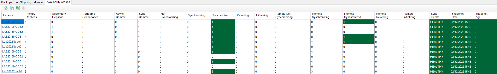

DBA Dash includes support for availability groups.

## How to add connections

Add connections to the SQL nodes that host your availability groups. The listener connection can also be monitored if you are using SQL 2022 contained availability groups ([See here](#contained-availability-groups-sql-2022)).

## Backup Status

Backup status takes into account the backups performed on each of the replicas.

## Availability Group health

DBA Dash reports the status of your availability groups on the Summary tab.  You can also see more detail about the health of your availability groups in the "Availability Groups" tab in the HA\DR folder in the tree.

## Contained Availability Groups (SQL 2022)

For contained availability groups it's only possible to monitor the associated jobs if you also add a connection to the listener in the service configuration tool. The connection will be identified by the name of the availability group - or you can override the ConnectionID in the service configuration tool. 

Note: Slow query capture [doesn't work](https://github.com/trimble-oss/dba-dash/issues/458) for the contained availability group if it's also enabled on the node it's running on in this version of DBA Dash.
