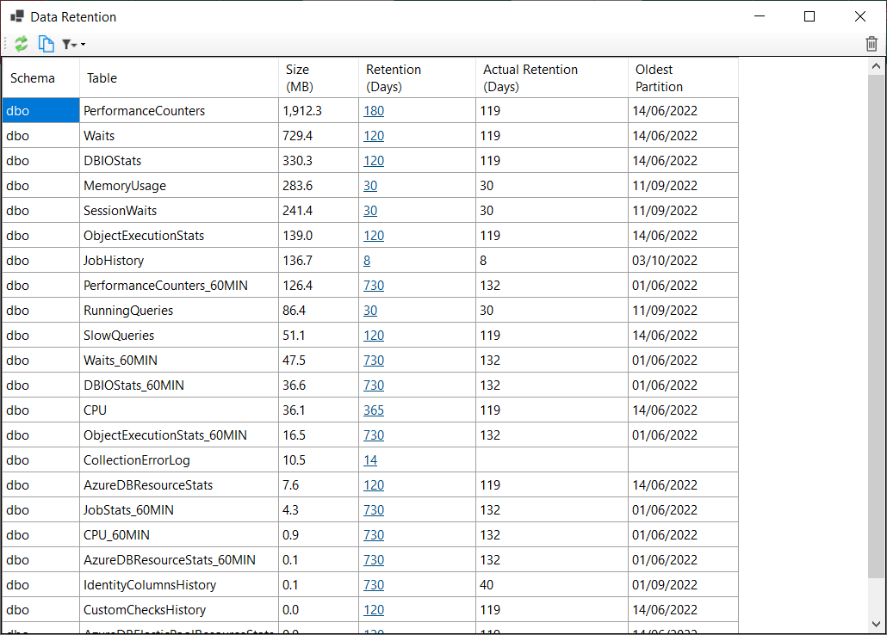

DBA Dash manages data retention automatically based on the retention policy which you can set for each table.  You might want to customize the defaults to keep the size of your repository database in check or to ensure that you have sufficient historical performance data.  

## Configuring Retention

* In the Options menu in the GUI, select "Data Retention"
  
[](data-retention.png)

* Review the size of the tables and click the link in the "Retention (Days)" column to adjust the retention.
* Click the bin icon on the right of the toolbar to run to clear the old data immediately.  Or you can wait for the agent to clear the old data (Every 12hrs)

 

## Efficient data removal

Partition switching is used in most cases to efficiently remove old data.  The partition is switched out to a table called Switch.{TableName}, then the data is truncated.  

The service calls `dbo.PurgeData` to remove old data.  

## Aggregate tables

A number of tables have data aggregated into 60min intervals.  This improves performance when querying the data over long time periods and also makes it cheaper to store historical data.  For example, there is a table called dbo.Waits that stores waits at the frequency of collection (1min by default).  The dbo.Waits_60MIN table stores this data aggregated in 60min intervals.  You can configure the retention differently on these tables - allowing you to keep the aggregated data for longer periods.  

## Per Instance Retention

Data retention isn't managed on a per instance bases due to the partition switching process used to efficiently remove old data.  You can do this manually if you need to and there are some existing stored procedures you can use to do this. For example:

```SQL
dbo.SlowQueries_Del @InstanceID=12345,@DaysToKeep=7
```

You can find the InstanceID in the `dbo.Instances` table.  The data will be deleted in batches and it's possible to control the batch size using @BatchSize.

Other stored procedures are available for different tables following the naming pattern `{TableName}_Del`:

```
dbo.AzureDBElasticPoolResourceStats_60MIN_Del
dbo.AzureDBElasticPoolResourceStats_Del
dbo.AzureDBResourceStats_60MIN_Del
dbo.AzureDBResourceStats_Del
dbo.BlockingSnapshotSummary_Del
dbo.CPU_60MIN_Del
dbo.CPU_Del
dbo.DBFileSnapshot_Del
dbo.DBIOStats_60MIN_Del
dbo.DBIOStats_Del
dbo.DriveSnapshot_Del
dbo.JobStats_60MIN_Del
dbo.MemoryUsage_Del
dbo.ObjectExecutionStats_60MIN_Del
dbo.ObjectExecutionStats_Del
dbo.PerformanceCounters_60MIN_Del
dbo.PerformanceCounters_Del
dbo.RunningQueries_Del
dbo.RunningQueriesSummary_Del
dbo.SessionWaits_Del
dbo.SlowQueries_Del
dbo.SlowQueriesStats_Del
dbo.Waits_60MIN_Del
dbo.Waits_Del
```