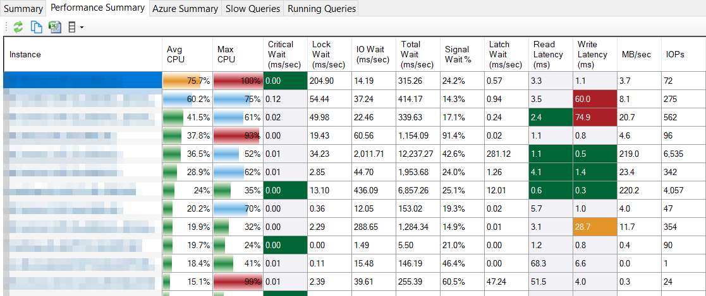
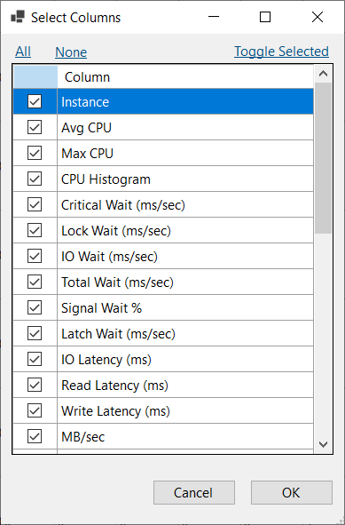
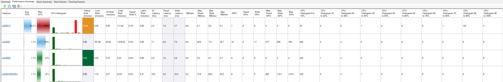
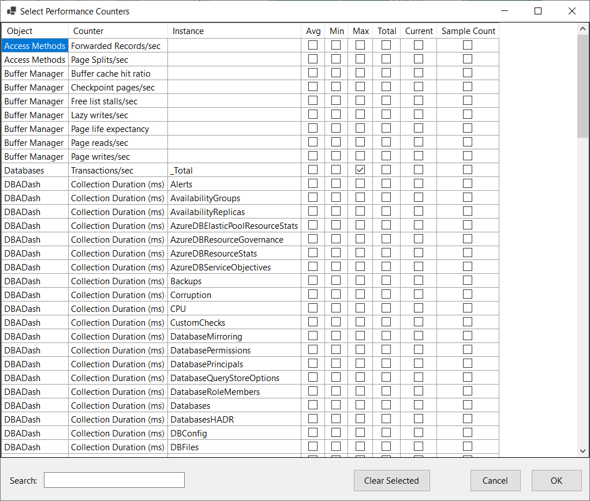
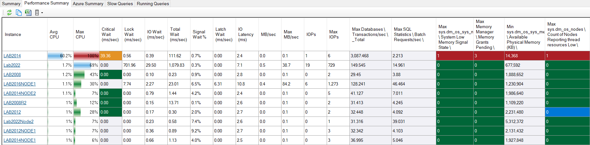
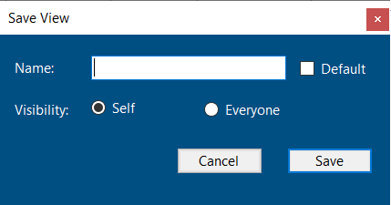

The performance summary page allows you to see a summary of the health of your servers on a single page.  You can see which servers are busy or might be experiencing performance issues.

[](performance-summary.png)

## Highlighting

### CPU

The CPU bar will highlight:
* Red (Critical) above 90% (CPUCriticalThreshold) utilization.
* Orange (Warning) above 75% (CPUWarningThreshold) utilization.
* Green (Good) below 50% (CPULowThreshold).
* Blue between the Good and Warning thresholds, 50-75% (CPULowThreshold-CPUWarningThreshold).

These thresholds can be modified in the dbo.Settings table.  

### Critical Wait

Small amounts of certain wait types can indicate potential for serious performance problems.  For example, RESOURCE_SEMAPHORE means you have queries **queued** waiting for a memory grant to execute.  You can see the wait types defined as critical by running this query in the repository database:

```SQL
SELECT WaitType
FROM dbo.WaitType
WHERE IsCriticalWait=1
```

Critical wait will highlight red at 1000ms/sec (CriticalWaitCriticalThreshold) and orange at 10ms/sec (CriticalWaitWarningThreshold).  A true zero value will be green.

These thresholds can be modified in the dbo.Settings table.  

 

### Read/Write Latency

Ideally disk latencies should be sub-millisecond or single digit millisecond.  High disk latencies can indicate IO performance issues.  High latencies might not be a big concern if there is very little IO happening on your system or if an IO related wait is not one of your top waits.   

* Less than 100 IOPs.  No highlighting.
* Red (Critical) above 50ms.  (ReadLatencyCriticalThreshold, WriteLatencyCriticalThreshold)
* Orange (Warning) above 10ms. (ReadLatencyWarningThreshold, WriteLatencyWarningThreshold)
* Green (Good) below 10ms. (ReadLatencyGoodThreshold, WriteLatencyGoodThreshold)

These thresholds can be modified in the dbo.Settings table.  

## Standard Columns

Additional columns are available by clicking the Columns button on the toolbar and selecting "Standard Columns".  

[](performance-summary-select-cols.png)

These columns include a CPU Histogram which shows how long the server has spent at particular CPU utilization levels.  

[](performance-summary-allcols.png)

## Performance Counter Columns

You can add any performance counter available in the "Metrics" tab to the performance summary.  Click the Columns button on the toolbar and select "Performance Counter Columns".

[](select-performance-counters.png)

You can select the performance counters you are interested in and the type of aggregation to perform.  The counters will then be available in the grid.  Any highlighting configured on the "Metrics" tab will carry over to the performance summary.

[](performance-summary-perfcols.png)

## Saving changes to the grid

* Click the save icon in the right side of the toolbar.  

[](save-view.png)

* Enter a name for the view and select a visibility.  
* Click save.

The view can be reloaded by clicking the "View" menu next to the save icon.

