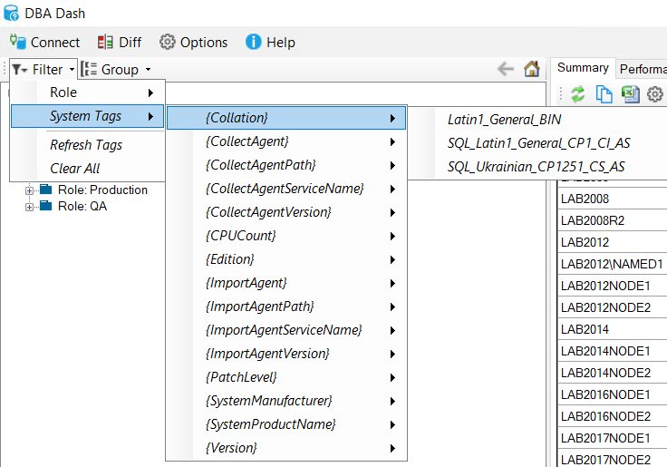
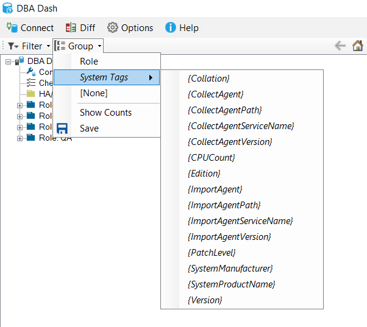
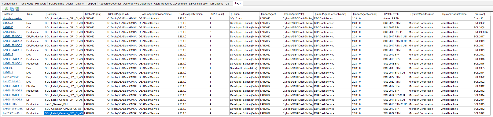
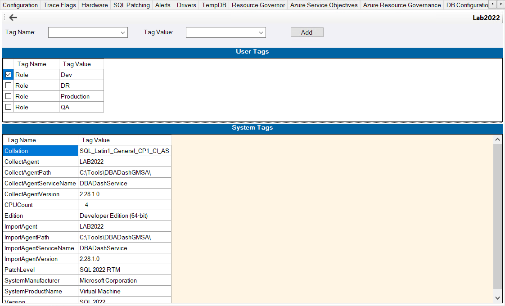

Tagging in DBA Dash is used to provide a way to filter and group your SQL instances. DBA Dash automatically creates a number of system tags which you can group and filter by.

## Grouping and Filtering

To filter instances by tag, select the tag from the "Filter" menu.

Multiple tags can be selected.  If you select "Role \ Production" and "Role \ DR" you will see instances tagged with either of the selected options.  If you then select "{Collation} \ Latin1_General_BIN" tag you will only see instances that have the selected collation that are tagged with the role DR or Production.  

The "Clear All" option will remove any tag filters you have applied.  The "Refresh Tags" option will update the menu with any new tags that have been added.

To group instances by tag, select the tag from the "Group" menu.

To remove the grouping, select `[None]`.  If you want the grouping to be persisted next time you load DBA Dash, click "Save".  

## Viewing tags

The "Tags" tab can be used to view the tags associated with your instances.  Under configuration node at root level, select the "Tags" tab.

## User Tags

From the Tags report above, you can click to drill down to a specific instance.  Or you can expand the instance in the tree and select the Configuration node, then select the "Tags" tab.  Here you will see the user and system tags associated with the instance.

To add or remove a user tag, you can select the associated checkbox.  If you want to add a new Tag/Value, enter the tag name and value in the combo boxes and click "Add".

An instance can be associated with multiple tags with the same Tag name.  For example, you might have a tag called "App" that associates an instance with a particular application. Some instances might be associated with a single application and other instances might serve multiple apps.

## Automation

If you want to automatically add tags to your SQL Instances, this blog post on how to [group instances by 1st char of instance name](/blog/group-instances-by-1st-char-of-instance-name/) will be useful.
